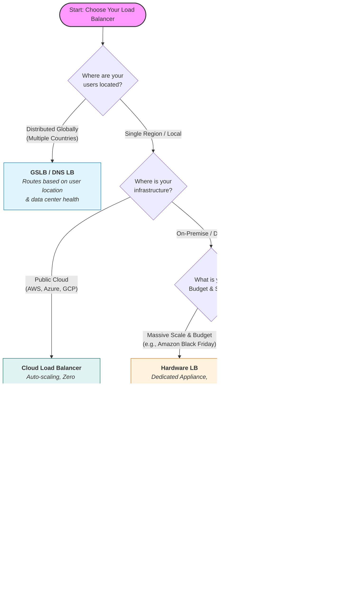

## Load Balancer Types

A **Load Balancer** acts like a traffic cop for your servers. Imagine a supermarket with 10 checkout lanes. If everyone lines up at just one lane, that cashier gets overwhelmed while the other 9 sit idle. A load balancer stands at the entrance, directing each new customer to the shortest line.

In technical terms, it distributes incoming network traffic across multiple servers (a "server farm" or "server pool"). This ensures no single server bears too much demand, keeping the system fast, reliable, and available.

This guide details the different types of load balancing strategies, their pros and cons, and real-world examples.

---

### 1. Hardware Load Balancing

Hardware load balancers are physical, dedicated boxes (appliances) that you install in your data center. They are the "heavy lifters" of the industry, built with specialized chips like **ASICs** (Application-Specific Integrated Circuits) to process traffic at incredible speeds.

#### Pros

- **Massive Performance:** Because the hardware is built _only_ for this job, it can process gigabytes of data faster than general computers.
- **Security:** Often comes with "walled garden" security features, essentially acting as a firewall to block bad traffic before it hits your servers.
- **Multi-tasking:** Capable of handling many different types of traffic protocols simultaneously.

#### Cons

- **Cost:** These physical boxes are expensive (thousands to tens of thousands of dollars).
- **Scalability Limits:** If you max out the box's capacity, you have to buy another physical box and wire it up.
- **Maintenance:** You need specialized staff to physically manage, rack, and configure the device.

**Real-World Example:**

> A massive e-commerce company (like Amazon or eBay) uses hardware load balancers during Black Friday. They need dedicated machines that can handle millions of connections per second without a millisecond of lag.

---

### 2. Software Load Balancing

Software load balancers are programs you install on standard servers (like a standard Linux or Windows machine) or virtual machines. They use code and algorithms to route traffic rather than specialized physical chips.

#### Pros

- **Cost-Effective:** Much cheaper than buying specialized hardware. You usually pay for a license or use open-source (free) versions like NGINX or HAProxy.
- **Flexible:** You can install it anywhere—on your laptop for testing, on a server in your office, or in the cloud.
- **Easy Scaling:** Need more power? Just spin up another virtual machine copy of the software.

#### Cons

- **Resource Sharing:** Since it runs on a general computer, it has to share CPU and RAM with the operating system and other apps running on that machine.
- **Performance Ceiling:** It might not match the raw throughput speed of specialized hardware ASICs under extreme pressure.

**Real-World Example:**

> A startup launching a new app installs NGINX (a popular software load balancer) on a virtual server. As they grow from 100 to 10,000 users, they can simply upgrade the virtual server's RAM without buying new physical equipment.

---

### 3. Cloud-based Load Balancing

This is "Load Balancing as a Service." Major cloud providers (like AWS, Google Cloud, Azure) manage the load balancer for you. You don't see the physical hardware or install the software; you just click a button to turn it on.

#### Pros

- **Elasticity:** It scales automatically. If traffic spikes at 2 AM, the cloud provider automatically allocates more power.
- **Zero Maintenance:** No patching software, no dusting off servers. The provider handles updates and security fixes.
- **Pay-as-you-go:** You typically pay only for the traffic you process, making it great for unpredictable workloads.

#### Cons

- **Vendor Lock-in:** Moving from AWS to Azure can be difficult because their load balancers work differently.
- **Less Control:** You can't tweak every tiny setting "under the hood" like you can with your own hardware or software.

**Real-World Example:**

> A mobile game developer uses AWS Elastic Load Balancing. When their game goes viral, the load balancer automatically expands to handle the new players. When the hype dies down, it shrinks back, saving money.

---

### 4. DNS Load Balancing

DNS load balancing is a technique where the Domain Name System (DNS)—the system that translates human-readable domain names (like google.com) into machine-readable IP addresses (like 192.0.2.1)—is used to distribute incoming traffic across multiple servers.

Instead of a single server handling all requests for a website, the DNS server has a list of IP addresses for that domain. When users look up the domain, the DNS server hands out different IP addresses to different users, effectively spreading the load.

#### Pros

- **Simplicity:** Very easy to set up. It requires no extra hardware, just configuration of your domain settings.
- **Geographic Routing:** You can send users in Europe to a European IP and users in the US to a US IP.

#### Cons

- **Caching Issues (The "Lag"):** Computers remember (cache) DNS answers. If Server A crashes, your users' computers might still remember Server A's IP address for 10-15 minutes, sending them to a dead end until the cache clears.
- **"Dumb" Distribution:** It generally doesn't know if a server is overloaded; it just hands out IPs in a list (Round Robin).

**Real-World Example:**

> A Content Delivery Network (CDN) uses this to ensure that when you try to watch a Netflix video, your computer is given the IP address of the server physically closest to your house to prevent buffering.

---

### 5. Global Server Load Balancing (GSLB)

GSLB is the "Big Brother" of DNS load balancing. While standard DNS balancing just hands out IPs in a list, GSLB is intelligent. It monitors the health and speed of your data centers around the world in real-time to make routing decisions.

#### How it Works

1. **Health Checks:** GSLB constantly "pings" your data centers. If the London Data Center stops responding, GSLB removes it from the list instantly.
2. **Latency/Proximity:** It looks at the user's IP address. If the user is in Germany, GSLB calculates that the Frankfurt Data Center will respond faster than the New York Data Center, so it sends the user to Frankfurt.
3. **Site Capacity:** It can track how busy a site is. If Frankfurt is at 100% capacity, GSLB can spill traffic over to Paris.

#### Types of GSLB Configurations

- **Active-Passive (Disaster Recovery):** All traffic goes to the Primary Site (e.g., New York). The Backup Site (e.g., Chicago) sits idle. If New York fails, GSLB flips the switch, and all traffic goes to Chicago.
- **Active-Active:** Both New York and Chicago handle traffic simultaneously, usually splitting users based on whoever is closest.

#### Pros

- **Disaster Recovery:** The gold standard for keeping websites online during major outages (hurricanes, power failures).
- **Performance:** Ensures users connect to the server physically closest to them, reducing lag (latency).

### Cons

- **Complexity:** Setting this up requires a deep understanding of DNS, networking, and synchronization between data centers.
- **Cost:** Requires maintaining infrastructure in multiple physical locations around the world.

**Real-World Example:**

> A multinational bank uses GSLB. If their London data center has a power outage, European customers are seamlessly redirected to the Frankfurt data center. The customers never realize the London site went down because the GSLB handled the failover instantly.

---

### 6. Hybrid Load Balancing

Why choose one when you can use them all? Hybrid load balancing mixes hardware, software, and cloud solutions.

- **Think of it like:** A hybrid car. It uses an electric battery for low speeds and a gas engine for high speeds, optimizing for the best of both worlds.

#### Pros

- **Ultimate Flexibility:** You can keep sensitive data on secure hardware in your own building while offloading public web traffic to the cloud.
- **Reliability:** You have multiple safety nets.

#### Cons

- **Management Nightmare:** You have to manage different systems that might not talk to each other easily.
- **Skill Gap:** Your IT team needs to be expert in both cloud systems and physical hardware.

**Real-World Example:**

> A streaming service keeps its movie database on private hardware load balancers for security (Core Data) but uses cloud load balancers to stream the actual video files to millions of users (Public Traffic).

---

### 7. Layer 4 Load Balancing (The "Transport" Layer)

Layer 4 load balancing operates at the fourth layer of the OSI model (Transport Layer). It is a "low-level" routing method that focuses purely on **speed and volume**.

It routes traffic based on limited information: **Source IP + Port** and **Destination IP + Port**. It does _not_ look inside the data packet.

#### How it Works (Packet Inspection)

1. **The Handshake:** A client (user) tries to connect to your server.
2. **The Decision:** The Load Balancer sees the request coming from `IP 1.2.3.4` on `Port 80`.
3. **The NAT (Network Address Translation):** The Load Balancer changes the destination IP to one of your backend servers (e.g., Server A) and forwards the packet.
4. **The Tunnel:** Once the connection is established, the Load Balancer just forwards packets back and forth without checking them again.

#### Pros

- **Super Fast:** Because it doesn't "read the letter" (inspect packet contents), it makes decisions incredibly quickly with very low CPU usage.
- **Secure (by obscurity):** Since it doesn't decrypt data (like SSL/TLS), the data remains encrypted as it passes through the balancer.
- **Protocol Agnostic:** It handles any TCP/UDP traffic, meaning it works for websites, email, databases, and games equally well.

### Cons

- **Not "Smart":** It cannot route based on content. It can't send "mobile users" to Server A and "desktop users" to Server B because it doesn't know which device is connecting.
- **No Caching:** Since it doesn't see the content, it cannot cache images or files to speed up the site.

**Real-World Example:**

> **SQL Database Clustering:** A company uses Layer 4 balancing for their database. All requests to port 3306 (SQL) are distributed evenly across 5 database servers. The load balancer doesn't care what query is being run; it just balances the connection load.

---

### 8. Layer 7 Load Balancing (The "Application" Layer)

Layer 7 load balancing operates at the top layer of the OSI model (Application Layer). It is a "high-level" routing method that focuses on **intelligence and content**.

It fully terminates the network connection, decrypts the request, inspects the data, and then makes a routing decision based on the actual content (URL, Headers, Cookies).

### How it Works (Content Inspection)

1. **Termination:** The Load Balancer accepts the connection from the user and decrypts the data.
2. **Inspection:** It looks at the HTTP request. Is the user asking for `/video` or `/chat`? Is the user using an iPhone or Android? Is there a cookie saying they are a "Premium Member"?
3. **Routing:** Based on these details, it initiates a _new_ connection to the specific server best suited to handle that request.

#### Specific Capabilities

- **URL Path Routing:** Send `example.com/blog` to the Blog Server and `example.com/shop` to the Store Server.
- **Host Routing:** Send `video.example.com` to powerful servers and `text.example.com` to cheaper servers.
- **Cookie persistence (Sticky Sessions):** If a user is logged in, Layer 7 balancing can see their "Session ID" cookie and ensure they are always sent to the same server so they don't get logged out.

#### Pros

- **Very Smart:** Can optimize traffic flow based on exactly what the user is doing.
- **Caching:** Since it sees the content, it can cache static files (like images or CSS) and serve them instantly without bothering the backend servers.

#### Cons

- **Slower (Computational Cost):** Decrypting SSL, reading headers, and making complex decisions takes more CPU power and time than Layer 4.
- **Complex:** Requires more configuration and management (e.g., managing SSL certificates on the load balancer itself).

**Real-World Example:**

> **Microservices Architecture:** A modern app like Netflix uses Layer 7.
>
> - If you click "Play," the request goes to a **Streaming Server**.
> - If you click "Search," the request goes to a **Search Index Server**.
> - If you update your billing, the request goes to a **PCI-Secure Payment Server**.
>   All of this happens behind a single domain name, managed by Layer 7 routing.

### Stateless vs. Stateful Load Balancing

Here is a comprehensive breakdown of Stateless and Stateful Load Balancing, expanding on your text with technical details, architectural context, and real-world implications.

#### 1. Stateless Load Balancing: "The Forgetful Router"

Stateless load balancing treats every single request as an isolated event. The load balancer has no memory of the user's previous requests. It looks at the incoming packet, applies a simple algorithm (like a coin toss or a list), and sends it to a backend server.

##### How It Works

- **Input Data:** Routing decisions are based strictly on the "packet headers" (static data). This includes the Source IP, Destination URL, or Protocol (TCP/UDP).
- **Algorithms:** Common algorithms include:
- **Round Robin:** Server A Server B Server C Server A.
- **Random:** Pick a server at random.
- **Least Connections:** Send to the server with the fewest current active requests.

- **No "Context":** If you send a request to add an item to your cart, and the next request is to checkout, a stateless balancer might send the first request to **Server A** and the second to **Server B**. If Server B doesn't know about the cart created on Server A, the checkout fails (unless they share a database).

#### Deep Dive into the Example: "Product Search"

- **Scenario:** A user searches for "Coffee Shops" in "Berlin."
- **Why Stateless works here:** The server does not need to know who you are or what you searched for 5 minutes ago to answer this question. The request contains all necessary data (`query="coffee"`, `location="Berlin"`).
- **Result:** The load balancer can send this query to _any_ available server. This maximizes speed because the balancer doesn't waste CPU cycles looking up session tables.

#### Pros & Cons

| Pros                                                                                        | Cons                                                                                                                                       |
| ------------------------------------------------------------------------------------------- | ------------------------------------------------------------------------------------------------------------------------------------------ |
| **High Performance:** No overhead for looking up session tables.                            | **No Continuity:** Cannot handle complex transactions (like banking) without external databases.                                           |
| **Resilience:** If a server dies, the next request just goes to a different one seamlessly. | **Redundant Caching:** If User A visits Server 1, then Server 2, both servers might have to fetch the same profile data from the database. |
| **Easy Scaling:** You can add new servers instantly without configuring "clustering."       |                                                                                                                                            |

---

### 2. Stateful Load Balancing: "The Loyal Router"

Stateful load balancing (often called **Session Persistence** or **Sticky Sessions**) creates a bond between a client and a specific backend server for the duration of a session.

#### How It Works

- **The Handshake:** When a client first connects, the load balancer assigns them to a server (e.g., Server A).
- **The Memory:** The load balancer records this assignment in a look-up table or injects a tracking mechanism (cookie) into the browser.
- **The Loyalty:** All future requests from that client are intercepted, identified, and routed specifically back to Server A.

#### Deep Dive into the Example: "User Login"

- **Scenario:** You log in to your banking dashboard.
- **The Problem:** Your login credentials (the "session token") are stored in the memory (RAM) of **Server A**. If the load balancer sends your next click ("View Balance") to **Server B**, Server B will say, "I don't know you, please log in again."
- **The Stateful Solution:** The load balancer ensures you stay connected to Server A so your login state remains valid.

#### Categories of Stateful Balancing

**A. Source IP Affinity (Client IP Persistence)**

- **Mechanism:** The load balancer takes the client's IP address and runs it through a hashing algorithm (). The result dictates which server takes the traffic.
- **The Flaw (Mobile Networks):** Mobile phones often switch IP addresses as they move between cell towers or when the carrier uses CGNAT (Carrier-Grade NAT). If your IP changes mid-session, the hash changes, and you are thrown to a new server, logging you out.
- **The Flaw (Mega-Proxies):** If a large company (with 5,000 employees) sits behind a single corporate proxy IP, _Source IP Affinity_ will send **all 5,000 employees** to the _same_ backend server, overloading it while other servers sit idle.

**B. Session Affinity (Cookie/Header Persistence)**

- **Mechanism:** This is the modern standard.
- **Application Cookie:** The web app generates a session cookie (`JSESSIONID`, `PHPSESSID`). The load balancer reads this and maps it to a server.
- **Load Balancer Cookie:** The load balancer _inserts_ its own cookie into the browser (e.g., `AWSALB` cookie). This cookie acts as a "nametag" that says "I belong to Server A."

- **Advantage:** It works regardless of IP changes. As long as the browser retains the cookie, the user stays connected to the right server.

---

### High Availability and Fault Tolerance

In simple terms, High Availability (HA) is the art of keeping your website online 99.999% of the time, even when things break. Fault Tolerance is the specific ability of a system to continue operating without interruption when one of its components fails.

#### 1. Redundancy and failover strategies for load balancers

To ensure high availability and fault tolerance, load balancers should be designed and deployed with redundancy in mind. This means having multiple instances of load balancers that can take over if one fails. Redundancy can be achieved through several failover strategies:

- **Active-passive configuration:**
  In this setup, you have two load balancers, but only one works at a time.

The Primary (Active): Handles 100% of the traffic.

The Standby (Passive): sits idle, doing nothing but watching the Primary.

**How it works technically:** Both load balancers share a "Virtual IP Address" (VIP). The Active node holds this IP. The Passive node sends a "heartbeat" signal (a tiny data packet) to the Active node every second, asking, "Are you alive?" If the Active node crashes and the heartbeat stops, the Passive node immediately takes over the VIP and starts accepting traffic. This process is often managed by a protocol called VRRP (Virtual Router Redundancy Protocol).

- Pros: Simplest to configure; debugging is easy (you know exactly which machine is doing the work).
- Cons: "Waste" of money/resources because the Passive server sits idle 99% of the time.

- **Active-active configuration:**
  Here, both load balancers are working simultaneously. If you have two load balancers, each handles roughly 50% of the traffic.

**How it works technically:** You need a mechanism in front of the load balancers to split the traffic between them. This is usually done via DNS Load Balancing (giving one domain name two IP addresses) or Anycast routing (where the network routes you to the nearest open node). If one load balancer fails, the DNS or network simply stops sending traffic to that IP, and the remaining load balancer takes on 100% of the load.

- Pros: 100% resource utilization (no wasted servers); higher total capacity.

- Cons: More complex to configure; troubleshooting is harder (which LB caused the error?); you must ensure the remaining LB can handle the sudden double-load if one fails.

##### 2. Health checks and monitoring

A load balancer is only useful if it sends traffic to servers that are actually working. "Health Checks" are the automated tests the load balancer runs to verify the status of backend servers.

There are two distinct levels of health checks:

- Layer 4 Checks (The "Ping"): The load balancer asks, "Is this server online?" It attempts to open a TCP connection. If the server accepts, it passes.

  - Limitation: A server might accept a connection but be frozen or displaying a blank white page. The L4 check won't catch this.

- Layer 7 Checks (The "Application Logic"): The load balancer makes a real HTTP request, usually to a specific endpoint like /health or /status. It expects a specific response (e.g., "200 OK").

  - Benefit: This confirms the database is connected and the app is actually running.

- The "Circuit Breaker" Pattern: If a server fails a health check 3 times in a row, the load balancer "trips the circuit" and stops sending it traffic. It will continue to secretly check that server in the background. Once the server passes health checks again, the load balancer slowly reintroduces traffic to it.

### Synchronization and State Sharing

The biggest challenge in High Availability is State. If you are logged into Load Balancer A, and it crashes, Load Balancer B needs to know who you are. If it doesn't, you will be logged out. This is why synchronization is vital.

#### The "Split-Brain" Scenario

This is a nightmare scenario in Active-Passive setups. Suppose the network cable connecting the two load balancers breaks, but both are actually still running.

- The Passive node thinks the Active node is dead (because the heartbeat stopped), so it tries to take over the IP.

- The Active node is still alive and holding the IP.

- Now both claim to be the "boss." This causes IP conflicts and data corruption.

#### Solution

- **External State Stores:** Instead of keeping session data in the load balancer's memory, we store it in a high-speed external database like Redis. If LB 1 dies, LB 2 just looks up the user's session in Redis.

- **Distributed Configuration (Consul/Etcd):** These are specialized tools that ensure every load balancer has the exact same settings. If you update a rule on one, these tools instantly replicate that rule to all others.

