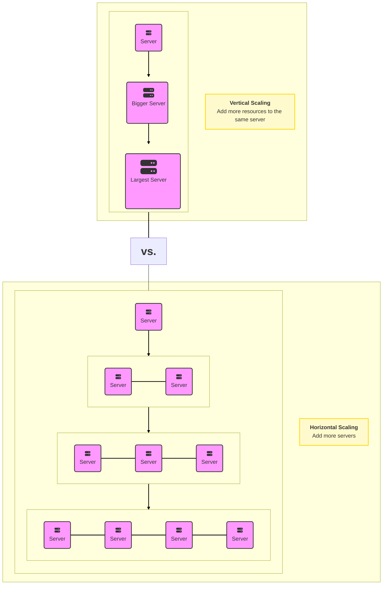

## Key Characteristics of Distributed Systems

### Scalability

Scalability is the ability of a system to handle an increasing workload, either by adding more resources (scaling out) or by upgrading the capacity of existing resources (scaling up).

#### A. Horizontal Scaling

Horizontal scaling, also known as scaling out, involves adding more machines or nodes to a system to distribute the workload evenly. This approach allows the system to handle an increased number of requests without overloading individual nodes. Horizontal scaling is particularly useful in distributed systems because it provides a cost-effective way to manage fluctuating workloads and maintain high availability.

#### B. Vertical Scaling

Vertical scaling, or scaling up, refers to increasing the capacity of individual nodes within a system. This can be achieved by upgrading the hardware, such as adding more CPU, memory, or storage. Vertical scaling can help improve the performance of a system by allowing it to handle more workloads on a single node. However, this approach has limitations, as there is a physical limit to the amount of resources that can be added to a single machine, and it can also lead to single points of failure.

#### Horizontal vs. Vertical Scaling

With horizontal-scaling it is often easier to scale dynamically by adding more machines into the existing pool; Vertical-scaling is usually limited to the capacity of a single server and scaling beyond that capacity often involves downtime and comes with an upper limit.

Good examples of horizontal scaling are Cassandra and MongoDB as they both provide an easy way to scale horizontally by adding more machines to meet growing needs. Similarly, a good example of vertical scaling is MySQL as it allows for an easy way to scale vertically by switching from smaller to bigger machines. However, this process often involves downtime.

### Availability

Availability is a measure of how accessible and reliable a system is to its users. In distributed systems, high availability is crucial to ensure that the system remains operational even in the face of failures or increased demand.

#### Definition of High Availability

High availability is often measured in terms of uptime, which is the ratio of time that a system is operational to the total time it is supposed to be operational. Achieving high availability involves minimizing planned and unplanned downtime, eliminating single points of failure, and implementing redundant systems and processes.

When it comes to distributed systems, high availability goes beyond simply ensuring that the system is up and running. It also involves guaranteeing that the system can handle increased load and traffic without compromising its performance. This scalability aspect is crucial, especially in scenarios where the user base grows rapidly or experiences sudden spikes in demand.

### Strategies for Achieving High Availability

To achieve high availability, organizations implement various strategies that focus on redundancy, replication, load balancing, distributed data storage, health monitoring, regular system maintenance, and geographic distribution.

#### 1. High Availability through Redundancy and Replication

One of the most effective strategies for achieving high availability is redundancy and replication. By duplicating critical components or entire systems, organizations can ensure that if one fails, the redundant system takes over seamlessly, avoiding any interruption in service.

#### 2. Availability through Load Balancing

Load balancing involves distributing workloads across multiple servers, ensuring that no single server is overwhelmed.

#### 3. Availability through Distributed Data Storage

Storing data across multiple locations or data centers enhances high availability by reducing the risk of data loss or corruption. Distributed data storage systems replicate data across geographically diverse locations, ensuring that even if one site experiences an outage, data remains accessible from other locations.

#### 4. Availability and Consistency Models (Strong, Weak, Eventual)

Consistency models define how a distributed system maintains a coherent and up-to-date view of its data across all replicas. Different consistency models provide different trade-offs between availability, performance, and data correctness.

Strong consistency ensures that all replicas have the same data at all times, at the cost of reduced availability and performance.

Weak consistency allows for temporary inconsistencies between replicas, with the advantage of improved availability and performance.

Eventual consistency guarantees that all replicas will eventually converge to the same data, providing a balance between consistency, availability, and performance.

#### 5. Availability through Health Monitoring and Alerts

Health monitoring involves continuously monitoring system performance, resource utilization, and various metrics to detect any anomalies or potential issues. Alerts are triggered when predefined thresholds are exceeded, allowing IT teams to take immediate action and prevent service disruptions.

#### 6. Availability through Regular System Maintenance and Updates

Regular system maintenance and updates are crucial for achieving high availability. By keeping systems up to date with the latest patches, security enhancements, and bug fixes, organizations can mitigate the risk of failures and vulnerabilities that could compromise system availability.

