## Network Essentials

### HTTP vs HTTPs

HTTP (Hypertext Transfer Protocol) and HTTPS (Hypertext Transfer Protocol Secure) are both protocols used for transmitting data over the internet, primarily used for loading webpages. While they are similar in many ways, the key difference lies in the security aspect provided by HTTPS.

#### 1. What is HTTP?

HTTP stands for HyperText Transfer Protocol. It's the foundational protocol used for transmitting data on the World Wide Web. When you enter a website address in your browser, HTTP is responsible for fetching and displaying that site.

**Stateless Protocol:** Each request from a client to a server is independent. The server doesn't retain any session information between requests.

**Text-Based:** Data is transmitted in plain text, making it readable by both humans and machines.

**Port 80:** By default, HTTP uses port 80 for communication.

#### 2. What is HTTPs?

HTTPS stands for HyperText Transfer Protocol Secure. It's an extension of HTTP with added security measures to protect data during transmission.

**Key Features of HTTPs**
**Encryption:** Uses protocols like SSL/TLS to encrypt data, ensuring that any intercepted information remains unreadable.

**Authentication:** Verifies that the website you're connecting to is legitimate, preventing man-in-the-middle attacks.

**Data Integrity:** Ensures that data isn't tampered with during transmission.

**Port 443:** HTTPS operates over port 443.

### How TLS handshake works

#### 1. The Core Concepts

Before the handshake begins, you must understand the two tools being used:

Asymmetric Encryption (The Handshake): Uses a Key Pair.

Public Key: Available to everyone. Used to encrypt data.

Private Key: Kept secret by the server. Used to decrypt data.

Mechanism: If you lock a box with the Public Key, only the Private Key can open it.

Symmetric Encryption (The Data Transfer): Uses a single "Session Key."

Both sides have the same key. It is used to lock and unlock the data.

Why switch? Asymmetric encryption is mathematically complex and slow. Symmetric encryption is incredibly fast.

#### 2. The Process: Step-by-Step

When you type https://google.com, your browser (Client) and the Google Server perform a TLS Handshake. This happens in milliseconds.

#### Phase 1: Negotiation (The "Hello")

Client Hello: Your browser sends a message listing the TLS versions and encryption algorithms (Cipher Suites) it supports. It also sends a random string of numbers (Client Random).

Server Hello: The server picks the best encryption algorithm from your list. It sends back its own random string (Server Random) and its Digital Certificate.

#### Phase 2: Authentication (Checking the ID)

The browser must prove the server is who it claims to be.

Certificate Check: The browser inspects the server's Digital Certificate. It looks at the Digital Signature on the certificate.

Chain of Trust: The browser asks: "Who signed this?" (e.g., DigiCert, Let's Encrypt). The browser has a pre-installed list of trusted authorities. If the signature matches a trusted authority, the identity is verified.

Public Key Extraction: The browser pulls the server's Public Key out of that verified certificate.

Phase 3: Key Exchange (The Secret Handoff)
Now they need to agree on a Session Key (Symmetric key) to encrypt the actual browsing data. There are two main ways this happens:

Option A: The RSA Key Exchange (Older, less common now)

The Client generates a random code called the Pre-Master Secret.

The Client encrypts this secret using the server's Public Key (extracted in Phase 2).

The Client sends this encrypted package to the Server.

The Server uses its Private Key to decrypt it. Now both sides have the Pre-Master Secret without anyone seeing it.

Option B: The Diffie-Hellman Exchange (Modern Standard, TLS 1.3)

Instead of sending a key across the wire, the two sides generate the key together mathematically.

The Math: Both sides share public variables (let's call them Paint Colors).

The Secret: Each side mixes their own secret color into the public paint.

The Swap: They exchange the mixed paints.

The Final Mix: Each side adds their secret color to the mix they just received.

Result: Both sides end up with the exact same final color (the Session Key), but a hacker seeing the exchanged paints cannot "un-mix" them to find the secret.

Phase 4: Encrypted Transmission
Both the Client and Server use the random numbers exchanged in Phase 1 + the Secret generated in Phase 3 to create the final Session Key.

The Handshake is complete.

Symmetric Encryption Begins: When you load the webpage, the data is encrypted using this Session Key. If a hacker intercepts the data, they see random characters (ciphertext).

```mermaid
sequenceDiagram
    autonumber
    participant C as Client (Browser)
    participant S as Server (Website)

    %% CONCEPT DEFINITIONS %%
    Note over C,S: 📚 CORE CONCEPTS (Prerequisites)<br/>1. Asymmetric Encryption: Uses Key Pair (Public locks, Private unlocks). Slow & Secure.<br/>2. Symmetric Encryption: Uses one "Session Key". Fast.<br/>3. Goal: Use Asymmetric to safely share the Symmetric Key.

    %% PHASE 1 %%
    rect rgb(240, 248, 255)
    Note over C,S: 🤝 PHASE 1: NEGOTIATION (The "Hello")

    C->>S: Client Hello
    Note right of C: Sends:<br/>• TLS Versions (1.2, 1.3)<br/>• Cipher Suites (Algorithms)<br/>• 🎲 Client Random (String #1)

    S->>C: Server Hello
    Note left of S: Selects Best Algorithm.<br/>Sends:<br/>• 🎲 Server Random (String #2)<br/>• 📜 Digital Certificate

    Note over C,S: ⏱️ TLS 1.3 Note: In newer versions, the math starts HERE (1 Round Trip).<br/>TLS 1.2 requires the full back-and-forth below (2 Round Trips).
    end

    %% PHASE 2 %%
    rect rgb(255, 250, 240)
    Note over C,S: 🛡️ PHASE 2: AUTHENTICATION (The "ID Check")

    Note over C: 🧐 Browser Inspects Certificate:<br/>1. Validates Digital Signature.<br/>2. Checks "Chain of Trust" (DigiCert, Let's Encrypt).<br/>3. IF TRUSTED: Extracts Server's Public Key (🔓).
    end

    %% PHASE 3 %%
    rect rgb(240, 255, 240)
    Note over C,S: 🔑 PHASE 3: KEY EXCHANGE (Choosing the Path)

    alt Option A: RSA Exchange (Older)
        C->>C: Generates "Pre-Master Secret"
        C->>S: Sends Secret (Encrypted with Server's 🔓 Public Key)
        Note left of S: Server decrypts with 🔐 Private Key.<br/>(Only Server can do this).
        Note over C,S: Result: Both have the Pre-Master Secret.
    else Option B: Diffie-Hellman (Modern/TLS 1.3)
        Note over C,S: 🎨 "The Paint Mixer" Analogy
        C->>S: Share Public Variables ("Paint Colors")
        S->>C: Share Public Variables
        C->>C: Mixes Secret Color + Public Paint
        S->>S: Mixes Secret Color + Public Paint
        C->>S: Swap Mixed Paints
        S->>C: Swap Mixed Paints
        Note over C,S: 🧮 Final Math: Each adds their secret to the mix.<br/>Result: Both derive exact same "Session Key" mathematically.<br/>(Hacker cannot "un-mix" the paint).
    end
    end

    %% PHASE 4 %%
    rect rgb(230, 230, 250)
    Note over C,S: 🔒 PHASE 4: ENCRYPTED TRANSMISSION

    Note over C,S: 🏗️ BUILD THE SESSION KEY<br/>Recipe: Client Random + Server Random + The Secret (from Phase 3).

    C->>S: Finished (Encrypted Hash)
    S->>C: Finished (Encrypted Hash)
    Note right of S: Integrity Check: Verifies handshake wasn't tampered with.

    Note over C,S: 🚀 SYMMETRIC ENCRYPTION BEGINS (The "Armored Truck")

    C->>S: HTTP Request (Encrypted)
    Note right of C: 🔐 THE LOCK MECHANISM (AES-256)<br/>Input: "Get /home" + Session Key<br/>Output: "Xy7#b9@z" (Ciphertext)<br/>Security: 2^256 combinations (Universe Age to crack).

    S->>C: HTTP Response (Encrypted)
    Note left of S: Server uses same Session Key to decrypt,<br/>process request, and encrypt response.
    end
```

