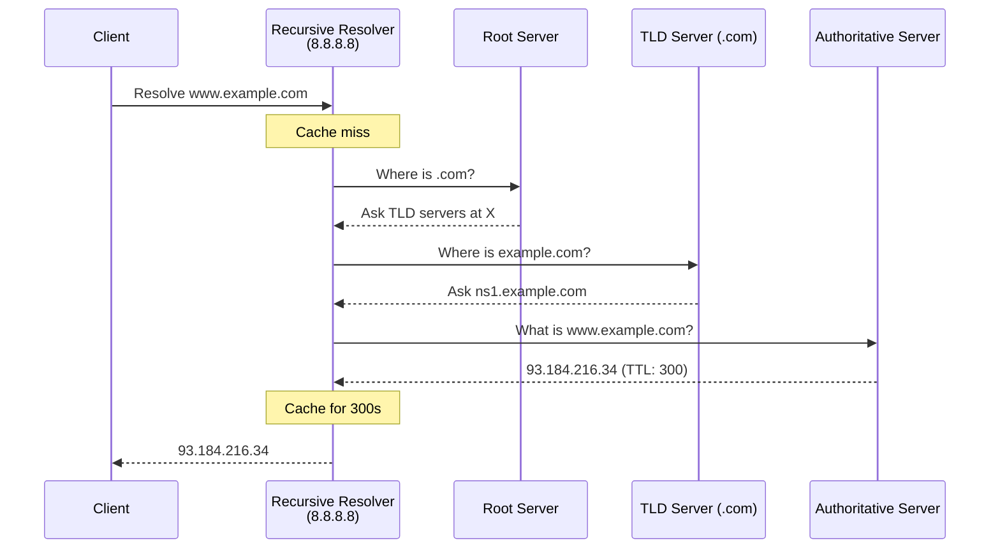
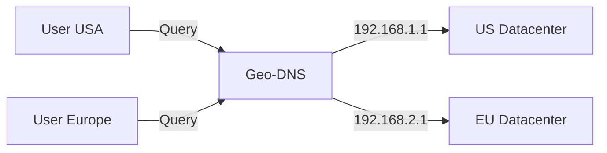

## DNS (Domain Name System)


DNS is a hierarchical, distributed naming system that translates domain names (e.g., `www.google.com`) into IP addresses (e.g., `142.250.190.4`). It's the internet's phonebook.

**Why DNS matters in system design:**
- Enables server migrations without user impact (abstraction layer)
- First layer of load distribution and traffic management
- Critical for global scale (CDNs, geo-routing, failover)

### DNS Hierarchy and Resolution



| Server Type | Role |
|-------------|------|
| **Root Servers** | 13 logical servers (A-M), ~1500+ instances via anycast. Entry point to hierarchy |
| **TLD Servers** | Manage .com, .org, etc. Point to authoritative servers |
| **Authoritative Servers** | Hold actual DNS records. Source of truth for a domain |
| **Recursive Resolver** | Does the heavy lifting for clients. Caches results |

### Essential DNS Records

| Record | Purpose | System Design Use |
|--------|---------|-------------------|
| **A** | Domain → IPv4 | Basic mapping, multiple for load balancing |
| **AAAA** | Domain → IPv6 | IPv6 support |
| **CNAME** | Alias → another domain | CDN integration (`cdn.example.com → d123.cloudfront.net`) |
| **NS** | Authoritative nameservers | Delegation |
| **MX** | Mail servers (with priority) | Email routing |

### TTL (Time To Live)

TTL controls how long DNS records are cached. This is crucial for system design trade-offs.

| TTL | Trade-off | When to Use |
|-----|-----------|-------------|
| **Low (60-300s)** | More DNS queries, faster failover | During migrations, active incident response |
| **High (1hr-1day)** | Fewer queries, slower propagation | Stable infrastructure |

**Interview insight:** Before a migration, lower TTL days in advance. After stable, raise it back.

### DNS-Based Load Balancing

#### Round-Robin DNS

Multiple A records for the same domain, rotated in responses.

```
example.com.  A  192.168.1.1
example.com.  A  192.168.1.2
example.com.  A  192.168.1.3
```

| Pros | Cons |
|------|------|
| Zero infrastructure cost | No health checks |
| Simple to implement | Client caching breaks distribution |
| Works everywhere | No awareness of server load |

**When to use:** Basic redundancy for stateless services. Never as sole load balancing for production.

#### Geo-DNS

Returns different IPs based on client location.



| Routing Policy | Use Case |
|----------------|----------|
| **Geographic** | Compliance, data residency |
| **Latency-based** | Performance optimization |
| **Failover** | Primary + secondary with health checks |
| **Weighted** | Gradual rollouts, A/B testing |

**Limitation:** Relies on IP geolocation (VPN users get wrong region). Failover speed limited by TTL.

### Anycast vs Geo-DNS

| Aspect | Anycast | Geo-DNS |
|--------|---------|---------|
| **How it works** | Same IP announced from multiple locations via BGP | Different IPs returned based on client location |
| **Routing layer** | Network (BGP) | Application (DNS) |
| **Failover speed** | Seconds (BGP convergence) | Minutes (DNS TTL) |
| **Best for** | Stateless (DNS, CDN) | Stateful applications |
| **TCP sessions** | Can break on route changes | Stable |

**Key insight:** Public DNS resolvers (8.8.8.8, 1.1.1.1) use anycast. CDNs use both.

### CDN and DNS Integration

CDNs use DNS to direct users to the nearest edge server.

```
1. User requests cdn.example.com/image.jpg
2. DNS: cdn.example.com → CNAME → d123.cloudfront.net
3. CDN DNS returns nearest edge IP (using geo/anycast)
4. Edge: Cache HIT → serve | Cache MISS → fetch from origin
```

**CNAME limitation:** Can't use CNAME at zone apex (`example.com`). Use ALIAS/ANAME records or CDN's anycast IP.

### Interview Checklist

| Topic | Key Points to Mention |
|-------|----------------------|
| **Resolution flow** | Client → Recursive Resolver → Root → TLD → Authoritative |
| **Caching** | Multiple layers (browser, OS, resolver). TTL controls freshness |
| **Load balancing** | Round-robin (simple), Geo-DNS (location), Anycast (network-level) |
| **TTL trade-offs** | Low = fast failover + more queries. High = fewer queries + stale data |
| **CDN integration** | CNAME to CDN, CDN resolves to edge. Mention cache HIT/MISS |
| **Failover** | Health checks + DNS updates. Anycast faster than DNS-based |

### Common Interview Scenarios

**"How would you handle a datacenter failover?"**
- Lower TTL beforehand
- Health checks detect failure
- DNS stops returning failed DC's IP
- Traffic shifts to healthy DC (delay = TTL)
- For faster: use anycast or L4 load balancer

**"Design a globally distributed service"**
- Geo-DNS for API servers (stateful, needs session affinity)
- CDN for static assets (stateless, cache at edge)
- Anycast for DNS resolution itself
- Consider: data replication, consistency trade-offs

---

