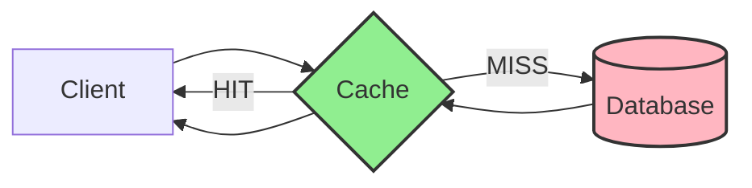
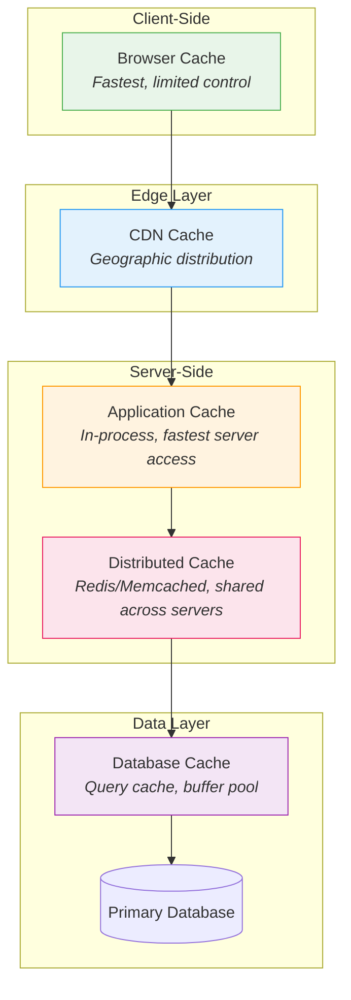

## What is Caching?

Caching is a technique that stores copies of frequently accessed data in a high-speed storage layer (the cache) to reduce the time and resources needed to fetch that data from its original, slower source. The cache sits between the data consumer and the data source, serving as a shortcut that dramatically improves response times.

**The fundamental trade-off:** Caching exchanges storage space and data freshness for speed. You are essentially betting that the cost of occasionally serving stale data is less than the cost of always fetching fresh data.

### Why Caching Matters in System Design

| Problem | How Caching Solves It |
|---------|----------------------|
| **High Latency** | Serves data from memory (nanoseconds) instead of disk/network (milliseconds) |
| **Database Overload** | Reduces read traffic to the database by 80-99% |
| **Network Costs** | Fewer requests to origin servers, lower bandwidth bills |
| **Scalability** | Enables handling 10x-100x more requests without scaling the database |

**Interview insight:** Always quantify the impact. "Adding a Redis cache reduced our p99 latency from 200ms to 15ms and cut database load by 90%."

### The Caching Hierarchy

Data can be cached at multiple layers, each with different trade-offs:

| Cache Layer | Latency | Capacity | Scope | Example |
|------------|---------|----------|-------|---------|
| **Browser** | ~0ms | Small (MB) | Single user | HTTP cache headers |
| **CDN** | 10-50ms | Large (TB) | Regional | Cloudflare, CloudFront |
| **Application** | <1ms | Medium (GB) | Single server | In-memory HashMap |
| **Distributed** | 1-5ms | Large (TB) | Cluster-wide | Redis, Memcached |
| **Database** | 1-10ms | Medium (GB) | Database scope | MySQL query cache |

**Key principle:** Cache as close to the user as possible. Each layer you move closer reduces latency significantly.

---

