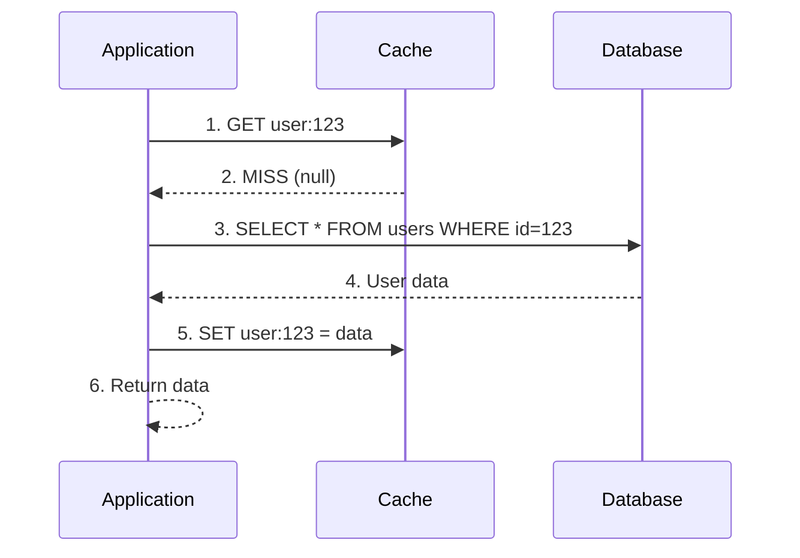
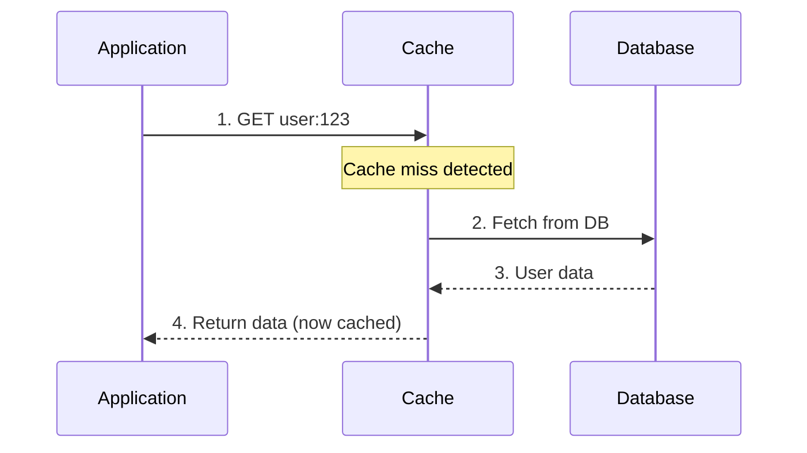
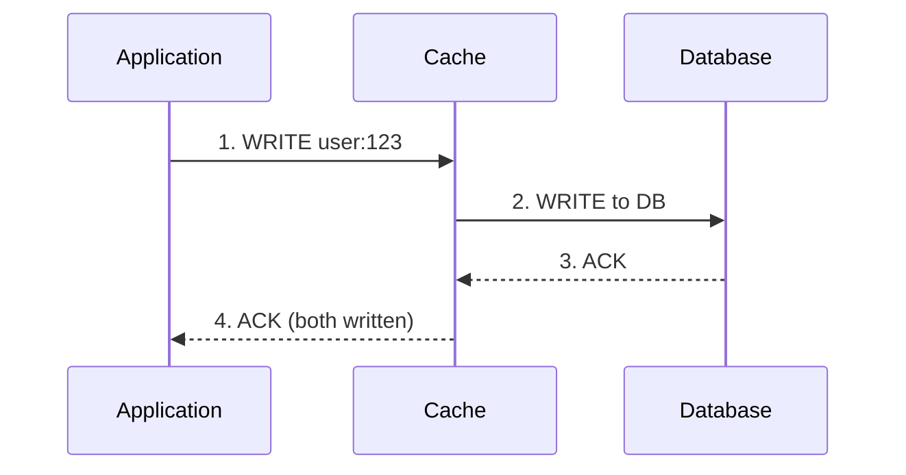
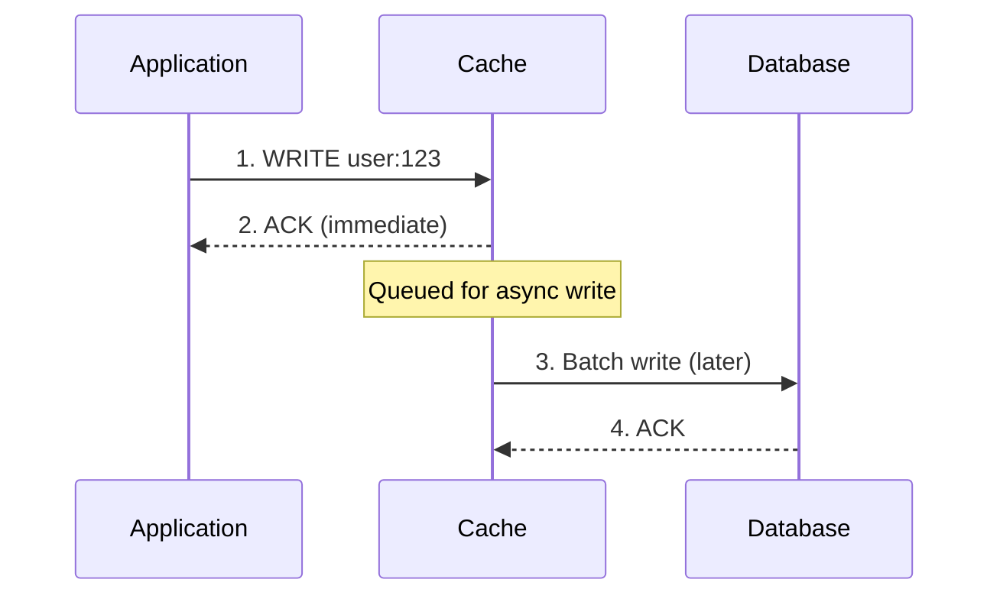
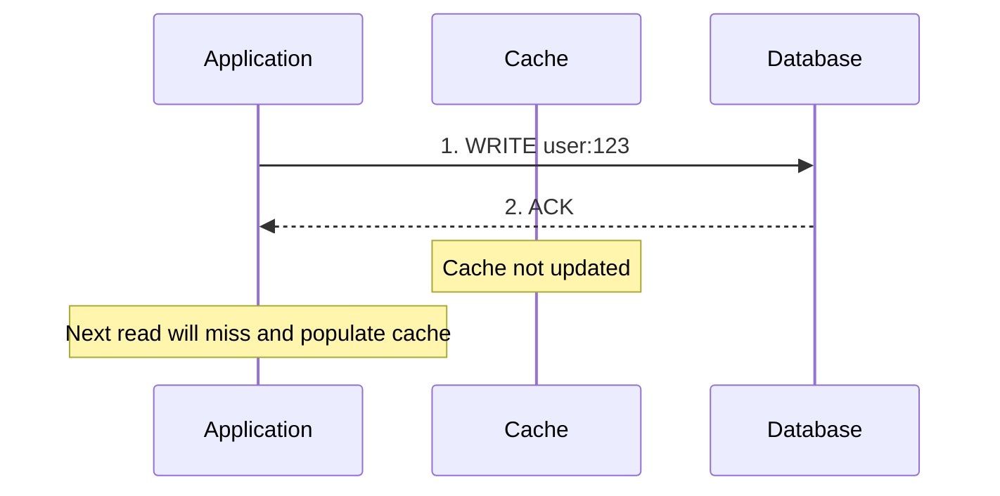

## Cache Strategies


Cache strategies define how your application reads from and writes to the cache. Choosing the right strategy depends on your read/write ratio, consistency requirements, and failure tolerance.

### Read Strategies

#### 1. Cache-Aside (Lazy Loading)

The application manages the cache explicitly. On a read, it first checks the cache; if missed, it fetches from the database and populates the cache.



```
# Pseudocode
def get_user(user_id):
    data = cache.get(f"user:{user_id}")
    if data is None:  # Cache miss
        data = db.query("SELECT * FROM users WHERE id = ?", user_id)
        cache.set(f"user:{user_id}", data, ttl=3600)
    return data
```

| Pros | Cons |
|------|------|
| Only requested data is cached (no waste) | Cache miss = 3 round trips (slow first request) |
| Cache failure doesn't break the app | Data can become stale |
| Simple to implement | Application manages cache logic |

**Best for:** Read-heavy workloads where data is requested unevenly (some items hot, most cold).

---

#### 2. Read-Through

The cache sits in front of the database. The application only talks to the cache, which fetches from the database on a miss.



| Pros | Cons |
|------|------|
| Application code is simpler | Cache library must support DB integration |
| Consistent caching logic | Less flexibility in cache population |
| Cache handles miss logic | Tight coupling between cache and data source |

**Best for:** When you want to abstract caching logic away from application code.

**Key difference from Cache-Aside:** In read-through, the cache is responsible for loading data. In cache-aside, the application is responsible.

---

### Write Strategies

#### 1. Write-Through

Every write goes to both the cache and the database synchronously. The write is only acknowledged after both succeed.



| Pros | Cons |
|------|------|
| Cache and DB always consistent | Higher write latency (2 writes) |
| No stale data | Every write hits DB (no write reduction) |
| Simple mental model | Cache may hold rarely-read data |

**Best for:** Systems where read-after-write consistency is critical (user profile updates, settings).

---

#### 2. Write-Behind (Write-Back)

Writes go to the cache immediately and return. The cache asynchronously flushes writes to the database in batches.



| Pros | Cons |
|------|------|
| Extremely fast writes | Risk of data loss if cache crashes |
| Reduces DB write load (batching) | Complex failure handling |
| Absorbs write spikes | Eventual consistency |

**Best for:** High write throughput systems where slight data loss is acceptable (analytics, counters, logs).

**Warning:** If the cache node dies before flushing, you lose data. Use replication or WAL (Write-Ahead Log).

---

#### 3. Write-Around

Writes go directly to the database, bypassing the cache. The cache is only populated on reads.



| Pros | Cons |
|------|------|
| Prevents cache churn from write-heavy data | First read after write is slow (miss) |
| Good for write-once, read-rarely data | Cache may serve stale data until TTL |

**Best for:** Data that is written frequently but read rarely (audit logs, historical records).

---

### Strategy Comparison Matrix

| Strategy | Consistency | Write Latency | Read Latency (Miss) | Data Loss Risk | Use Case |
|----------|-------------|---------------|---------------------|----------------|----------|
| **Cache-Aside** | Eventual | N/A (direct DB) | High (3 hops) | None | General purpose, read-heavy |
| **Read-Through** | Eventual | N/A | Medium (2 hops) | None | Abstracted caching |
| **Write-Through** | Strong | High | Low | None | Consistency critical |
| **Write-Behind** | Eventual | Very Low | Low | **High** | Write-heavy, analytics |
| **Write-Around** | Eventual | Low | High (first read) | None | Write-once data |

### Combining Strategies

In practice, you often combine read and write strategies:

| Combination | When to Use |
|-------------|-------------|
| **Cache-Aside + Write-Around** | Default choice for most applications |
| **Read-Through + Write-Through** | When you need strong consistency |
| **Cache-Aside + Write-Behind** | High-performance with acceptable risk |

**Interview tip:** Always mention the trade-off. "We chose write-through because user profile consistency was critical, accepting the higher write latency."

---

