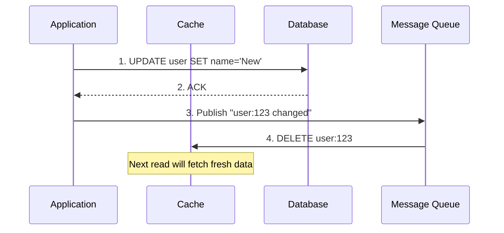
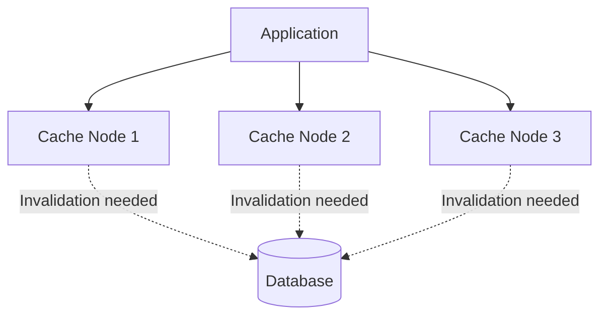

## Cache Invalidation


Cache invalidation is one of the "two hard problems" in computer science. The challenge: how do you ensure the cache doesn't serve stale data after the source of truth changes?

> "There are only two hard things in Computer Science: cache invalidation and naming things." — Phil Karlton

### Invalidation Strategies

#### 1. Time-To-Live (TTL)

Each cache entry has an expiration timestamp. After TTL expires, the entry is considered stale and will be refreshed on the next request.

```
cache.set("user:123", user_data, ttl=3600)  # Expires in 1 hour
```

| TTL Value | Trade-off | Use Case |
|-----------|-----------|----------|
| **Short (seconds)** | Fresh data, more DB load | Stock prices, live scores |
| **Medium (minutes)** | Balanced | User profiles, product info |
| **Long (hours/days)** | Stale data risk, low DB load | Static content, configs |

**The TTL dilemma:** Too short = cache is useless. Too long = users see stale data.

**Best practice:** Start with a reasonable TTL (5-15 minutes), then tune based on cache hit rate and staleness tolerance.

---

#### 2. Event-Based Invalidation

Actively invalidate or update cache entries when the underlying data changes.



**Two approaches:**

| Approach | Description | Pros | Cons |
|----------|-------------|------|------|
| **Invalidate** | Delete the cache key | Simple, always consistent | Next read is slow (miss) |
| **Update** | Update cache with new value | No miss penalty | Risk of race conditions |

**Race condition warning:** If you update (not delete), concurrent writes can cause the cache to hold an older value than the DB.

```
# Dangerous: Race condition possible
Thread A: Read DB (version 1)
Thread B: Read DB (version 2)
Thread B: Write cache (version 2)
Thread A: Write cache (version 1)  <-- Stale!

# Safe: Invalidate instead
Thread A: DELETE cache key
Thread B: DELETE cache key
# Next read will fetch the latest version
```

---

#### 3. Version-Based Invalidation

Embed a version number in the cache key. When data changes, increment the version.

```
# Version 1
cache.get("user:123:v1")

# After update, use version 2
cache.get("user:123:v2")  # Old key automatically orphaned
```

| Pros | Cons |
|------|------|
| No explicit delete needed | Orphaned keys waste memory |
| Works well with immutable data | Requires version tracking |
| Natural cache busting for static assets | Key management complexity |

**Common use case:** Static asset URLs with hash/version (`app.js?v=abc123`).

---

### Invalidation Patterns Comparison

| Pattern | Consistency | Complexity | Best For |
|---------|-------------|------------|----------|
| **TTL Only** | Eventual (bounded staleness) | Low | Read-heavy, staleness OK |
| **Event-Based Delete** | Strong (after propagation) | Medium | Most applications |
| **Event-Based Update** | Strong (if no race) | High | Write-through systems |
| **Version-Based** | Strong | Medium | Immutable data, assets |

### Cache Invalidation in Distributed Systems

When you have multiple cache nodes, invalidation becomes harder:



**Challenge:** How do you ensure all nodes invalidate simultaneously?

| Solution | How It Works |
|----------|--------------|
| **Pub/Sub** | Publish invalidation events to all cache nodes (Redis Pub/Sub, Kafka) |
| **Consistent Hashing** | Each key lives on one node only, no broadcast needed |
| **Short TTL + Event** | Use TTL as safety net, events for immediate invalidation |

**Interview insight:** "We used Redis Pub/Sub to broadcast invalidation events, with a 5-minute TTL as a fallback in case messages were lost."

---

