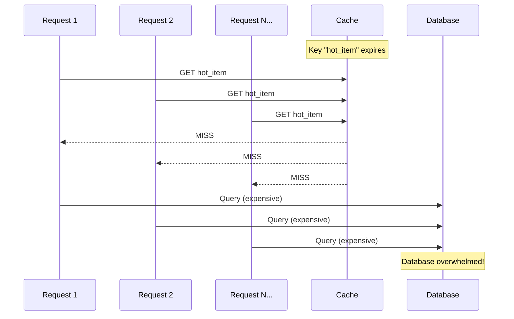
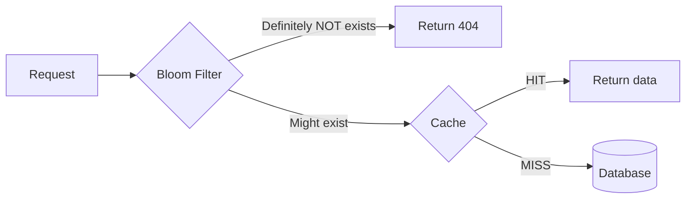

## Caching Challenges


Caching introduces complexity. Understanding these challenges and their solutions is critical for system design interviews.

### 1. Cache Stampede (Thundering Herd)

When a popular cache entry expires, hundreds of concurrent requests simultaneously hit the database to regenerate it.



**Solutions:**

| Solution | How It Works | Trade-off |
|----------|--------------|-----------|
| **Locking** | First request acquires lock, others wait | Adds latency for waiting requests |
| **Probabilistic Early Refresh** | Randomly refresh before TTL expires | May refresh unnecessarily |
| **Stale-While-Revalidate** | Serve stale data while refreshing in background | Brief staleness |

**Locking implementation:**
```
def get_with_lock(key):
    data = cache.get(key)
    if data is not None:
        return data

    # Try to acquire lock
    if cache.set(f"lock:{key}", "1", nx=True, ttl=30):
        # Won the lock, fetch from DB
        data = db.query(key)
        cache.set(key, data, ttl=3600)
        cache.delete(f"lock:{key}")
        return data
    else:
        # Another request is fetching, wait and retry
        time.sleep(0.1)
        return get_with_lock(key)
```

---

### 2. Cache Penetration

Queries for data that doesn't exist bypass the cache and always hit the database.

```
Request: GET user:999999 (doesn't exist)
Cache: MISS
DB: NULL
Cache: Nothing to cache → Next request hits DB again
```

**Attack vector:** Malicious users can flood your system with requests for non-existent keys.

**Solutions:**

| Solution | How It Works |
|----------|--------------|
| **Cache Null Values** | Store `NULL` with short TTL: `cache.set("user:999", NULL, ttl=60)` |
| **Bloom Filter** | Probabilistic filter that quickly rejects non-existent keys |

**Bloom filter approach:**


---

### 3. Cache Breakdown (Hot Key Problem)

A single extremely popular key expires, causing massive load on one database shard.

**Different from stampede:** Stampede affects many keys; breakdown is about one ultra-hot key.

**Solutions:**

| Solution | Description |
|----------|-------------|
| **Never expire hot keys** | Remove TTL for critical keys, invalidate manually |
| **Mutex/Lock** | Same as stampede solution |
| **Replicate hot keys** | Store copies across multiple cache nodes |

---

### 4. Cache Avalanche

Many cache entries expire simultaneously, causing massive database load.

**Common cause:** Server restart clears all cache, or all keys were set with the same TTL.

**Solutions:**

| Solution | Description |
|----------|-------------|
| **Jittered TTL** | Add random offset: `ttl = base_ttl + random(0, 300)` |
| **Warm-up on restart** | Pre-populate cache before accepting traffic |
| **Circuit breaker** | Fail fast if DB is overwhelmed |

```
# Add jitter to prevent synchronized expiration
base_ttl = 3600
jitter = random.randint(0, 300)
cache.set(key, value, ttl=base_ttl + jitter)
```

---

### 5. Data Inconsistency

Cache and database can become out of sync due to failed updates, race conditions, or network partitions.

**Classic race condition:**
```
Time 1: Thread A reads user (version 1) from DB
Time 2: Thread B updates user to version 2 in DB
Time 3: Thread B invalidates cache
Time 4: Thread A writes version 1 to cache ← STALE!
```

**Solutions:**

| Solution | Description |
|----------|-------------|
| **Delete, don't update** | Always invalidate instead of updating cache |
| **Read-your-writes** | After write, read from DB (not cache) |
| **Versioning** | Include version in cache key or value |
| **Short TTL** | Limit staleness window |

---

### Challenge Summary Table

| Challenge | Symptom | Primary Solution |
|-----------|---------|------------------|
| **Stampede** | DB spike when popular key expires | Locking or stale-while-revalidate |
| **Penetration** | DB hit for non-existent data | Cache nulls + Bloom filter |
| **Breakdown** | Single hot key overwhelms DB | Never-expire + replication |
| **Avalanche** | Mass expiration crashes DB | Jittered TTL |
| **Inconsistency** | Stale data served | Delete-based invalidation |

---

