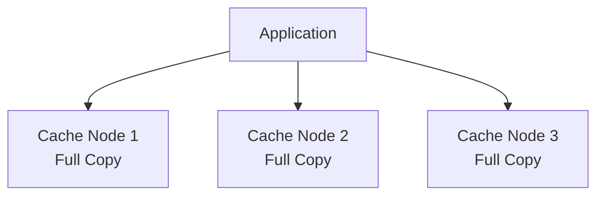
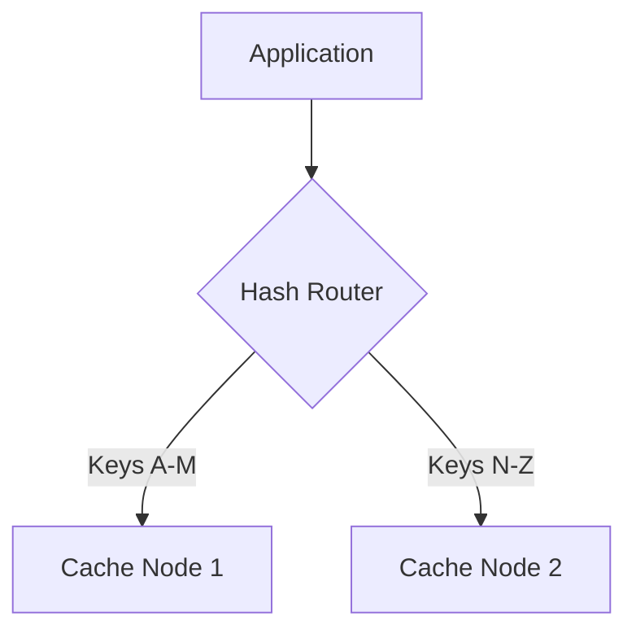
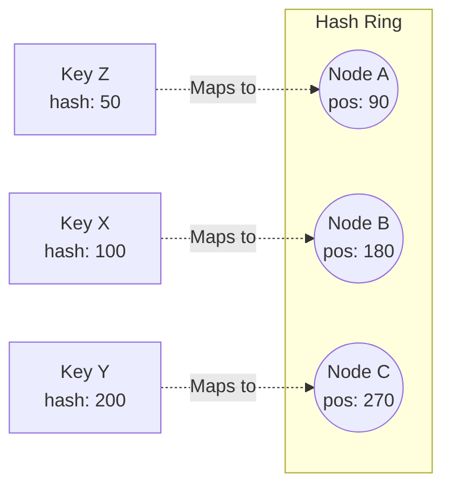

## Distributed Caching

When a single cache server isn't enough, you need a distributed cache cluster. This introduces new challenges around data distribution and consistency.

### Cache Topologies

#### 1. Replicated Cache

Every node holds a complete copy of all data.

| Pros | Cons |
|------|------|
| Any node can serve any request | Limited by smallest node's memory |
| High availability | Write amplification (update all nodes) |
| Simple reads | Consistency challenges |

**Best for:** Small datasets that are read-heavy.

---

#### 2. Partitioned (Sharded) Cache

Data is divided across nodes. Each key lives on one node.

**How to route:** Use consistent hashing to determine which node owns a key.

| Pros | Cons |
|------|------|
| Scales horizontally | Node failure loses that shard's data |
| Large total capacity | Cross-shard operations expensive |
| Write scales linearly | Hot keys can overload one node |

**Best for:** Large datasets, write-heavy workloads.

---

### Consistent Hashing

Traditional hashing (`hash(key) % num_nodes`) breaks when nodes are added/removed — nearly all keys remap.

Consistent hashing minimizes key movement when the cluster changes.

**Rule:** A key maps to the first node clockwise from its hash position.

**When Node B fails:** Only keys between A and B remap to C. Other keys unchanged.

| Operation | Keys Remapped |
|-----------|---------------|
| Add node | ~1/N of keys (N = total nodes) |
| Remove node | ~1/N of keys |

**Virtual nodes:** Each physical node gets multiple positions on the ring to ensure even distribution.

---

### Redis vs Memcached

| Feature | Redis | Memcached |
|---------|-------|-----------|
| **Data Structures** | Strings, Lists, Sets, Hashes, Sorted Sets | Strings only |
| **Persistence** | RDB snapshots, AOF logs | None (pure cache) |
| **Replication** | Built-in master-replica | None |
| **Clustering** | Redis Cluster (auto-sharding) | Client-side sharding |
| **Memory Efficiency** | Higher overhead | More efficient for simple K/V |
| **Pub/Sub** | Yes | No |
| **Lua Scripting** | Yes | No |

**When to use Redis:** Need data structures, persistence, or pub/sub.

**When to use Memcached:** Simple key-value, maximum memory efficiency, multi-threaded performance.

---

