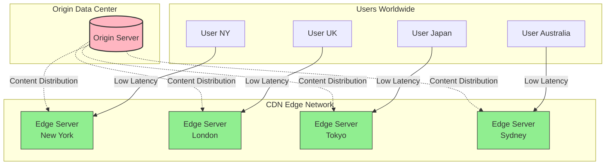
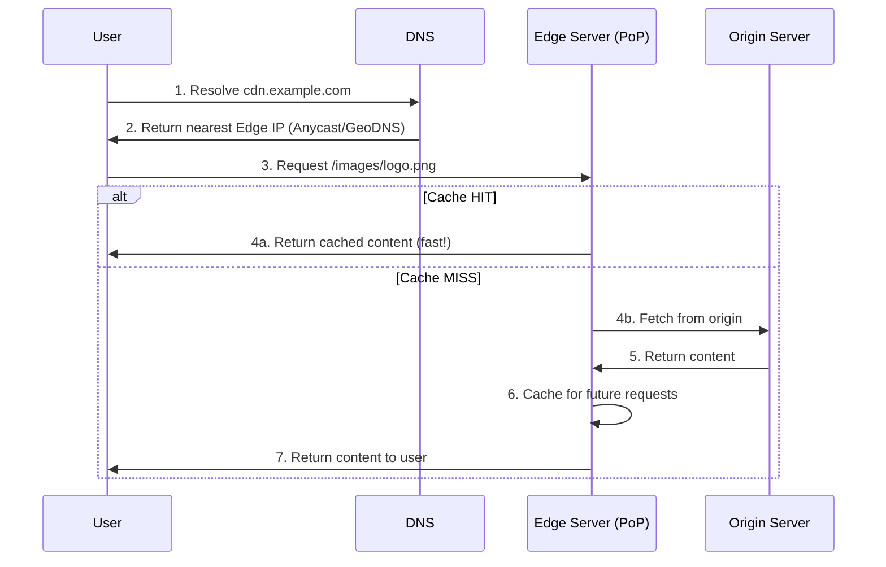
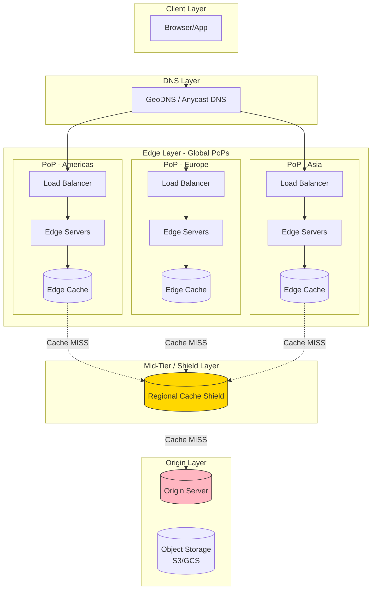
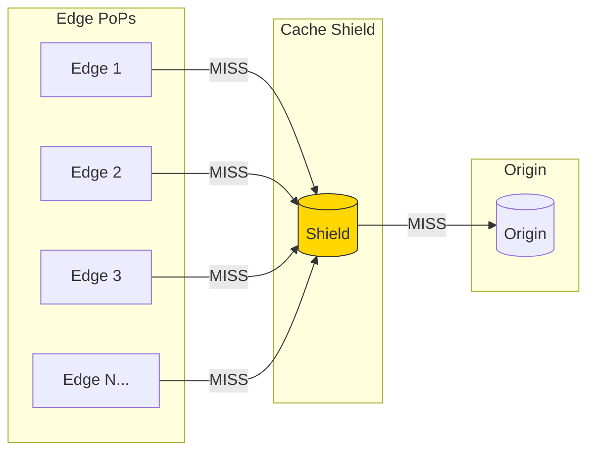
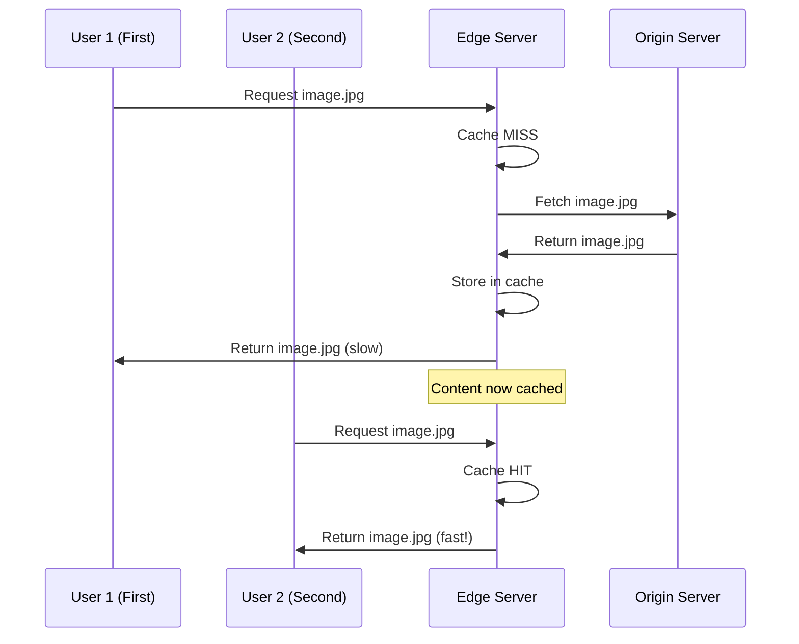
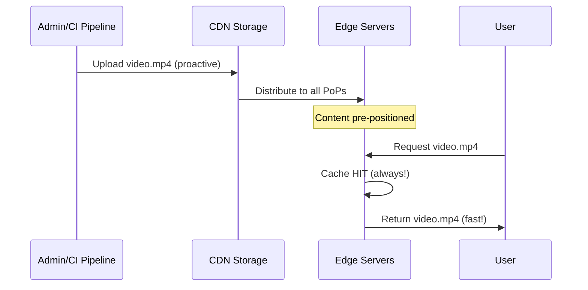
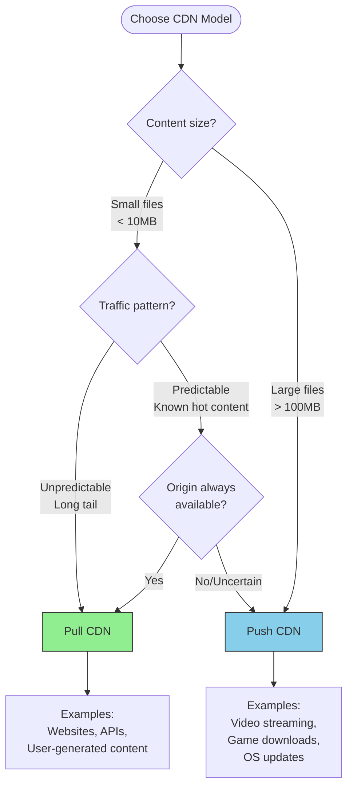

## CDN (Content Delivery Network)


### What is CDN?

A Content Delivery Network (CDN) is a geographically distributed network of servers that delivers content to users from the server closest to them. Instead of every user fetching content from a single origin server (potentially thousands of miles away), a CDN caches content at multiple "edge" locations worldwide, dramatically reducing latency and load on the origin.



**The core value proposition:** A user in Tokyo requesting an image from a US-based website gets it from a Tokyo edge server (~20ms) instead of crossing the Pacific Ocean (~200ms). This 10x latency reduction is why CDNs are essential for any globally accessible application.

### Why CDN Matters in System Design

| Problem | How CDN Solves It |
|---------|-------------------|
| **High Latency** | Serves content from geographically nearest server |
| **Origin Overload** | Offloads 80-95% of static content requests |
| **Bandwidth Costs** | Reduces egress from expensive origin data centers |
| **Availability** | If one edge fails, traffic routes to the next nearest |
| **DDoS Protection** | Distributed network absorbs attack traffic across many nodes |

**Interview insight:** "Our CDN handles 95% of static asset requests, reducing origin server load from 100K to 5K requests per second, and dropping global p50 latency from 180ms to 25ms."

---

### Origin Server vs. Edge Server

Understanding the distinction between origin and edge servers is fundamental to CDN architecture.

#### Origin Server

The **origin server** is the authoritative source of truth for your content. It hosts the original, canonical version of all files and data. When content isn't available at an edge location, the CDN fetches it from the origin.

**Characteristics:**
- Single location (or small number of replicated data centers)
- Contains the master copy of all content
- Handles cache misses from edge servers
- Typically where your application logic runs
- Higher latency for distant users if accessed directly

### Edge Server

**Edge servers** (also called PoPs - Points of Presence) are CDN nodes distributed globally. They cache copies of content and serve users from the nearest location.

**Characteristics:**
- Hundreds to thousands of locations worldwide
- Store cached copies of popular content
- No application logic—just content delivery
- Optimized for fast reads and high throughput
- Automatically route users to nearest healthy node

```mermaid
flowchart LR
    subgraph Origin_Characteristics [Origin Server]
        O1[Single Location]
        O2[Master Data Copy]
        O3[Application Logic]
        O4[Handles Cache Misses]
    end

    subgraph Edge_Characteristics [Edge Server]
        E1[Global Distribution]
        E2[Cached Copies]
        E3[No App Logic]
        E4[Optimized for Speed]
    end

    User([User Request]) --> Decision{Content<br/>Cached?}
    Decision -->|Yes - Cache HIT| Edge_Characteristics
    Decision -->|No - Cache MISS| Origin_Characteristics
    Origin_Characteristics -->|Populate Cache| Edge_Characteristics
    Edge_Characteristics -->|Response| User

    style Decision fill:#FFD700,stroke:#333
    style Origin_Characteristics fill:#FFB6C1,stroke:#333
    style Edge_Characteristics fill:#90EE90,stroke:#333
```



#### Comparison Table

| Aspect | Origin Server | Edge Server |
|--------|---------------|-------------|
| **Location** | Centralized (1-3 data centers) | Distributed (100s of PoPs) |
| **Content** | Original, authoritative | Cached copies |
| **Latency to User** | High (100-300ms globally) | Low (10-50ms) |
| **Traffic Volume** | Low (only cache misses) | High (serves most requests) |
| **Cost** | Higher compute costs | Higher bandwidth costs |
| **Failure Impact** | Critical—affects cache refills | Minimal—traffic reroutes |

**Interview tip:** "The origin is like a warehouse storing all inventory, while edge servers are local stores. Customers shop at local stores for speed, but the warehouse restocks them and handles special orders."

---

### CDN Architecture

A CDN's architecture determines how content flows from origin to users. Understanding this flow is critical for system design interviews.

### How a CDN Request Works



### Request Flow Explained

1. **DNS Resolution:** User's browser resolves `cdn.example.com`. The CDN's DNS (using GeoDNS or Anycast) returns the IP of the nearest edge server.

2. **Edge Selection:** The CDN automatically routes the user to the optimal PoP based on:
   - Geographic proximity
   - Network latency
   - Server health and load
   - ISP peering arrangements

3. **Cache Check:** The edge server checks if the requested content exists in its cache and is still valid (not expired).

4. **Cache HIT:** If cached, content is served immediately (~10-50ms latency).

5. **Cache MISS:** If not cached, the edge fetches from origin, caches the response, then serves the user.

#### CDN Components Architecture



### Key Architectural Components

| Component | Purpose | Example |
|-----------|---------|---------|
| **GeoDNS** | Routes users to nearest PoP based on IP geolocation | Route53, Cloudflare DNS |
| **Anycast** | Single IP advertised from multiple locations; network routes to nearest | Used by Cloudflare, Google |
| **Edge Cache** | Stores content at PoP level; first cache layer | SSD-based, in-memory |
| **Cache Shield** | Mid-tier cache that protects origin from thundering herd | Reduces origin load by 90%+ |
| **Origin** | Authoritative content source | Your servers, S3, GCS |

### Cache Shield (Mid-Tier Caching)

A **cache shield** is an intermediate caching layer between edge servers and the origin. Instead of every edge PoP hitting the origin on a cache miss, they first check a regional shield.

**Why it matters:**
- Without shield: 100 PoPs × 1 miss each = 100 origin requests
- With shield: 100 PoPs hit 3 regional shields = 3 origin requests max



**Interview insight:** "We added a cache shield layer, reducing origin requests from 50K/sec during cache expiration storms to under 100/sec—a 500x reduction."

---

### Push CDN vs. Pull CDN

The two fundamental CDN models differ in **who initiates content distribution**: the origin (push) or the edge (pull). This is one of the most common CDN questions in system design interviews.

#### Pull CDN (Lazy Loading)

In a **Pull CDN**, edge servers fetch content from the origin **on-demand** when a user requests it. The first user experiences a cache miss; subsequent users get cached content.



**How it works:**
1. User requests content from edge
2. Edge checks cache → MISS on first request
3. Edge fetches from origin, caches it, returns to user
4. Subsequent requests served from cache until TTL expires

**Pros:**
- Simple setup—just point your domain to the CDN
- Storage efficient—only caches content that's actually requested
- Automatic—no manual content management needed

**Cons:**
- First user experiences higher latency (cache miss penalty)
- Origin must always be available for cache misses
- Can cause origin spikes when cache expires (thundering herd)

**Best for:**
- Websites with unpredictable traffic patterns
- Large content libraries where not everything is accessed
- Dynamic content with short TTLs
- Most general-purpose web applications

---

### Push CDN (Proactive Loading)

In a **Push CDN**, you explicitly upload content to the CDN **before** users request it. The CDN acts more like distributed storage than a cache.



**How it works:**
1. You upload content directly to CDN storage (API, CLI, or CI/CD)
2. CDN distributes content to edge locations proactively
3. Users always get cache hits (content is pre-positioned)
4. You manage content lifecycle (upload, update, delete)

**Pros:**
- No cache miss penalty—content always available at edge
- Origin can be offline—CDN serves independently
- Predictable performance—no cold start latency
- Full control over what's cached and where

**Cons:**
- Higher storage costs—pay for all content, not just popular items
- Manual management—you must upload/update/delete content
- Replication delay—takes time to propagate to all PoPs
- Overkill for frequently changing content

**Best for:**
- Video streaming platforms (Netflix, YouTube)
- Software distribution (game patches, app updates)
- Static assets that rarely change (logos, fonts)
- Scenarios where origin availability is uncertain

---

### Push vs. Pull Comparison

| Aspect | Pull CDN | Push CDN |
|--------|----------|----------|
| **Content Loading** | On-demand (lazy) | Proactive (eager) |
| **First Request** | Cache miss (slow) | Cache hit (fast) |
| **Storage Cost** | Lower (only popular content) | Higher (all content) |
| **Origin Dependency** | Required for misses | Can work offline |
| **Management** | Automatic | Manual upload/delete |
| **Best For** | Websites, APIs | Video, large files |
| **TTL Control** | Cache headers | Explicit versioning |
| **Invalidation** | Purge API + wait for TTL | Re-upload new version |

### Decision Framework



### Hybrid Approach

Most production systems use **both** models:

- **Pull CDN** for HTML, CSS, JS, and user-uploaded images
- **Push CDN** for video content, software binaries, and critical static assets

**Example architecture:**
```
cdn.example.com/static/*     → Pull CDN (CloudFront)
cdn.example.com/videos/*     → Push CDN (dedicated video CDN)
cdn.example.com/downloads/*  → Push CDN (pre-positioned binaries)
```

**Interview tip:** "We use a hybrid approach: Pull CDN for our website assets since traffic is unpredictable and storage efficiency matters, but Push CDN for video content where eliminating cache misses is critical for user experience."

---

