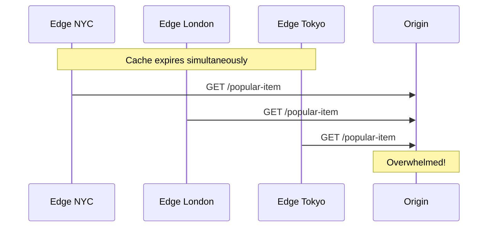

## CDN Challenges


While CDNs provide significant benefits, they introduce complexity. Understanding these challenges demonstrates depth in system design interviews.

### 1. Cache Invalidation

The classic "hardest problem in computer science." When content changes at origin, cached copies at edge servers become stale.

**The problem:**
```
Time 0: User uploads new profile picture
Time 1: Origin has new image
Time 2: CDN edges still serve old image (cached)
Time 3: User sees old picture, thinks upload failed
```

**Solutions:**

| Strategy | How It Works | Trade-off |
|----------|--------------|-----------|
| **TTL-based** | Content expires after set time | Simple but allows staleness window |
| **Purge API** | Explicitly invalidate specific URLs | Immediate but requires integration |
| **Versioned URLs** | `image.jpg?v=2` or `image.v2.jpg` | Never stale but requires URL updates |
| **Surrogate Keys** | Tag content, purge by tag | Flexible but CDN-specific |

**Best practice:** Use versioned URLs for assets (cache forever), short TTL + purge for dynamic content.

```
# Versioned assets (cache forever)
/static/app.a1b2c3d4.js  → Cache-Control: max-age=31536000

# Dynamic content (short TTL + purge on change)
/api/user/123/profile    → Cache-Control: max-age=60
```

---

### 2. Cache Consistency Across PoPs

Different edge locations may have different cached versions during propagation.

**The problem:**
```
User in NYC: Sees v2 of homepage (just purged/updated)
User in Tokyo: Still sees v1 (purge hasn't propagated)
```

**Solutions:**
- **Accept eventual consistency:** Most applications can tolerate brief inconsistency
- **Versioned URLs:** All users request same version (no inconsistency possible)
- **Sticky routing:** Route same user to same PoP (bad for latency)

**Interview insight:** "We use content-addressed URLs (hash in filename) so cache inconsistency is impossible—users either get the old URL or new URL, never mixed content."

---

### 3. Origin Overload During Cache Misses

When cache expires or is purged, all edge servers simultaneously request from origin (thundering herd).



**Solutions:**
- **Cache shield:** Single mid-tier cache absorbs stampede
- **Stale-while-revalidate:** Serve stale content while refreshing
- **Request coalescing:** Edge waits for first request to complete, shares response
- **Jittered TTL:** Randomize expiration to prevent synchronization

---

### 4. Cold Start / Cache Warming

After deployment or PoP addition, caches are empty. First users experience high latency.

**Solutions:**

| Strategy | Description |
|----------|-------------|
| **Pre-warming** | Proactively request popular content after deployment |
| **Gradual rollout** | Slowly shift traffic to new PoPs |
| **Origin scaling** | Ensure origin can handle initial miss storm |

---

### 5. Cost Management

CDN costs can escalate unexpectedly, especially with:
- High bandwidth content (video)
- Global distribution (more PoPs = higher cost)
- Cache misses (origin egress + CDN ingress)

**Cost optimization strategies:**
- Compress content (gzip/brotli) to reduce bandwidth
- Optimize cache hit ratio (longer TTLs, better keys)
- Use tiered pricing (commit to bandwidth for discounts)
- Monitor and alert on unexpected traffic spikes

---

### 6. Security Considerations

**Challenges:**
- **Sensitive data leakage:** Ensure private content isn't cached
- **Cache poisoning:** Attacker tricks CDN into caching malicious content
- **DDoS amplification:** CDN can amplify attacks if misconfigured

**Mitigations:**
- Set `Cache-Control: private` for user-specific content
- Validate `Host` header to prevent poisoning
- Use CDN's built-in DDoS protection features
- Implement proper access controls at origin

---

