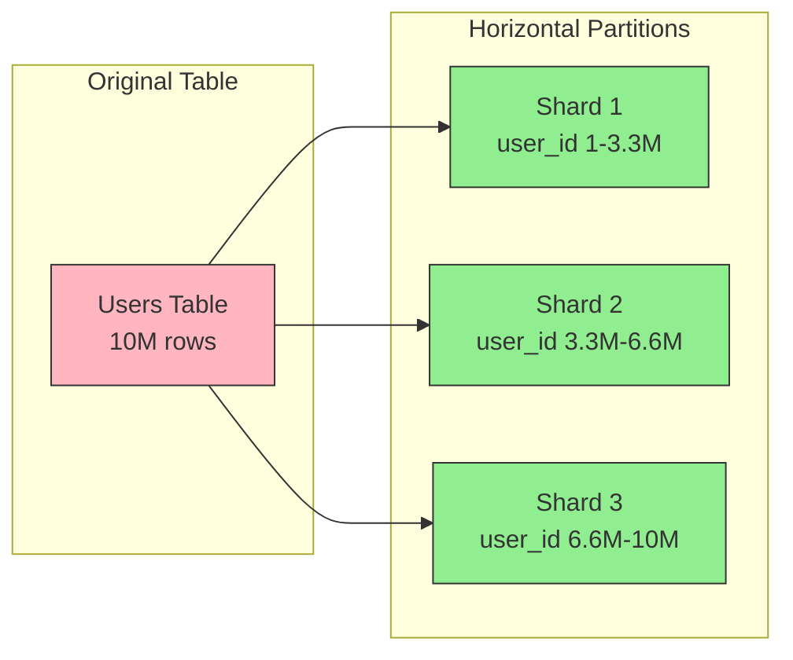
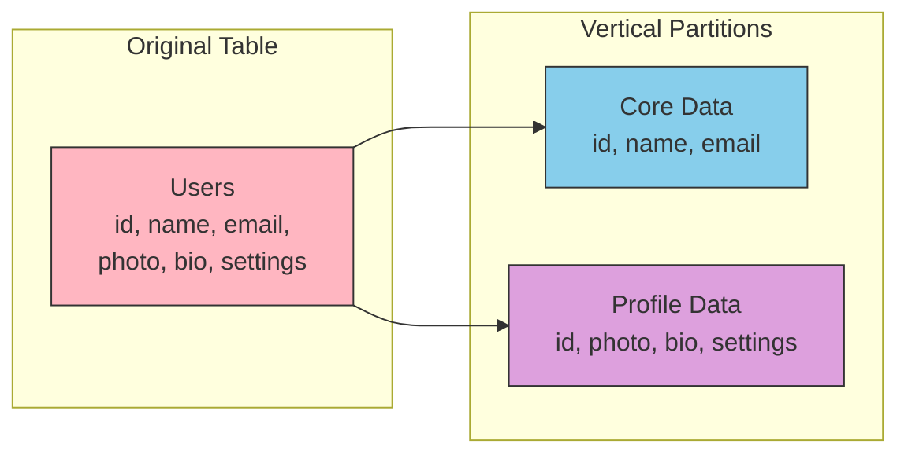
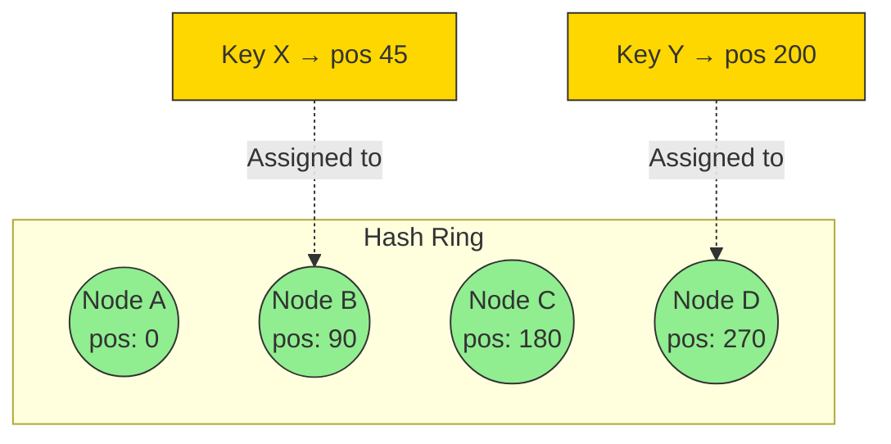

## Data Partitioning

### What is Data Partitioning?

Data partitioning (sharding) splits a large dataset across multiple databases/servers. Each partition holds a subset of data, enabling horizontal scaling when a single database can't handle the load.

**When to partition:**
- Single database can't handle read/write throughput
- Dataset exceeds single machine storage
- Need to reduce query latency by limiting scan scope

---

### Partitioning Methods

#### 1. Horizontal Partitioning (Sharding)

Splits rows across partitions. Each partition has same schema but different rows.

**Use case:** Most common. Users table split by user_id ranges.

#### 2. Vertical Partitioning

Splits columns across partitions. Each partition has different columns.

**Use case:** Separate frequently accessed columns from large/rarely accessed ones (e.g., blob storage).

#### 3. Functional Partitioning

Splits by business function. Different databases for different features.

**Use case:** Orders DB, Users DB, Payments DB - each scaled independently.

---

### Sharding Strategies

#### 1. Range-Based Sharding

Partition by value ranges (e.g., user_id 1-1M → Shard 1).

| Pros | Cons |
|------|------|
| Simple to implement | Uneven distribution (hotspots) |
| Range queries efficient | New ranges need rebalancing |

#### 2. Hash-Based Sharding

`shard = hash(partition_key) % num_shards`

| Pros | Cons |
|------|------|
| Even distribution | Range queries span all shards |
| No hotspots | Adding shards requires rehashing |

#### 3. Directory-Based Sharding

Lookup service maps keys to shards.

| Pros | Cons |
|------|------|
| Flexible mapping | Lookup service is SPOF |
| Easy rebalancing | Extra network hop |

#### 4. Consistent Hashing

Keys and servers mapped to a hash ring. Minimizes data movement when adding/removing nodes.

**Interview insight:** "When adding a new shard with consistent hashing, only K/N keys need redistribution (K=total keys, N=nodes), versus rehashing everything with modulo hashing."

---

### Choosing a Partition Key

The partition key determines data distribution. Critical decision.

**Good partition key:**
- High cardinality (many unique values)
- Even distribution (no hotspots)
- Matches query patterns (queries hit single shard)

| Scenario | Good Key | Bad Key |
|----------|----------|---------|
| User data | user_id | country (uneven) |
| Time-series | device_id + time bucket | timestamp only (writes to one shard) |
| Multi-tenant | tenant_id | created_at |

---
### Benefits of Data Partitioning

| Benefit | Description |
|---------|-------------|
| **Horizontal Scalability** | Add shards to handle more data/traffic |
| **Improved Performance** | Queries scan smaller datasets |
| **Increased Availability** | Shard failure affects only subset of data |
| **Cost Efficiency** | Use commodity hardware instead of vertical scaling |

---

### Common Problems with Data Partitioning

#### 1. Cross-Shard Queries

Queries spanning multiple shards require scatter-gather, increasing latency.

**Mitigation:** Design schema so common queries hit single shard.

#### 2. Cross-Shard Joins

Joins across shards are expensive or impossible.

**Mitigation:** Denormalize data or use application-level joins.

#### 3. Hotspots

Uneven data/traffic distribution overloads some shards.

**Mitigation:** Better partition key, consistent hashing, or shard splitting.

#### 4. Rebalancing

Adding/removing shards requires data migration.

**Mitigation:** Consistent hashing, virtual nodes, or directory-based routing.

#### 5. Distributed Transactions

ACID across shards is complex (2PC, Saga patterns).

**Mitigation:** Design for eventual consistency where possible.

#### 6. Referential Integrity

Foreign keys can't span shards.

**Mitigation:** Application-level enforcement, denormalization.

---
### Data Partitioning Interview Checklist

| Topic | Key Points |
|-------|------------|
| **When to shard** | Exceeded single DB capacity (storage, throughput, or latency) |
| **Partition key selection** | High cardinality, even distribution, matches access patterns |
| **Horizontal vs Vertical** | Horizontal = rows, Vertical = columns |
| **Hash vs Range** | Hash = even distribution; Range = efficient range queries |
| **Consistent hashing** | Minimizes redistribution when cluster changes |
| **Cross-shard operations** | Expensive; design to avoid them |
| **Hotspot mitigation** | Salting keys, consistent hashing, virtual nodes |
| **Rebalancing strategy** | Consistent hashing or directory-based for flexibility |

---

