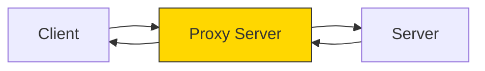
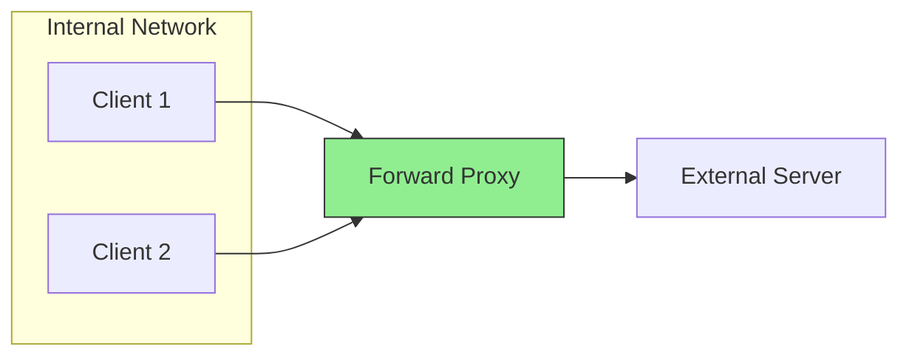
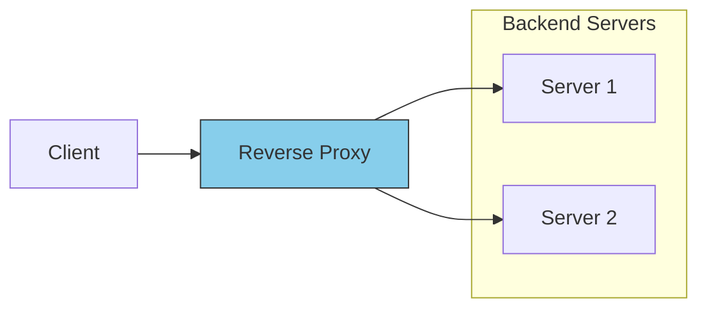

## Proxy Servers

### What is a Proxy Server?

A proxy server is an intermediary between clients and servers. Clients connect to the proxy, which forwards requests to the destination server and returns responses.

**Why proxies matter:** In distributed systems, direct client-to-server communication creates tight coupling. Proxies decouple clients from servers, enabling load balancing, caching, security, and protocol translation without changing either endpoint.

### Types of Proxies

#### Forward Proxy

Sits in front of clients. Server sees proxy's IP, not client's.

**How it works:** Client explicitly configures proxy address. All outbound requests route through proxy first. Proxy can inspect, filter, cache, or modify requests before forwarding.

**Use cases:** Corporate network filtering, anonymity, bypass geo-restrictions, shared caching for repeated requests.

#### Reverse Proxy

Sits in front of servers. Client sees proxy's IP, not server's.

**How it works:** Client connects to proxy thinking it's the actual server. Proxy receives request, decides which backend server handles it, forwards request, and returns response. Client never knows backend exists.

**Why it's essential:** Almost every production system uses reverse proxies. They're the entry point that enables horizontal scaling—without them, you'd need to expose every backend server directly and handle load distribution client-side.

**Use cases:** Load balancing, SSL termination, caching, security, A/B testing, canary deployments.

**Interview insight:** "Nginx and HAProxy are reverse proxies. CDN edge servers also act as reverse proxies with caching."

### Forward vs Reverse Proxy

| Aspect | Forward Proxy | Reverse Proxy |
|--------|---------------|---------------|
| **Position** | In front of clients | In front of servers |
| **Who configures** | Client | Server admin |
| **Hides** | Client identity | Server identity |
| **Use case** | Access control, anonymity | Load balancing, security |

---

### Uses of Proxies in System Design

| Use Case | How It Works |
|----------|--------------|
| **Load Balancing** | Distribute requests across backend servers |
| **SSL Termination** | Decrypt HTTPS at proxy, reducing backend load |
| **Caching** | Store responses, serve repeated requests without hitting origin |
| **Compression** | Compress responses before sending to clients |
| **Rate Limiting** | Control request rates per client/IP |
| **Authentication** | Centralized auth before reaching backend |
| **API Gateway** | Route, transform, and aggregate API requests |

---

### VPN vs. Proxy Server

| Aspect | Proxy | VPN |
|--------|-------|-----|
| **Scope** | Application-level (browser, app) | System-level (all traffic) |
| **Encryption** | Usually none (except HTTPS proxy) | Always encrypted tunnel |
| **Speed** | Faster (no encryption overhead) | Slower (encryption cost) |
| **Anonymity** | Partial (only proxied apps) | Full (all traffic routed) |
| **Use case** | Bypass restrictions, caching | Security on untrusted networks |

**When to use which:**
- **Proxy:** Route specific application traffic, caching, load balancing
- **VPN:** Encryption for all traffic, secure remote access

---

### Proxy Interview Checklist

| Topic | Key Points |
|-------|------------|
| **Forward vs Reverse** | Forward = client-side, Reverse = server-side |
| **Reverse proxy examples** | Nginx, HAProxy, Envoy, Traefik |
| **Common uses** | Load balancing, SSL termination, caching, rate limiting |
| **API Gateway** | Reverse proxy + routing + auth + rate limiting |
| **CDN as proxy** | Edge servers are reverse proxies with geographic distribution |

---

