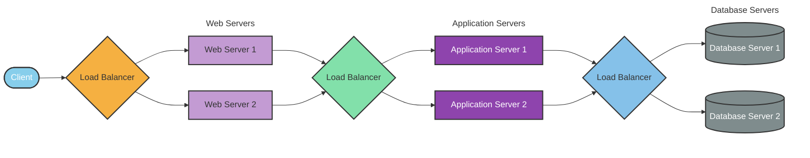

## Load Balancing

### Introduction to Load Balancing

Load balancing is a crucial component of System Design, as it helps distribute incoming requests and traffic evenly across multiple servers. The main goal of load balancing is to ensure high availability, reliability, and performance by avoiding overloading a single server and avoiding downtime.

Typically a load balancer sits between the client and the server accepting incoming network and application traffic and distributing the traffic across multiple backend servers using various algorithms. By balancing application requests across multiple servers, a load balancer reduces the load on individual servers and prevents any one server from becoming a single point of failure, thus improving overall application availability and responsiveness.

To utilize full scalability and redundancy, we can try to balance the load at each layer of the system. We can add LBs at three places:

- Between the user and the web server
- Between web servers and an internal platform layer, like application servers or cache servers
- Between internal platform layer and database.

#### Key terminology and concepts

**Load Balancer:** A device or software that distributes network traffic across multiple servers based on predefined rules or algorithms.

**Backend Servers:** The servers that receive and process requests forwarded by the load balancer. Also referred to as the server pool or server farm.

**Load Balancing Algorithm:** The method used by the load balancer to determine how to distribute incoming traffic among the backend servers.

**Health Checks:** Periodic tests performed by the load balancer to determine the availability and performance of backend servers. Unhealthy servers are removed from the server pool until they recover.

**Session Persistence:** A technique used to ensure that subsequent requests from the same client are directed to the same backend server, maintaining session state and providing a consistent user experience.

**SSL/TLS Termination:** The process of decrypting SSL/TLS-encrypted traffic at the load balancer level, offloading the decryption burden from backend servers and allowing for centralized SSL/TLS management.

#### How Load Balancer works?

Load balancers work by distributing incoming network traffic across multiple servers or resources to ensure efficient utilization of computing resources and prevent overload. Here are the general steps that a load balancer follows to distribute traffic:

1. The load balancer receives a request from a client or user.
2. The load balancer evaluates the incoming request and determines which server or resource should handle the request. This is done based on a predefined load-balancing algorithm that takes into account factors such as server capacity, server response time, number of active connections, and geographic location.
3. The load balancer forwards the incoming traffic to the selected server or resource.
4. The server or resource processes the request and sends a response back to the load balancer.
5. The load balancer receives the response from the server or resource and sends it to the client or user who made the request.

## Load Balancing Algorithms

A load balancing algorithm is a method used by a load balancer to distribute incoming traffic and requests among multiple servers or resources. The primary purpose of a load balancing algorithm is to ensure efficient utilization of available resources, improve overall system performance, and maintain high availability and reliability.

Here are the most famous load balancing algorithms:

### 1. Round Robin

This algorithm distributes incoming requests to servers in a cyclic order. It assigns a request to the first server, then moves to the second, third, and so on, and after reaching the last server, it starts again at the first.

#### Pros

- Ensures an equal distribution of requests among the servers, as each server gets a turn in a fixed order.
- Easy to implement and understand.
- Works well when servers have similar capacities.

#### Cons

- **No Load Awareness:** Does not take into account the current load or capacity of each server. All servers are treated equally regardless of their current state.
- **No Session Affinity:** Subsequent requests from the same client may be directed to different servers, which can be problematic for stateful applications.
- **Performance Issues with Different Capacities:** May not perform optimally when servers have different capacities or varying workloads.
- **Predictable Distribution Pattern:** Round Robin is predictable in its request distribution pattern, which could potentially be exploited by attackers who can observe traffic patterns and might find vulnerabilities in specific servers by predicting which server will handle their requests.

#### Use cases

- **Homogeneous Environments:** Suitable for environments where all servers have similar capacity and performance.
- **Stateless Applications:** Works well for stateless applications where each request can be handled independently.

### 2. Least Connections

The Least Connections algorithm is a dynamic load balancing technique that assigns incoming requests to the server with the fewest active connections at the time of the request. This method ensures a more balanced distribution of load across servers, especially in environments where traffic patterns are unpredictable and request processing times vary.

#### Pros

- **Load Awareness:** Takes into account the current load on each server by considering the number of active connections, leading to better utilization of server resources.
- **Dynamic Distribution:** Adapts to changing traffic patterns and server loads, ensuring no single server becomes a bottleneck.
- **Efficiency in Heterogeneous Environments:** Performs well when servers have varying capacities and workloads, as it dynamically allocates requests to less busy servers.

#### Cons

- **Higher Complexity:** More complex to implement compared to simpler algorithms like Round Robin, as it requires real-time monitoring of active connections.
- **State Maintenance:** Requires the load balancer to maintain the state of active connections, which can increase overhead.
- **Potential for Connection Spikes:** In scenarios where connection duration is short, servers can experience rapid spikes in connection counts, leading to frequent rebalancing.
