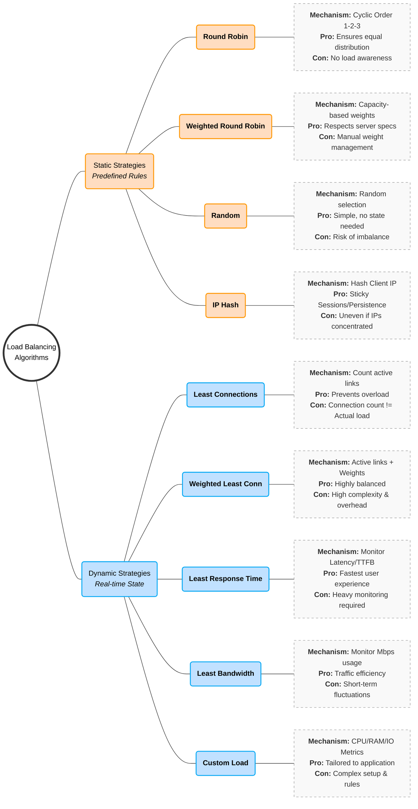
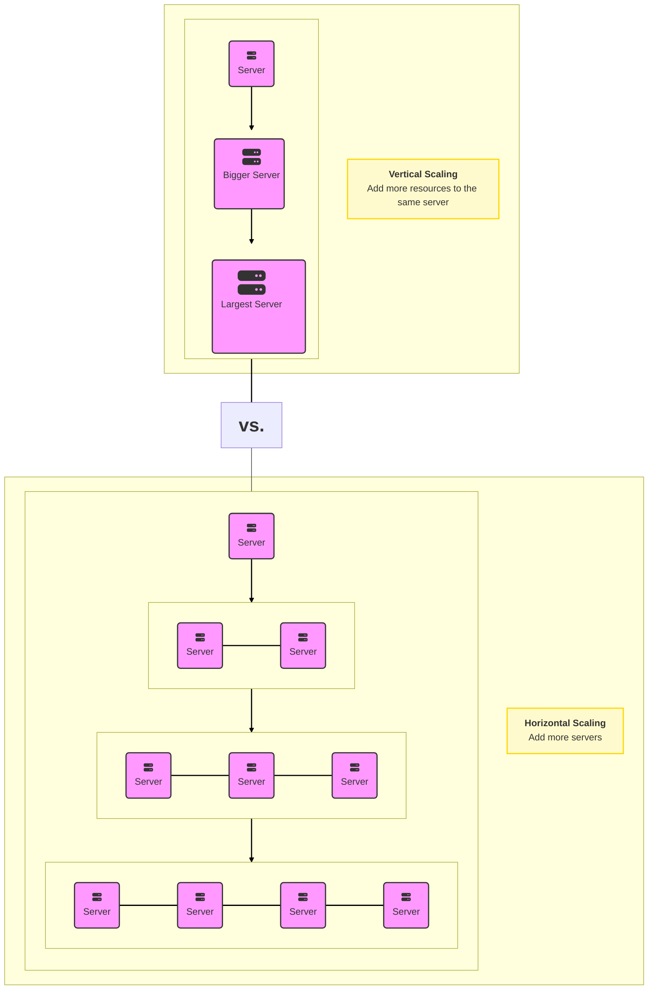

## Load Balancing

### Introduction to Load Balancing

Load balancing is a crucial component of System Design, as it helps distribute incoming requests and traffic evenly across multiple servers. The main goal of load balancing is to ensure high availability, reliability, and performance by avoiding overloading a single server and avoiding downtime.

Typically a load balancer sits between the client and the server accepting incoming network and application traffic and distributing the traffic across multiple backend servers using various algorithms. By balancing application requests across multiple servers, a load balancer reduces the load on individual servers and prevents any one server from becoming a single point of failure, thus improving overall application availability and responsiveness.


To utilize full scalability and redundancy, we can try to balance the load at each layer of the system. We can add LBs at three places:

- Between the user and the web server
- Between web servers and an internal platform layer, like application servers or cache servers
- Between internal platform layer and database.


#### Key terminology and concepts

**Load Balancer:** A device or software that distributes network traffic across multiple servers based on predefined rules or algorithms.

**Backend Servers:** The servers that receive and process requests forwarded by the load balancer. Also referred to as the server pool or server farm.

**Load Balancing Algorithm:** The method used by the load balancer to determine how to distribute incoming traffic among the backend servers.

**Health Checks:** Periodic tests performed by the load balancer to determine the availability and performance of backend servers. Unhealthy servers are removed from the server pool until they recover.

**Session Persistence:** A technique used to ensure that subsequent requests from the same client are directed to the same backend server, maintaining session state and providing a consistent user experience.

**SSL/TLS Termination:** The process of decrypting SSL/TLS-encrypted traffic at the load balancer level, offloading the decryption burden from backend servers and allowing for centralized SSL/TLS management.

#### How Load Balancer works?

Load balancers work by distributing incoming network traffic across multiple servers or resources to ensure efficient utilization of computing resources and prevent overload. Here are the general steps that a load balancer follows to distribute traffic:

1. The load balancer receives a request from a client or user.
2. The load balancer evaluates the incoming request and determines which server or resource should handle the request. This is done based on a predefined load-balancing algorithm that takes into account factors such as server capacity, server response time, number of active connections, and geographic location.
3. The load balancer forwards the incoming traffic to the selected server or resource.
4. The server or resource processes the request and sends a response back to the load balancer.
5. The load balancer receives the response from the server or resource and sends it to the client or user who made the request.

## Load Balancing Algorithms

A load balancing algorithm is a method used by a load balancer to distribute incoming traffic and requests among multiple servers or resources. The primary purpose of a load balancing algorithm is to ensure efficient utilization of available resources, improve overall system performance, and maintain high availability and reliability.

Here are the most famous load balancing algorithms:

### 1. Round Robin

This algorithm distributes incoming requests to servers in a cyclic order. It assigns a request to the first server, then moves to the second, third, and so on, and after reaching the last server, it starts again at the first.

#### Pros

- Ensures an equal distribution of requests among the servers, as each server gets a turn in a fixed order.
- Easy to implement and understand.
- Works well when servers have similar capacities.

#### Cons

- **No Load Awareness:** Does not take into account the current load or capacity of each server. All servers are treated equally regardless of their current state.
- **No Session Affinity:** Subsequent requests from the same client may be directed to different servers, which can be problematic for stateful applications.
- **Performance Issues with Different Capacities:** May not perform optimally when servers have different capacities or varying workloads.
- **Predictable Distribution Pattern:** Round Robin is predictable in its request distribution pattern, which could potentially be exploited by attackers who can observe traffic patterns and might find vulnerabilities in specific servers by predicting which server will handle their requests.

#### Use cases

- **Homogeneous Environments:** Suitable for environments where all servers have similar capacity and performance.
- **Stateless Applications:** Works well for stateless applications where each request can be handled independently.

### 2. Least Connections

The Least Connections algorithm is a dynamic load balancing technique that assigns incoming requests to the server with the fewest active connections at the time of the request. This method ensures a more balanced distribution of load across servers, especially in environments where traffic patterns are unpredictable and request processing times vary.

#### Pros

- **Load Awareness:** Takes into account the current load on each server by considering the number of active connections, leading to better utilization of server resources.
- **Dynamic Distribution:** Adapts to changing traffic patterns and server loads, ensuring no single server becomes a bottleneck.
- **Efficiency in Heterogeneous Environments:** Performs well when servers have varying capacities and workloads, as it dynamically allocates requests to less busy servers.

#### Cons

- **Higher Complexity:** More complex to implement compared to simpler algorithms like Round Robin, as it requires real-time monitoring of active connections.
- **State Maintenance:** Requires the load balancer to maintain the state of active connections, which can increase overhead.
- **Potential for Connection Spikes:** In scenarios where connection duration is short, servers can experience rapid spikes in connection counts, leading to frequent rebalancing.

#### Comparison to Round Robin

- **Round Robin:** Distributes requests in a fixed, cyclic order without considering the current load on each server.
- **Least Connections:** Distributes requests based on the current load, directing new requests to the server with the fewest active connections.

### 3. Weighted Round Robin

Weighted Round Robin (WRR) is an enhanced version of the Round Robin load balancing algorithm. It assigns weights to each server based on their capacity or performance, distributing incoming requests proportionally according to these weights. This ensures that more powerful servers handle a larger share of the load, while less powerful servers handle a smaller share.

#### Pros

- **Load Distribution According to Capacity:** Servers with higher capacities handle more requests, leading to better utilization of resources.
- **Flexibility:** Easily adjustable to accommodate changes in server capacities or additions of new servers.
- **Improved Performance:** Helps in optimizing overall system performance by preventing overloading of less powerful servers.

#### Cons

- **Complexity in Weight Assignment:** Determining appropriate weights for each server can be challenging and requires accurate performance metrics.
- **Increased Overhead:** Managing and updating weights can introduce additional overhead, especially in dynamic environments where server performance fluctuates.
- **Not Ideal for Highly Variable Loads:** In environments with highly variable load patterns, WRR may not always provide optimal load balancing as it doesn't consider real-time server load.

#### Use Cases

- **Heterogeneous Server Environments:** Ideal for environments where servers have different processing capabilities, ensuring efficient use of resources.

### 4. Weighted Least Connections

Weighted Least Connections is an advanced load balancing algorithm that combines the principles of the Least Connections and Weighted Round Robin algorithms. It takes into account both the current load (number of active connections) on each server and the relative capacity of each server (weight). This approach ensures that more powerful servers handle a proportionally larger share of the load, while also dynamically adjusting to the real-time load on each server.

#### Pros

- **Dynamic Load Balancing:** Adjusts to the real-time load on each server, ensuring a more balanced distribution of requests.
- **Capacity Awareness:** Takes into account the relative capacity of each server, leading to better utilization of resources.
- **Flexibility:** Can handle environments with heterogeneous servers and variable load patterns effectively.

#### Cons

- **Complexity:** More complex to implement compared to simpler algorithms like Round Robin and Least Connections.
- **State Maintenance:** Requires the load balancer to keep track of both active connections and server weights, increasing overhead.
- **Weight Assignment:** Determining appropriate weights for each server can be challenging and requires accurate performance metrics.

#### Use Cases

- **Heterogenous Server Environments:** Ideal for environments where servers have different processing capacities and workloads.
- **High Traffic Web Applications:** Suitable for web applications with variable traffic patterns, ensuring no single server becomes a bottleneck.
- **Database Clusters:** Useful in database clusters where nodes have varying performance capabilities and query loads.

### 5. IP Hash

IP Hash load balancing is a technique that assigns client requests to servers based on the client's IP address. The load balancer uses a hash function to convert the client's IP address into a hash value, which is then used to determine which server should handle the request. This method ensures that requests from the same client IP address are consistently routed to the same server, providing session persistence.

#### Example

Suppose you have three servers (Server A, Server B, and Server C) and a client with the IP address 192.168.1.10. The load balancer applies a hash function to this IP address, resulting in a hash value. If the hash value is 2 and there are three servers, the load balancer routes the request to Server C (2 % 3 = 2).

#### Pros

- **Session Persistence:** Ensures that requests from the same client IP address are consistently routed to the same server, which is beneficial for stateful applications.
- **Simplicity:** Easy to implement and does not require the load balancer to maintain the state of connections.
- **Deterministic:** Predictable and consistent routing based on the client's IP address.

#### Cons

- **Uneven Distribution:** If client IP addresses are not evenly distributed, some servers may receive more requests than others, leading to an uneven load.
- **Dynamic Changes:** Adding or removing servers can disrupt the hash mapping, causing some clients to be routed to different servers.
- **Limited Flexibility:** Does not take into account the current load or capacity of servers, which can lead to inefficiencies.

#### Use Cases

- **Stateful Applications:** Ideal for applications where maintaining session persistence is important, such as online shopping carts or user sessions.
- **Geographically Distributed Clients:** Useful when clients are distributed across different regions and consistent routing is required.

### 6. Least Response Time

Least Response Time load balancing is a dynamic algorithm that assigns incoming requests to the server with the lowest response time, ensuring efficient utilization of server resources and optimal client experience. This approach aims to direct traffic to the server that can handle the request the fastest, based on recent performance metrics.

#### How Least Response Time Load Balancing Works

1. **Monitor Response Times:** The load balancer continuously monitors the response times of each server. Response time is typically measured from when a request is sent to a server until a response is received.
2. **Assign Requests:** When a new request arrives, the load balancer assigns it to the server with the lowest average response time.
3. **Dynamic Adjustment:** The load balancer dynamically adjusts the assignment of requests based on real-time performance data, ensuring that the fastest server handles the next request.

#### Pros

- **Optimized Performance:** Ensures that requests are handled by the fastest available server, leading to reduced latency and improved client experience.
- **Dynamic Load Balancing:** Continuously adjusts to changing server performance, ensuring optimal distribution of load.
- **Effective Resource Utilization:** Helps in better utilization of server resources by directing traffic to servers that can respond quickly.

#### Cons

- **Complexity:** More complex to implement compared to simpler algorithms like Round Robin, as it requires continuous monitoring of server performance.
- **Overhead:** Monitoring response times and dynamically adjusting the load can introduce additional overhead.
- **Short-Term Variability:** Response times can vary in the short term due to network fluctuations or transient server issues, potentially causing frequent rebalancing.

#### Use Cases

- **Real-Time Applications:** Ideal for applications where low latency and fast response times are critical, such as online gaming, video streaming, or financial trading platforms.
- **Web Services:** Useful for web services and APIs that need to provide quick responses to user requests.
- **Dynamic Environments:** Suitable for environments with fluctuating loads and varying server performance.

### 7. Random

Random load balancing is a simple algorithm that distributes incoming requests to servers randomly. Instead of following a fixed sequence or using performance metrics, the load balancer selects a server at random to handle each request. This method can be effective in scenarios where the load is relatively uniform and servers have similar capacities.

Suppose you have three servers: Server A, Server B, and Server C. When a new request arrives, the load balancer randomly chooses one of these servers to handle the request. Over time, if the randomness is uniform, each server should receive approximately the same number of requests.

#### Pros

- **Simplicity:** Very easy to implement and understand, requiring minimal configuration.
- **No State Maintenance:** The load balancer does not need to track the state or performance of servers, reducing overhead.
- **Uniform Distribution Over Time:** If the random selection is uniform, the load will be evenly distributed across servers over a long period.

#### Cons

- **No Load Awareness:** Does not consider the current load or capacity of servers, which can lead to uneven distribution if server performance varies.
- **Potential for Imbalance:** In the short term, random selection can lead to an uneven distribution of requests.
- **No Session Affinity:** Requests from the same client may be directed to different servers, which can be problematic for stateful applications.
- Security systems that rely on detecting anomalies (e.g., to mitigate DDoS attacks) might find it slightly more challenging to identify malicious patterns if a Random algorithm is used, due to the inherent unpredictability in request distribution. This could potentially dilute the visibility of attack patterns.

#### Use Cases

- **Homogeneous Environments:** Suitable for environments where servers have similar capacity and performance.
- **Stateless Applications:** Works well for stateless applications where each request can be handled independently.
- **Simple Deployments:** Ideal for simple deployments where the complexity of other load balancing algorithms is not justified.

### 8. Least Bandwidth

The Least Bandwidth load balancing algorithm distributes incoming requests to servers based on the current bandwidth usage. It routes each new request to the server that is consuming the least amount of bandwidth at the time. This approach helps in balancing the network load more efficiently by ensuring that no single server gets overwhelmed with too much data traffic.

#### Pros

- **Dynamic Load Balancing:** Continuously adjusts to the current network load, ensuring optimal distribution of traffic.
- **Prevents Overloading:** Helps in preventing any single server from being overwhelmed with too much data traffic, leading to better performance and stability.
- **Efficient Resource Utilization:** Ensures that all servers are utilized more effectively by balancing the bandwidth usage.

#### Cons

- **Complexity:** More complex to implement compared to simpler algorithms like Round Robin, as it requires continuous monitoring of bandwidth usage.
- **Overhead:** Monitoring bandwidth and dynamically adjusting the load can introduce additional overhead.
- **Short-Term Variability:** Bandwidth usage can fluctuate in the short term, potentially causing frequent rebalancing.

#### Use Cases

- **High Bandwidth Applications:** Ideal for applications with high bandwidth usage, such as video streaming, file downloads, and large data transfers.
- **Content Delivery Networks (CDNs):** Useful for CDNs that need to balance traffic efficiently to deliver content quickly.
- **Real-Time Applications:** Suitable for real-time applications where maintaining low latency is critical.

### 9. Custom Load

Custom Load load balancing is a flexible and highly configurable approach that allows you to define your own metrics and rules for distributing incoming traffic across a pool of servers. Unlike standard load balancing algorithms that use predefined criteria such as connection count or response time, Custom Load load balancing enables you to tailor the distribution strategy based on specific requirements and conditions unique to your application or infrastructure.

#### How Custom Load Load Balancing Works

- **Define Custom Metrics:** Determine the metrics that best represent the load or performance characteristics relevant to your application. These metrics can include CPU usage, memory usage, disk I/O, application-specific metrics, or a combination of several metrics.

- **Implement Monitoring:** Continuously monitor the defined metrics on each server in the pool. This may involve integrating with monitoring tools or custom scripts that collect and report the necessary data.

- **Create Load Balancing Rules:** Establish rules and algorithms that use the monitored metrics to make load balancing decisions. This can be a simple weighted sum of metrics or more complex logic that prioritizes certain metrics over others.

- **Dynamic Adjustment:** Use the collected data and rules to dynamically adjust the distribution of incoming requests, ensuring that the traffic is balanced according to the custom load criteria.

#### Pros

- **Flexibility:** Allows for highly customized load balancing strategies tailored to the specific needs and performance characteristics of your application.
- **Optimized Resource Utilization:** Can lead to more efficient use of server resources by considering a comprehensive set of metrics.
- **Adaptability:** Easily adaptable to changing conditions and requirements, making it suitable for complex and dynamic environments.

#### Cons

- **Complexity:** More complex to implement and configure compared to standard load balancing algorithms.
- **Monitoring Overhead:** Requires continuous monitoring of multiple metrics, which can introduce additional overhead.
- **Potential for Misconfiguration:** Incorrectly defined metrics or rules can lead to suboptimal load balancing and performance issues.

#### Use Cases

- **Complex Applications:** Ideal for applications with complex performance characteristics and varying resource requirements.
- **Highly Dynamic Environments:** Suitable for environments where workloads and server performance can change rapidly and unpredictably.
- **Custom Requirements:** Useful when standard load balancing algorithms do not meet the specific needs of the application.

### Mind Map



## Uses of Load Balancing

Load balancing is a technique used to distribute workloads evenly across multiple computing resources (servers, network links, etc.) to optimize resource utilization, minimize response time, and prevent overload.

[Image of load balancing architecture diagram]

### Key Benefits

1.  **Improving Website Performance**
    Distributes incoming traffic among multiple servers to reduce individual load and ensure faster response times for end users.

2.  **High Availability & Reliability**
    Prevents single points of failure by monitoring server health and automatically redirecting traffic to healthy servers if one fails.

3.  **Scalability**
    Enables seamless infrastructure scaling; new servers can be added to the pool to handle increased demand without disrupting services.

4.  **Redundancy**
    Maintains redundant copies of data and services across multiple servers, mitigating the risk of data loss or outages due to hardware failure.

5.  **Network Optimization**
    Reduces network congestion and improves throughput by distributing traffic across multiple paths or internet connections.

6.  **Geographic Distribution**
    Directs users to the nearest or best-performing data center based on location to reduce latency (e.g., routing US users to North American servers).

7.  **Application Performance**
    Assigns dedicated resources to specific applications or services, ensuring critical apps perform optimally without fighting for resources.

8.  **Security**
    Mitigates Distributed Denial-of-Service (DDoS) attacks by spreading malicious traffic across multiple servers, preventing any single target from being overwhelmed.

9.  **Cost & Energy Efficiency**
    Optimizes hardware usage, potentially reducing the number of servers required and lowering infrastructure and energy costs.

10. **Content Caching**
    Stores static content (images, videos) directly on the load balancer to serve requests instantly, reducing load on backend application servers.

## Load Balancer Types

A **Load Balancer** acts like a traffic cop for your servers. Imagine a supermarket with 10 checkout lanes. If everyone lines up at just one lane, that cashier gets overwhelmed while the other 9 sit idle. A load balancer stands at the entrance, directing each new customer to the shortest line.

In technical terms, it distributes incoming network traffic across multiple servers (a "server farm" or "server pool"). This ensures no single server bears too much demand, keeping the system fast, reliable, and available.

This guide details the different types of load balancing strategies, their pros and cons, and real-world examples.

---

### 1. Hardware Load Balancing

Hardware load balancers are physical, dedicated boxes (appliances) that you install in your data center. They are the "heavy lifters" of the industry, built with specialized chips like **ASICs** (Application-Specific Integrated Circuits) to process traffic at incredible speeds.

#### Pros

- **Massive Performance:** Because the hardware is built _only_ for this job, it can process gigabytes of data faster than general computers.
- **Security:** Often comes with "walled garden" security features, essentially acting as a firewall to block bad traffic before it hits your servers.
- **Multi-tasking:** Capable of handling many different types of traffic protocols simultaneously.

#### Cons

- **Cost:** These physical boxes are expensive (thousands to tens of thousands of dollars).
- **Scalability Limits:** If you max out the box's capacity, you have to buy another physical box and wire it up.
- **Maintenance:** You need specialized staff to physically manage, rack, and configure the device.

**Real-World Example:**

> A massive e-commerce company (like Amazon or eBay) uses hardware load balancers during Black Friday. They need dedicated machines that can handle millions of connections per second without a millisecond of lag.

---

### 2. Software Load Balancing

Software load balancers are programs you install on standard servers (like a standard Linux or Windows machine) or virtual machines. They use code and algorithms to route traffic rather than specialized physical chips.

#### Pros

- **Cost-Effective:** Much cheaper than buying specialized hardware. You usually pay for a license or use open-source (free) versions like NGINX or HAProxy.
- **Flexible:** You can install it anywhere—on your laptop for testing, on a server in your office, or in the cloud.
- **Easy Scaling:** Need more power? Just spin up another virtual machine copy of the software.

#### Cons

- **Resource Sharing:** Since it runs on a general computer, it has to share CPU and RAM with the operating system and other apps running on that machine.
- **Performance Ceiling:** It might not match the raw throughput speed of specialized hardware ASICs under extreme pressure.

**Real-World Example:**

> A startup launching a new app installs NGINX (a popular software load balancer) on a virtual server. As they grow from 100 to 10,000 users, they can simply upgrade the virtual server's RAM without buying new physical equipment.

---

### 3. Cloud-based Load Balancing

This is "Load Balancing as a Service." Major cloud providers (like AWS, Google Cloud, Azure) manage the load balancer for you. You don't see the physical hardware or install the software; you just click a button to turn it on.

#### Pros

- **Elasticity:** It scales automatically. If traffic spikes at 2 AM, the cloud provider automatically allocates more power.
- **Zero Maintenance:** No patching software, no dusting off servers. The provider handles updates and security fixes.
- **Pay-as-you-go:** You typically pay only for the traffic you process, making it great for unpredictable workloads.

#### Cons

- **Vendor Lock-in:** Moving from AWS to Azure can be difficult because their load balancers work differently.
- **Less Control:** You can't tweak every tiny setting "under the hood" like you can with your own hardware or software.

**Real-World Example:**

> A mobile game developer uses AWS Elastic Load Balancing. When their game goes viral, the load balancer automatically expands to handle the new players. When the hype dies down, it shrinks back, saving money.

---

### 4. DNS Load Balancing

DNS load balancing is a technique where the Domain Name System (DNS)—the system that translates human-readable domain names (like google.com) into machine-readable IP addresses (like 192.0.2.1)—is used to distribute incoming traffic across multiple servers.

Instead of a single server handling all requests for a website, the DNS server has a list of IP addresses for that domain. When users look up the domain, the DNS server hands out different IP addresses to different users, effectively spreading the load.

#### Pros

- **Simplicity:** Very easy to set up. It requires no extra hardware, just configuration of your domain settings.
- **Geographic Routing:** You can send users in Europe to a European IP and users in the US to a US IP.

#### Cons

- **Caching Issues (The "Lag"):** Computers remember (cache) DNS answers. If Server A crashes, your users' computers might still remember Server A's IP address for 10-15 minutes, sending them to a dead end until the cache clears.
- **"Dumb" Distribution:** It generally doesn't know if a server is overloaded; it just hands out IPs in a list (Round Robin).

**Real-World Example:**

> A Content Delivery Network (CDN) uses this to ensure that when you try to watch a Netflix video, your computer is given the IP address of the server physically closest to your house to prevent buffering.

---

### 5. Global Server Load Balancing (GSLB)

GSLB is the "Big Brother" of DNS load balancing. While standard DNS balancing just hands out IPs in a list, GSLB is intelligent. It monitors the health and speed of your data centers around the world in real-time to make routing decisions.

#### How it Works

1. **Health Checks:** GSLB constantly "pings" your data centers. If the London Data Center stops responding, GSLB removes it from the list instantly.
2. **Latency/Proximity:** It looks at the user's IP address. If the user is in Germany, GSLB calculates that the Frankfurt Data Center will respond faster than the New York Data Center, so it sends the user to Frankfurt.
3. **Site Capacity:** It can track how busy a site is. If Frankfurt is at 100% capacity, GSLB can spill traffic over to Paris.

#### Types of GSLB Configurations

- **Active-Passive (Disaster Recovery):** All traffic goes to the Primary Site (e.g., New York). The Backup Site (e.g., Chicago) sits idle. If New York fails, GSLB flips the switch, and all traffic goes to Chicago.
- **Active-Active:** Both New York and Chicago handle traffic simultaneously, usually splitting users based on whoever is closest.

#### Pros

- **Disaster Recovery:** The gold standard for keeping websites online during major outages (hurricanes, power failures).
- **Performance:** Ensures users connect to the server physically closest to them, reducing lag (latency).

### Cons

- **Complexity:** Setting this up requires a deep understanding of DNS, networking, and synchronization between data centers.
- **Cost:** Requires maintaining infrastructure in multiple physical locations around the world.

**Real-World Example:**

> A multinational bank uses GSLB. If their London data center has a power outage, European customers are seamlessly redirected to the Frankfurt data center. The customers never realize the London site went down because the GSLB handled the failover instantly.

---

## 6. Hybrid Load Balancing

Why choose one when you can use them all? Hybrid load balancing mixes hardware, software, and cloud solutions.

- **Think of it like:** A hybrid car. It uses an electric battery for low speeds and a gas engine for high speeds, optimizing for the best of both worlds.

### Pros

- **Ultimate Flexibility:** You can keep sensitive data on secure hardware in your own building while offloading public web traffic to the cloud.
- **Reliability:** You have multiple safety nets.

### Cons

- **Management Nightmare:** You have to manage different systems that might not talk to each other easily.
- **Skill Gap:** Your IT team needs to be expert in both cloud systems and physical hardware.

**Real-World Example:**

> A streaming service keeps its movie database on private hardware load balancers for security (Core Data) but uses cloud load balancers to stream the actual video files to millions of users (Public Traffic).

---

## 7. Layer 4 Load Balancing (The "Transport" Layer)

Layer 4 load balancing operates at the fourth layer of the OSI model (Transport Layer). It is a "low-level" routing method that focuses purely on **speed and volume**.

It routes traffic based on limited information: **Source IP + Port** and **Destination IP + Port**. It does _not_ look inside the data packet.

### How it Works (Packet Inspection)

1. **The Handshake:** A client (user) tries to connect to your server.
2. **The Decision:** The Load Balancer sees the request coming from `IP 1.2.3.4` on `Port 80`.
3. **The NAT (Network Address Translation):** The Load Balancer changes the destination IP to one of your backend servers (e.g., Server A) and forwards the packet.
4. **The Tunnel:** Once the connection is established, the Load Balancer just forwards packets back and forth without checking them again.

### Pros

- **Super Fast:** Because it doesn't "read the letter" (inspect packet contents), it makes decisions incredibly quickly with very low CPU usage.
- **Secure (by obscurity):** Since it doesn't decrypt data (like SSL/TLS), the data remains encrypted as it passes through the balancer.
- **Protocol Agnostic:** It handles any TCP/UDP traffic, meaning it works for websites, email, databases, and games equally well.

### Cons

- **Not "Smart":** It cannot route based on content. It can't send "mobile users" to Server A and "desktop users" to Server B because it doesn't know which device is connecting.
- **No Caching:** Since it doesn't see the content, it cannot cache images or files to speed up the site.

**Real-World Example:**

> **SQL Database Clustering:** A company uses Layer 4 balancing for their database. All requests to port 3306 (SQL) are distributed evenly across 5 database servers. The load balancer doesn't care what query is being run; it just balances the connection load.

---

## 8. Layer 7 Load Balancing (The "Application" Layer)

Layer 7 load balancing operates at the top layer of the OSI model (Application Layer). It is a "high-level" routing method that focuses on **intelligence and content**.

It fully terminates the network connection, decrypts the request, inspects the data, and then makes a routing decision based on the actual content (URL, Headers, Cookies).

### How it Works (Content Inspection)

1. **Termination:** The Load Balancer accepts the connection from the user and decrypts the data.
2. **Inspection:** It looks at the HTTP request. Is the user asking for `/video` or `/chat`? Is the user using an iPhone or Android? Is there a cookie saying they are a "Premium Member"?
3. **Routing:** Based on these details, it initiates a _new_ connection to the specific server best suited to handle that request.

### Specific Capabilities

- **URL Path Routing:** Send `example.com/blog` to the Blog Server and `example.com/shop` to the Store Server.
- **Host Routing:** Send `video.example.com` to powerful servers and `text.example.com` to cheaper servers.
- **Cookie persistence (Sticky Sessions):** If a user is logged in, Layer 7 balancing can see their "Session ID" cookie and ensure they are always sent to the same server so they don't get logged out.

### Pros

- **Very Smart:** Can optimize traffic flow based on exactly what the user is doing.
- **Caching:** Since it sees the content, it can cache static files (like images or CSS) and serve them instantly without bothering the backend servers.

### Cons

- **Slower (Computational Cost):** Decrypting SSL, reading headers, and making complex decisions takes more CPU power and time than Layer 4.
- **Complex:** Requires more configuration and management (e.g., managing SSL certificates on the load balancer itself).

**Real-World Example:**

> **Microservices Architecture:** A modern app like Netflix uses Layer 7.
>
> - If you click "Play," the request goes to a **Streaming Server**.
> - If you click "Search," the request goes to a **Search Index Server**.
> - If you update your billing, the request goes to a **PCI-Secure Payment Server**.
>   All of this happens behind a single domain name, managed by Layer 7 routing.

```mermaid
flowchart TD
    Start([Start: Choose Your Load Balancer]) --> Q1{Where are your<br/>users located?}

    %% Branch: Global Traffic
    Q1 -- "Distributed Globally<br/>(Multiple Countries)" --> GSLB[<b>GSLB / DNS LB</b><br/><i>Routes based on user location<br/>& data center health</i>]

    %% Branch: Single Region
    Q1 -- "Single Region / Local" --> Q2{Where is your<br/>infrastructure?}

    %% Cloud Branch
    Q2 -- "Public Cloud<br/>(AWS, Azure, GCP)" --> Cloud[<b>Cloud Load Balancer</b><br/><i>Auto-scaling, Zero Maintenance,<br/>Pay-as-you-go</i>]

    %% On-Premise Branch
    Q2 -- "On-Premise / Data Center" --> Q3{What is your<br/>Budget & Scale?}

    %% Hardware vs Software
    Q3 -- "Massive Scale & Budget<br/>(e.g., Amazon Black Friday)" --> HW[<b>Hardware LB</b><br/><i>Dedicated Appliance,<br/>Max Performance & Security</i>]
    Q3 -- "Standard Budget / Flexibility<br/>(e.g., Startup / Dev)" --> SW[<b>Software LB</b><br/><i>NGINX / HAProxy,<br/>Cost-effective & Flexible</i>]

    %% Layer Decision Subgraph
    subgraph Layer_Strategy [Configuration Strategy]
        direction TB
        Logic{How should traffic<br/>be routed?}

        Logic -- "By Content (URL/Cookies)<br/>Need Caching" --> L7[<b>Layer 7 (Application)</b><br/><i>Smart, CPU Intensive</i>]
        Logic -- "By IP/Port (Raw Speed)<br/>Non-HTTP Traffic" --> L4[<b>Layer 4 (Transport)</b><br/><i>Fast, Protocol Agnostic</i>]
    end

    %% Linking Types to Layers
    Cloud -.-> Logic
    HW -.-> Logic
    SW -.-> Logic

    style Start fill:#f9f,stroke:#333,stroke-width:2px
    style GSLB fill:#e1f5fe,stroke:#0277bd
    style Cloud fill:#e0f2f1,stroke:#00695c
    style HW fill:#fff3e0,stroke:#ef6c00
    style SW fill:#f3e5f5,stroke:#7b1fa2
    style L7 fill:#fff9c4,stroke:#fbc02d
    style L4 fill:#ffebee,stroke:#c62828
```

### Stateless vs. Stateful Load Balancing

Here is a comprehensive breakdown of Stateless and Stateful Load Balancing, expanding on your text with technical details, architectural context, and real-world implications.

#### 1. Stateless Load Balancing: "The Forgetful Router"

Stateless load balancing treats every single request as an isolated event. The load balancer has no memory of the user's previous requests. It looks at the incoming packet, applies a simple algorithm (like a coin toss or a list), and sends it to a backend server.

##### How It Works

- **Input Data:** Routing decisions are based strictly on the "packet headers" (static data). This includes the Source IP, Destination URL, or Protocol (TCP/UDP).
- **Algorithms:** Common algorithms include:
- **Round Robin:** Server A Server B Server C Server A.
- **Random:** Pick a server at random.
- **Least Connections:** Send to the server with the fewest current active requests.

- **No "Context":** If you send a request to add an item to your cart, and the next request is to checkout, a stateless balancer might send the first request to **Server A** and the second to **Server B**. If Server B doesn't know about the cart created on Server A, the checkout fails (unless they share a database).

#### Deep Dive into the Example: "Product Search"

- **Scenario:** A user searches for "Coffee Shops" in "Berlin."
- **Why Stateless works here:** The server does not need to know who you are or what you searched for 5 minutes ago to answer this question. The request contains all necessary data (`query="coffee"`, `location="Berlin"`).
- **Result:** The load balancer can send this query to _any_ available server. This maximizes speed because the balancer doesn't waste CPU cycles looking up session tables.

#### Pros & Cons

| Pros                                                                                        | Cons                                                                                                                                       |
| ------------------------------------------------------------------------------------------- | ------------------------------------------------------------------------------------------------------------------------------------------ |
| **High Performance:** No overhead for looking up session tables.                            | **No Continuity:** Cannot handle complex transactions (like banking) without external databases.                                           |
| **Resilience:** If a server dies, the next request just goes to a different one seamlessly. | **Redundant Caching:** If User A visits Server 1, then Server 2, both servers might have to fetch the same profile data from the database. |
| **Easy Scaling:** You can add new servers instantly without configuring "clustering."       |                                                                                                                                            |

---

### 2. Stateful Load Balancing: "The Loyal Router"

Stateful load balancing (often called **Session Persistence** or **Sticky Sessions**) creates a bond between a client and a specific backend server for the duration of a session.

#### How It Works

- **The Handshake:** When a client first connects, the load balancer assigns them to a server (e.g., Server A).
- **The Memory:** The load balancer records this assignment in a look-up table or injects a tracking mechanism (cookie) into the browser.
- **The Loyalty:** All future requests from that client are intercepted, identified, and routed specifically back to Server A.

#### Deep Dive into the Example: "User Login"

- **Scenario:** You log in to your banking dashboard.
- **The Problem:** Your login credentials (the "session token") are stored in the memory (RAM) of **Server A**. If the load balancer sends your next click ("View Balance") to **Server B**, Server B will say, "I don't know you, please log in again."
- **The Stateful Solution:** The load balancer ensures you stay connected to Server A so your login state remains valid.

#### Categories of Stateful Balancing

**A. Source IP Affinity (Client IP Persistence)**

- **Mechanism:** The load balancer takes the client's IP address and runs it through a hashing algorithm (). The result dictates which server takes the traffic.
- **The Flaw (Mobile Networks):** Mobile phones often switch IP addresses as they move between cell towers or when the carrier uses CGNAT (Carrier-Grade NAT). If your IP changes mid-session, the hash changes, and you are thrown to a new server, logging you out.
- **The Flaw (Mega-Proxies):** If a large company (with 5,000 employees) sits behind a single corporate proxy IP, _Source IP Affinity_ will send **all 5,000 employees** to the _same_ backend server, overloading it while other servers sit idle.

**B. Session Affinity (Cookie/Header Persistence)**

- **Mechanism:** This is the modern standard.
- **Application Cookie:** The web app generates a session cookie (`JSESSIONID`, `PHPSESSID`). The load balancer reads this and maps it to a server.
- **Load Balancer Cookie:** The load balancer _inserts_ its own cookie into the browser (e.g., `AWSALB` cookie). This cookie acts as a "nametag" that says "I belong to Server A."

- **Advantage:** It works regardless of IP changes. As long as the browser retains the cookie, the user stays connected to the right server.

---

### High Availability and Fault Tolerance

In simple terms, High Availability (HA) is the art of keeping your website online 99.999% of the time, even when things break. Fault Tolerance is the specific ability of a system to continue operating without interruption when one of its components fails.

#### 1. Redundancy and failover strategies for load balancers

To ensure high availability and fault tolerance, load balancers should be designed and deployed with redundancy in mind. This means having multiple instances of load balancers that can take over if one fails. Redundancy can be achieved through several failover strategies:

- **Active-passive configuration:**
  In this setup, you have two load balancers, but only one works at a time.

The Primary (Active): Handles 100% of the traffic.

The Standby (Passive): sits idle, doing nothing but watching the Primary.

**How it works technically:** Both load balancers share a "Virtual IP Address" (VIP). The Active node holds this IP. The Passive node sends a "heartbeat" signal (a tiny data packet) to the Active node every second, asking, "Are you alive?" If the Active node crashes and the heartbeat stops, the Passive node immediately takes over the VIP and starts accepting traffic. This process is often managed by a protocol called VRRP (Virtual Router Redundancy Protocol).

- Pros: Simplest to configure; debugging is easy (you know exactly which machine is doing the work).
- Cons: "Waste" of money/resources because the Passive server sits idle 99% of the time.

- **Active-active configuration:**
  Here, both load balancers are working simultaneously. If you have two load balancers, each handles roughly 50% of the traffic.

**How it works technically:** You need a mechanism in front of the load balancers to split the traffic between them. This is usually done via DNS Load Balancing (giving one domain name two IP addresses) or Anycast routing (where the network routes you to the nearest open node). If one load balancer fails, the DNS or network simply stops sending traffic to that IP, and the remaining load balancer takes on 100% of the load.

- Pros: 100% resource utilization (no wasted servers); higher total capacity.

- Cons: More complex to configure; troubleshooting is harder (which LB caused the error?); you must ensure the remaining LB can handle the sudden double-load if one fails.

##### 2. Health checks and monitoring

A load balancer is only useful if it sends traffic to servers that are actually working. "Health Checks" are the automated tests the load balancer runs to verify the status of backend servers.

There are two distinct levels of health checks:

- Layer 4 Checks (The "Ping"): The load balancer asks, "Is this server online?" It attempts to open a TCP connection. If the server accepts, it passes.

  - Limitation: A server might accept a connection but be frozen or displaying a blank white page. The L4 check won't catch this.

- Layer 7 Checks (The "Application Logic"): The load balancer makes a real HTTP request, usually to a specific endpoint like /health or /status. It expects a specific response (e.g., "200 OK").

  - Benefit: This confirms the database is connected and the app is actually running.

- The "Circuit Breaker" Pattern: If a server fails a health check 3 times in a row, the load balancer "trips the circuit" and stops sending it traffic. It will continue to secretly check that server in the background. Once the server passes health checks again, the load balancer slowly reintroduces traffic to it.

### Synchronization and State Sharing

The biggest challenge in High Availability is State. If you are logged into Load Balancer A, and it crashes, Load Balancer B needs to know who you are. If it doesn't, you will be logged out. This is why synchronization is vital.

#### The "Split-Brain" Scenario

This is a nightmare scenario in Active-Passive setups. Suppose the network cable connecting the two load balancers breaks, but both are actually still running.

- The Passive node thinks the Active node is dead (because the heartbeat stopped), so it tries to take over the IP.

- The Active node is still alive and holding the IP.

- Now both claim to be the "boss." This causes IP conflicts and data corruption.

#### Solution

- **External State Stores:** Instead of keeping session data in the load balancer's memory, we store it in a high-speed external database like Redis. If LB 1 dies, LB 2 just looks up the user's session in Redis.

- **Distributed Configuration (Consul/Etcd):** These are specialized tools that ensure every load balancer has the exact same settings. If you update a rule on one, these tools instantly replicate that rule to all others.

### Scalability and Performance

#### Horizontal and vertical scaling of load balancers

When a single load balancer becomes the bottleneck, you must scale the load balancing layer itself. This is distinct from scaling the backend application servers.

##### **A. Vertical Scaling (Scaling Up)**

This strategy involves beefing up the single load balancer instance with more hardware power—adding more CPU cores, increasing RAM, or upgrading network interfaces (e.g., moving from 10Gbps to 40Gbps NICs).

How it works: You replace the existing machine with a bigger one.

- **The Ceiling:** Vertical scaling has a "hard limit." Eventually, you hit the physical limits of current hardware technology.

- **The Software Bottleneck:** Even with infinite RAM, you are limited by software constraints, such as the maximum number of ephemeral ports (approx 65k) available for opening connections.

- **Use Case:** Best for small to medium workloads where simplicity is key. Managing one giant machine is easier than managing a cluster.

##### B. Horizontal Scaling (Scaling Out)

This is the standard for high-availability enterprise systems. Instead of one giant load balancer, you deploy a cluster of multiple load balancers that work in parallel.

- The "Bootstrap" Problem: If you have 5 load balancers, how does the client know which one to visit? You need a mechanism to distribute traffic to the load balancers.

  - DNS Load Balancing (Round Robin): The simplest method. You associate a single domain name (e.g., api.example.com) with multiple IP addresses (one for each load balancer) in your DNS records. The DNS server rotates the order of IPs it returns to clients.

    - Drawback: DNS propagation is slow. If one load balancer dies, clients might keep trying to hit it until their local DNS cache expires.

  - Anycast VIP: The advanced method. You assign the same IP address to multiple load balancers located in different places. The core network routers (using BGP - Border Gateway Protocol) automatically route the user's packet to the geographically nearest load balancer advertising that IP.

  - ECMP (Equal-Cost Multi-Path): Used within data centers. The network router spreads packets across multiple load balancers based on a hash of the packet headers, treating them as equal paths to the destination.

#### Connection and Request Rate Limits

Unchecked traffic can crash even the most robust systems. Load balancers act as the "bouncer" for your application, enforcing strict entry rules.

##### A. Connection Limiting (Layer 4 Protection)

This limits the number of open TCP connections a single client (or the total global traffic) can establish.

    - Why it matters: Every open connection consumes a file descriptor and memory on the server. If a hacker opens 100,000 connections but sends no data (a Slowloris attack), they can starve the server of resources.

    - Mechanism: The load balancer monitors the counter of active connections. If the limit is reached, new SYN packets (connection requests) are dropped or rejected immediately, protecting the backend servers from ever seeing the traffic.

##### B. Request Rate Limiting (Layer 7 Protection)

This limits the number of HTTP requests over a specific time window (e.g., "100 requests per minute").

**Algorithms:**

- **Token Bucket:** The user is given "tokens" at a steady rate. Every request costs a token. If the bucket is empty, the request is denied. This allows for short "bursts" of traffic.

- **Leaky Bucket:** Requests are processed at a constant, steady rate, regardless of how fast they come in. Good for smoothing out traffic spikes.

**Granularity:**

- **By IP:** Limits a specific user.

- **By Path:** Limits expensive endpoints (e.g., /search might have a lower limit than /home).

- **By API Key:** Ensures "Gold Tier" customers get more throughput than "Free Tier" users.

#### 3. Caching and Content Optimization

A load balancer is the perfect place to optimize content because it sits at the edge of your network, closest to the user.

##### A. Static Content Caching

Instead of asking the backend web server for logo.png every single time, the load balancer stores a copy in its memory.

- The "Hit" vs. "Miss": When a request comes in, the LB checks its cache. If the file is there (Cache Hit), it serves it instantly without touching the backend. This drastically lowers the CPU load on backend servers.

- Cache-Control Headers: The LB respects headers like max-age or ETag to know when the content is stale and needs to be refreshed from the backend.

##### B. Compression (Gzip/Brotli)

Sending large text files (HTML, CSS, JSON) is slow. Compression shrinks these files by up to 70%.

- Offloading: Compressing data requires CPU power. By performing compression on the load balancer (often using specialized hardware), you free up the backend application servers to focus on business logic rather than compressing bits.

##### C. SSL/TLS Termination

Decrypting HTTPS traffic is mathematically expensive.

- Termination: The load balancer decrypts the incoming traffic, inspects it, and passes it to the backend (often over unencrypted HTTP within the secure private network). This is called "SSL Offloading," saving the backend servers significant CPU cycles.

#### 4. Impact of load balancers on latency

Placing a load balancer in the middle inherently adds a small amount of latency (the time it takes to process and forward the packet). However, smart optimizations can actually make the total request time faster than if the load balancer weren't there.

##### A. Connection Multiplexing (Keep-Alive)

Establishing a TCP connection requires a "3-Way Handshake" (SYN, SYN-ACK, ACK), which takes time.

- The Optimization: The load balancer maintains a pool of "warm," already-established connections to the backend servers.

- The Flow: When a client request arrives, the LB doesn't open a new connection to the backend. It grabs an existing open connection from the pool. This eliminates the handshake latency for the backend leg of the journey.

##### B. Geographical Distribution (GSLB)

If your user is in London but your server is in New York, latency is governed by the speed of light.

- Global Server Load Balancing (GSLB): You deploy load balancers in multiple regions (e.g., US-East, EU-West, Asia-Pacific).

- DNS Routing: The GSLB system detects the user's location (via their IP) and updates DNS to point them to the physically closest load balancer (e.g., the London user is routed to the EU-West VIP).

##### C. Protocol Upgrades (HTTP/2 & HTTP/3)

Modern load balancers can translate protocols to improve speed.

- HTTP/2: Supports Multiplexing, allowing multiple requests (images, scripts, CSS) to be sent over a single TCP connection simultaneously, rather than waiting for one to finish before starting the next.

- HTTP/3 (QUIC): Uses UDP instead of TCP. It solves "Head-of-Line Blocking," meaning if one packet is lost, it doesn't pause the entire stream of data. This is crucial for users on unstable mobile networks.

### Challenges of Load Balancers

Here is a condensed, high-impact breakdown of the challenges associated with Load Balancers (LBs) and their architectural solutions.

---

#### **1. The Single Point of Failure (SPOF)**

Since the LB acts as the "front door," if it fails, the entire application goes offline (), regardless of backend health.

- **The Remedy: High Availability (HA) Pairs**
- **Active-Passive:** Deploy two LBs. The "Active" node handles traffic while the "Passive" node monitors its heartbeat.
- **VRRP (Virtual Router Redundancy Protocol):** If the Active node dies, the Passive node instantly claims the shared Virtual IP (VIP) to resume traffic flow without manual intervention.

#### **2. Configuration Complexity & Drift**

Modern LBs are programmable logic centers. Misconfigured timeouts or cipher suites can drop users or create security holes. Manual changes lead to **Configuration Drift**, where the live server diverges from documentation.

- **The Remedy: Infrastructure as Code (IaC)**
- Avoid manual tweaks. Use tools like **Terraform** or **Ansible** to define configurations in code. This ensures consistency and allows for rapid recovery or rollback.

#### **3. Scalability Bottlenecks**

The LB itself has limits, primarily **Port Exhaustion** (running out of ephemeral ports) and **CPU Saturation** (from heavy SSL decryption).

- **The Remedy: Offloading & DNS Scaling**
- **SSL Offloading:** Move the heavy lifting of decryption to specialized cloud services (like AWS ALB or Cloudflare) to spare the LB's CPU.
- **DNS Load Balancing:** Use DNS to distribute traffic across multiple LB clusters rather than relying on a single giant instance.

#### **4. Latency (The "Extra Hop")**

Introducing a middleman doubles the network packets needed for a request (Client LB Server), potentially increasing wait times.

- **The Remedy: Direct Server Return (DSR)**
- In DSR, the LB forwards the request to the backend, but the backend replies **directly to the client**, bypassing the LB on the return trip. This prevents the LB from becoming a bottleneck for large outbound data (like video streams).

#### **5. Sticky Sessions vs. Statelessness**

If an application stores user data (e.g., shopping carts) in a specific server's RAM, the LB must mistakenly keep sending that user to the same server ("Sticky Sessions"). This causes uneven load distribution.

- **The Remedy: Distributed Caching (Redis)**
- Adopt a **Stateless Architecture**. Don't store sessions on the web server. Store them in a shared database like **Redis**. Now, the LB can send traffic to _any_ server, and the user's session remains intact.

#### **6. Cost Management**

Hardware LBs require expensive upfront capital (CAPEX), while cloud LBs (OPEX) can scale costs linearly with traffic, leading to "bill shock" during attacks.

- **The Remedy:** Use **Autoscaling** to ensure you only pay for the active LBs you need at that moment, and implement strict **Rate Limiting** to prevent DDoS attacks from inflating your data processing bills.

#### **7. Health Checks & "Flapping"**

If an LB is too sensitive, it might mark a struggling server as "Dead," then "Healthy," then "Dead" again rapidly. This is called **Flapping**, and it destabilizes the cluster.

- **The Remedy: Hysteresis**
- Configure distinct thresholds for status changes. For example, require **3 consecutive failures** to mark a server down, but **5 consecutive successes** to mark it back up. This buffer ensures a server is truly stable before it receives traffic again.

---

### Introduction to API Gateway

An API Gateway acts as a single entry point for all client requests. It takes a request, understands what the user wants (the business intent), and routes it to the correct service. Crucially, it performs tasks that the backend services shouldn't have to worry about.

Key Responsibilities:

- Authentication & Security: "Do you have an ID badge?" It checks if the user is logged in (OAuth, JWT) before the request ever reaches your servers.

- Protocol Translation: "I speak English, but the engineering team speaks German." It can take a REST request from a phone and convert it to gRPC or SOAP for an old legacy system.

- Rate Limiting: "You can only visit 5 times a minute." It prevents users from spamming the system.

- Response Aggregation: If a user's profile page needs data from the User Service, Billing Service, and Shipping Service, the Gateway calls all three and combines the answers into one neat JSON response for the phone.

#### API Gateways and Load Balancer: How are they different?

The confusion often arises because **API Gateways can do load balancing**, but Load Balancers cannot do API management.

| Feature           | API Gateway                                                                                  | Load Balancer                                                                                   |
| ----------------- | -------------------------------------------------------------------------------------------- | ----------------------------------------------------------------------------------------------- |
| **Primary Goal**  | Expose, secure, and manage APIs as a product.                                                | Distribute traffic to ensure uptime and speed.                                                  |
| **OSI Layer**     | **Layer 7 (Application):** It reads the actual data/content of the message.                  | **Layer 4 (Transport):** Mostly looks at IP/Port. (Some L7 LBs exist but are less logic-heavy). |
| **Intelligence**  | **High:** Can read a user's ID, route based on specific headers, or rewrite URLs.            | **Low/Medium:** Cares mostly about server health and traffic volume.                            |
| **Security**      | **Deep Security:** Authentication (OAuth), SQL Injection blocking, Rate limiting by user ID. | **Infrastructure Security:** DDoS protection, Firewalling IPs, SSL Offloading.                  |
| **Routing Logic** | "Route `/billing` to Service A and `/profile` to Service B."                                 | "Route the next 10 packets to Server #3 because it's free."                                     |

---

### Key Usage of API Gateways

- Centralized Security: It provides a single point to enforce security policies. Instead of every microservice handling authentication (who you are) and authorization (what you are allowed to do), the gateway handles this once, verifying tokens or keys before passing the request further.

- Rate Limiting and Throttling: It protects backend services from being overwhelmed by traffic spikes or malicious attacks (DDoS). The gateway can limit how many requests a user or service can make per second.

- Protocol Translation: It allows clients to communicate via one protocol (e.g., HTTP/REST) while backend services might use another (e.g., gRPC or AMQP), ensuring seamless communication without the client needing to know backend details.

- Load Balancing: The gateway distributes incoming network traffic across multiple servers to ensure no single server bears too much load, improving application responsiveness and availability.

- Request/Response Transformation: It can modify requests and responses on the fly. For example, it might aggregate data from multiple services into a single response for the client, reducing the number of round trips the client needs to make.

- Analytics and Monitoring: Because all traffic flows through the gateway, it is the perfect place to log usage data, monitor response times, and track errors, providing a unified view of system health.

### Disadvantages of API Gateways

However, the very features that make an API Gateway powerful also create its downsides. By centralizing logic, you create a potential bottleneck and a critical dependency.

- **Single Point of Failure (SPOF):** This is the most critical risk. If the Product Service fails, only the product page breaks. **If the API Gateway fails, the entire application goes offline.** This necessitates expensive, high-availability setups with redundancy to ensure the Gateway never crashes.
- **Increased Latency:** Physics is unavoidable; the Gateway adds an extra "hop" in the network journey. Every request must go from Client Gateway Service, rather than Client Service. While usually measured in milliseconds, this additional step can be problematic for high-frequency trading or real-time gaming applications where every microsecond counts.
- **Operational Complexity:** Managing a Gateway is not free. It requires its own infrastructure, monitoring, and scaling rules. It can also become a **development bottleneck**; if a team adds a new microservice but has to wait for the "Gateway Team" to update the routing configuration before they can go live, agility is lost.
- **Risk of the "Monolithic Gateway":** There is a temptation to put too much business logic (like complex code or data processing) into the Gateway. If this happens, the Gateway essentially becomes a new monolith—bloated, hard to update, and difficult to test—recreating the exact problem microservices were meant to solve.

# Key Characteristics of Distributed Systems

## Scalability

Scalability is the ability of a system to handle an increasing workload, either by adding more resources (scaling out) or by upgrading the capacity of existing resources (scaling up).

### A. Horizontal Scaling

Horizontal scaling, also known as scaling out, involves adding more machines or nodes to a system to distribute the workload evenly. This approach allows the system to handle an increased number of requests without overloading individual nodes. Horizontal scaling is particularly useful in distributed systems because it provides a cost-effective way to manage fluctuating workloads and maintain high availability.

### B. Vertical Scaling

Vertical scaling, or scaling up, refers to increasing the capacity of individual nodes within a system. This can be achieved by upgrading the hardware, such as adding more CPU, memory, or storage. Vertical scaling can help improve the performance of a system by allowing it to handle more workloads on a single node. However, this approach has limitations, as there is a physical limit to the amount of resources that can be added to a single machine, and it can also lead to single points of failure.

### Horizontal vs. Vertical Scaling

With horizontal-scaling it is often easier to scale dynamically by adding more machines into the existing pool; Vertical-scaling is usually limited to the capacity of a single server and scaling beyond that capacity often involves downtime and comes with an upper limit.

Good examples of horizontal scaling are Cassandra and MongoDB as they both provide an easy way to scale horizontally by adding more machines to meet growing needs. Similarly, a good example of vertical scaling is MySQL as it allows for an easy way to scale vertically by switching from smaller to bigger machines. However, this process often involves downtime.



## Availability

Availability is a measure of how accessible and reliable a system is to its users. In distributed systems, high availability is crucial to ensure that the system remains operational even in the face of failures or increased demand.

### Definition of High Availability

High availability is often measured in terms of uptime, which is the ratio of time that a system is operational to the total time it is supposed to be operational. Achieving high availability involves minimizing planned and unplanned downtime, eliminating single points of failure, and implementing redundant systems and processes.

When it comes to distributed systems, high availability goes beyond simply ensuring that the system is up and running. It also involves guaranteeing that the system can handle increased load and traffic without compromising its performance. This scalability aspect is crucial, especially in scenarios where the user base grows rapidly or experiences sudden spikes in demand.

### Strategies for Achieving High Availability

To achieve high availability, organizations implement various strategies that focus on redundancy, replication, load balancing, distributed data storage, health monitoring, regular system maintenance, and geographic distribution.

#### 1. High Availability through Redundancy and Replication

One of the most effective strategies for achieving high availability is redundancy and replication. By duplicating critical components or entire systems, organizations can ensure that if one fails, the redundant system takes over seamlessly, avoiding any interruption in service.

#### 2. Availability through Load Balancing

Load balancing involves distributing workloads across multiple servers, ensuring that no single server is overwhelmed.

#### 3. Availability through Distributed Data Storage

Storing data across multiple locations or data centers enhances high availability by reducing the risk of data loss or corruption. Distributed data storage systems replicate data across geographically diverse locations, ensuring that even if one site experiences an outage, data remains accessible from other locations.

#### 4. Availability and Consistency Models (Strong, Weak, Eventual)

Consistency models define how a distributed system maintains a coherent and up-to-date view of its data across all replicas. Different consistency models provide different trade-offs between availability, performance, and data correctness.

Strong consistency ensures that all replicas have the same data at all times, at the cost of reduced availability and performance.

Weak consistency allows for temporary inconsistencies between replicas, with the advantage of improved availability and performance.

Eventual consistency guarantees that all replicas will eventually converge to the same data, providing a balance between consistency, availability, and performance.

#### 5. Availability through Health Monitoring and Alerts

Health monitoring involves continuously monitoring system performance, resource utilization, and various metrics to detect any anomalies or potential issues. Alerts are triggered when predefined thresholds are exceeded, allowing IT teams to take immediate action and prevent service disruptions.

#### 6. Availability through Regular System Maintenance and Updates

Regular system maintenance and updates are crucial for achieving high availability. By keeping systems up to date with the latest patches, security enhancements, and bug fixes, organizations can mitigate the risk of failures and vulnerabilities that could compromise system availability.

## Latency and Performance

Latency and performance are critical aspects of distributed systems, as they directly impact the user experience and the system's ability to handle large amounts of data and traffic.

### A. Data Locality

Data locality refers to the organization and distribution of data within a distributed system to minimize the amount of data that needs to be transferred between nodes. By storing related data close together or near the nodes that access it most frequently, you can reduce the latency associated with data retrieval and improve overall performance. Techniques to achieve data locality include data partitioning, sharding, and data replication.

### B. Load Balancing

Load balancing is the process of distributing incoming network traffic or computational workload across multiple nodes or resources to ensure that no single node is overwhelmed.

### C. Caching Strategies

Caching is a technique used to store frequently accessed data or computed results temporarily, allowing the system to quickly retrieve the data from cache instead of recalculating or fetching it from the primary data source.

## Concurrency and Coordination

In distributed systems, Concurrency and Coordination are the mechanisms used to tame non-determinism. Unlike a single computer where the OS controls the clock and memory, distributed systems consist of independent nodes connected by an unreliable network, each with its own clock.

### A. Concurrency Control

Concurrency control is the process of managing simultaneous access to shared resources or data in a distributed system.

- **Locking:** Locks are used to restrict access to shared resources or data, ensuring that only one process can access them at a time.

- **Optimistic concurrency control:** This approach assumes that conflicts are rare and allows multiple processes to work simultaneously. Conflicts are detected and resolved later, usually through a validation and rollback mechanism.

- **Transactional memory:** This technique uses transactions to group together multiple operations that should be executed atomically, ensuring data consistency and isolation.

### B. Synchronization

While Concurrency Control handles access, Synchronization handles timing and ordering. In distributed systems, "time" is relative because physical clocks drift.

- **Barriers:** Barriers are used to synchronize the execution of multiple processes or threads, ensuring that they all reach a specific point before proceeding.

- **Semaphores:** Semaphores are signaling mechanisms that control access to shared resources and maintain synchronization among multiple processes or threads.

- **Condition variables:** Condition variables allow processes or threads to wait for specific conditions to be met before proceeding with their execution.

### C. Coordination Services

Coordination services are specialized components or tools that help manage distributed systems' complexity by providing a set of abstractions and primitives for tasks like configuration management, service discovery, leader election, and distributed locking. Examples of coordination services include Apache ZooKeeper, etcd, and Consul.

### D. Consistency Models

Consistency models define the rules of engagement between your application and your data. They are the contract that tells you how current your data is at any given moment across a distributed cluster.

#### 1. Global / Data-Centric Models

These models view the system from the perspective of the database itself, ensuring that all nodes agree on a specific history of events.

**Linearizability (Strict Consistency)**
This is the "Holy Grail" of consistency. It provides a guarantee that the system behaves exactly like a single server, even if it is distributed across the world. In a linearizable system, once a write is successfully committed at a specific timestamp (say, 12:00:00), any read operation that begins after that timestamp (12:00:01) is guaranteed to return that new value, regardless of which node receives the request. This model respects **real-time** wall-clock order. It is extremely expensive to implement because it requires heavy coordination (like the Raft or Paxos algorithms) to ensure every node is perfectly synced before acknowledging a write.

- **Use Case:** Financial ledgers, password changes, or medical data where stale data could be catastrophic.

**Sequential Consistency**
This model is slightly more relaxed than Linearizability. It guarantees that all nodes see operations in the _same total order_, but that order does not necessarily have to match real-time wall-clock time. If User A writes "X" and User B writes "Y" simultaneously, the system can choose to process "Y" before "X" or "X" before "Y"—as long as _every_ node in the cluster agrees on that chosen sequence. The system respects the "program order" of a single client (if I write A then B, everyone sees A then B), but it does not guarantee that my write is instantly visible to you the moment I hit enter, only that we will eventually agree on the sequence of events.

- **Use Case:** Distributed queues (FIFO) or logging systems where the order of processing matters more than the exact millisecond the entry arrived.

---

#### 2. Relaxed / Weak Models

These models prioritize system uptime and low latency over immediate data accuracy. They are defined by the **BASE** philosophy (Basically Available, Soft state, Eventual consistency).

**Causal Consistency**
This model is a smart middle ground. It tracks which operations depend on others. If Operation B was caused by Operation A (e.g., a "Reply" to a "Comment"), the system guarantees that everyone will see the Comment (A) before the Reply (B). However, unrelated (concurrent) events can be seen in any order. If two people upload different photos to different albums at the same time, it doesn't matter which one you see first. This captures the vast majority of "correctness" required for human applications without the performance penalty of enforcing a global order on unrelated events.

- **Use Case:** Social media feeds, chat applications (Slack/Discord), where conversation threads must remain in order but unrelated channels don't matter.

**Eventual Consistency**
The weakest but fastest model. It guarantees that if no new updates are made to a given data item, _eventually_ all accesses to that item will return the last updated value. In the short term, however, different nodes may return different versions of the data. This allows the system to accept writes even when parts of the network are broken or slow. The system typically resolves conflicts using a "Last Write Wins" strategy or by asking the application to merge divergent data.

- **Use Case:** DNS (Domain Name System), YouTube view counters, or "Likes" on a viral post. It is acceptable if a user sees "99 likes" while another sees "101 likes" for a few seconds.

---

#### 3. Client-Centric Models

These models focus on the _user's_ experience rather than the global state of the database. They bridge the gap between weak and strong consistency by ensuring a single user sees a sensible view of the world.

**Read-Your-Writes Consistency**
This guarantees that a client will always see the effects of their _own_ previous writes. If you update your profile picture, this model ensures that when the page reloads, you see the new picture—even if other users in the world still see the old one for a few minutes. Without this, users would constantly feel like the application is broken ("I just saved this, why is it gone?").

- **Use Case:** User profile management, document editing tools, or posting a status update.

**Monotonic Read Consistency**
This guarantees that "time never moves backward." If a user reads a data value (Version 2), they will never subsequently read an older value (Version 1). This is crucial in distributed systems where a user might be load-balanced between two servers. If Server A has the new data and Server B is lagging, switching the user from A to B would effectively revert their view of history. Monotonic reads prevent this by ensuring the user is only routed to servers that are at least as up-to-date as the last one they visited.

- **Use Case:** Checking an email inbox (deleted emails shouldn't reappear) or banking transaction histories (a deposit shouldn't disappear after you've seen it).

**Session Consistency**
This wraps the above guarantees (Read-Your-Writes and Monotonic Reads) into the context of a specific user session. As long as your browser window is open or your session token is active, the system guarantees consistent data. If the session ends or expires, the guarantee resets. This is practical because it aligns the data guarantee with the user's interaction period.

- **Use Case:** E-commerce shopping carts. As long as you are shopping, your cart items must persist. If you log out and log back in days later, it is acceptable if the cart state is rebuilt from a slightly different backup, but during the active session, it must be rock solid.

## Monitoring and Observability

In the world of distributed systems, if you cannot measure it, you cannot manage it. Monitoring and Observability are often used interchangeably, but they serve different purposes.

- **Monitoring** tells you **when** something is wrong (e.g., "The server is down"). It is reactive and based on known failure modes.
- **Observability** allows you to understand **why** it is wrong (e.g., "The server is down because a database lock caused a memory leak"). It is exploratory and helps you debug unknown unknowns.

To achieve true observability, we rely on three fundamental pillars: **Metrics**, **Traces**, and **Logs**.

---

### A. Metrics Collection (The "Vitals")

Metrics are numerical data points measured over time. They are cheap to store and fast to query because they are aggregated. They tell you "What" is happening but not "Why."

- **How it works:** Instead of recording every single login attempt (which would fill your disk), metrics simply increment a counter: `login_attempts = 502`.
- **Key Types:**
- **Counters:** Values that only go up (e.g., Total Requests, Errors).
- **Gauges:** Values that fluctuate (e.g., CPU usage, Memory available).
- **Histograms:** Distributions of values (e.g., "99% of requests finished in under 200ms").

- **High Cardinality Issues:** A common challenge in metrics is "cardinality." If you tag metrics with data that changes too often (like User IDs or IP addresses), your database will explode in size. Metrics are for _aggregate_ health, not individual user tracking.
- **Tools:** **Prometheus** (standard for Kubernetes), **InfluxDB**, **Datadog**.

### B. Distributed Tracing (The "Journey")

In a microservices architecture, a single user click might trigger requests across 50 different services. If the request is slow, metrics will show high latency on all 50 services, but they won't tell you _which one_ caused the delay.

- **How it works:** A unique ID (**Trace ID**) is attached to the request header at the entry point (e.g., the Load Balancer). As the request travels from Service A → Service B → Database, this ID is passed along ("Context Propagation").
- **Spans:** Each operation in the chain creates a "Span," which records the start time, end time, and metadata for that specific step.
- **The Waterfall View:** Tracing tools visualize this data as a waterfall, instantly highlighting the specific database query or API call that took 5 seconds while everything else took 5ms.
- **Tools:** **Jaeger**, **Zipkin**, **OpenTelemetry** (the industry standard for collecting traces).

### C. Logging (The "Journal")

Logs are discrete, timestamped records of specific events. Unlike metrics, logs act as the "Black Box" recorder of your system, providing the highest fidelity of data.

- **Structured vs. Unstructured:**
- _Old Way (Unstructured):_ `2023-10-01 Error: User failed login.` (Hard for machines to parse).
- _New Way (Structured/JSON):_ `{"timestamp": "2023-10-01", "level": "ERROR", "event": "login_failed", "user_id": 8421}`. This allows you to query logs like a database (e.g., "Show me all errors for user 8421").

- **Log Aggregation:** Since you have hundreds of servers, you cannot SSH into each one to read text files. You must ship all logs to a central "Log Aggregator" to index and search them.
- **Tools:** **ELK Stack** (Elasticsearch, Logstash, Kibana), **Splunk**, **Loki**.

### D. Alerting & Anomaly Detection (The "Alarm")

Collecting data is useless if no one looks at it. Alerting converts data into action.

- **SLIs, SLOs, and SLAs:** Modern alerting is built on these acronyms:
- **SLI (Indicator):** The real number (e.g., "Latency is 250ms").
- **SLO (Objective):** The internal goal (e.g., "Latency should be < 300ms 99% of the time").
- **SLA (Agreement):** The legal contract with users (e.g., "If latency > 500ms, we pay you back").

- **Alert Fatigue:** The biggest risk in monitoring. If you alert on _everything_ (e.g., "CPU is at 80%"), engineers will ignore the pager. You should only alert on **symptoms** that affect the user (e.g., "Checkout Error Rate > 1%"), not purely on causes.
- **Anomaly Detection:** Instead of static thresholds ("Alert if > 100 errors"), machine learning learns the daily pattern. It knows that 100 errors is normal on Black Friday but abnormal on a Tuesday morning.

### E. Visualization (The "Cockpit")

This is the "Single Pane of Glass" where all three pillars converge.

- **Correlating Data:** The best dashboards allow you to spot a spike in a **Metric** (High Latency), click it to see the **Trace** (The slow database query), and drill down into the **Logs** (The specific error message "Connection Timeout").
- **Golden Signals:** Google SRE recommends every dashboard track the "Four Golden Signals":

1. **Latency:** Time it takes to service a request.
2. **Traffic:** Demand placed on your system (req/sec).
3. **Errors:** Rate of requests that fail.
4. **Saturation:** How "full" your most constrained resource is (e.g., Memory).

## Resilience and Error Handling

Resilience and error handling help minimize the impact of failures and ensure that the system can recover gracefully from unexpected events.

### A. Fault Tolerance

Fault tolerance is the architectural capacity of a system to continue delivering its intended service, possibly at a reduced level, rather than failing completely when some part of the system fails.

Designing a fault-tolerant system involves incorporating redundancy at various levels (data, services, nodes) and implementing strategies like replication, sharding, and load balancing to ensure that the system can withstand failures

### B. Graceful Degradation

When a system faces extreme load or component failure, it must prioritize the "Critical User Journey." Graceful degradation ensures that the system fails progressively rather than catastrophically.

System health is not a boolean (up/down). If a recommendation engine fails on an e-commerce site, the "Buy" button (core functionality) must still work, perhaps displaying a generic list of items instead of personalized ones.

### C. Retry and Backoff Strategies

Distributed systems frequently encounter "transient faults"—temporary glitches like network jitter or momentary service unavailability. Handling these requires a balance between persistence and resource conservation.

Before implementing retries, operations must be idempotent, meaning performing the same operation multiple times yields the same result (e.g., charging a credit card only once despite three retry attempts).

### D. Error Handling and Reporting

Resilience requires visibility. It is not enough to handle errors; the system must communicate the context of the error to engineers to facilitate Root Cause Analysis (RCA).

### E. Chaos Engineering

Chaos engineering is the practice of intentionally injecting failures into a distributed system to test its resilience and identify weaknesses. By simulating real-world failure scenarios, you can evaluate the system's ability to recover and adapt

## Fault Tolerance vs. High Availability

### Fault Tolerance

Fault Tolerance refers to a system's ability to continue operating without interruption when one or more of its components fail.

**Characteristics**

Redundancy: Incorporates redundancy in system components (like servers, networks, storage) to ensure no single point of failure.

Automatic Failover: Automatically switches to a redundant or standby system upon the failure of a system component.

No Data Loss: Ensures that no data is lost in the event of a failure.

### High Availability

High Availability refers to a system's ability to remain operational and accessible for a very high percentage of the time, minimizing downtime as much as possible.

**Characteristics**
Uptime Guarantee: Designed to ensure a high level of operational performance and uptime (often quantified in terms of “nines” – for example, 99.999% availability).

Load Balancing and Redundancy: Achieved through techniques like load balancing, redundant systems, and clustering.

Rapid Recovery: Focuses on quickly restoring service after a failure, though a brief disruption is acceptable.
