## Load Balancing

### Introduction to Load Balancing

Load balancing is a crucial component of System Design, as it helps distribute incoming requests and traffic evenly across multiple servers. The main goal of load balancing is to ensure high availability, reliability, and performance by avoiding overloading a single server and avoiding downtime.

Typically a load balancer sits between the client and the server accepting incoming network and application traffic and distributing the traffic across multiple backend servers using various algorithms. By balancing application requests across multiple servers, a load balancer reduces the load on individual servers and prevents any one server from becoming a single point of failure, thus improving overall application availability and responsiveness.


To utilize full scalability and redundancy, we can try to balance the load at each layer of the system. We can add LBs at three places:

- Between the user and the web server
- Between web servers and an internal platform layer, like application servers or cache servers
- Between internal platform layer and database.


#### Key terminology and concepts

**Load Balancer:** A device or software that distributes network traffic across multiple servers based on predefined rules or algorithms.

**Backend Servers:** The servers that receive and process requests forwarded by the load balancer. Also referred to as the server pool or server farm.

**Load Balancing Algorithm:** The method used by the load balancer to determine how to distribute incoming traffic among the backend servers.

**Health Checks:** Periodic tests performed by the load balancer to determine the availability and performance of backend servers. Unhealthy servers are removed from the server pool until they recover.

**Session Persistence:** A technique used to ensure that subsequent requests from the same client are directed to the same backend server, maintaining session state and providing a consistent user experience.

**SSL/TLS Termination:** The process of decrypting SSL/TLS-encrypted traffic at the load balancer level, offloading the decryption burden from backend servers and allowing for centralized SSL/TLS management.

#### How Load Balancer works?

Load balancers work by distributing incoming network traffic across multiple servers or resources to ensure efficient utilization of computing resources and prevent overload. Here are the general steps that a load balancer follows to distribute traffic:

1. The load balancer receives a request from a client or user.
2. The load balancer evaluates the incoming request and determines which server or resource should handle the request. This is done based on a predefined load-balancing algorithm that takes into account factors such as server capacity, server response time, number of active connections, and geographic location.
3. The load balancer forwards the incoming traffic to the selected server or resource.
4. The server or resource processes the request and sends a response back to the load balancer.
5. The load balancer receives the response from the server or resource and sends it to the client or user who made the request.

## Load Balancing Algorithms

A load balancing algorithm is a method used by a load balancer to distribute incoming traffic and requests among multiple servers or resources. The primary purpose of a load balancing algorithm is to ensure efficient utilization of available resources, improve overall system performance, and maintain high availability and reliability.

Here are the most famous load balancing algorithms:

### 1. Round Robin

This algorithm distributes incoming requests to servers in a cyclic order. It assigns a request to the first server, then moves to the second, third, and so on, and after reaching the last server, it starts again at the first.

#### Pros

- Ensures an equal distribution of requests among the servers, as each server gets a turn in a fixed order.
- Easy to implement and understand.
- Works well when servers have similar capacities.

#### Cons

- **No Load Awareness:** Does not take into account the current load or capacity of each server. All servers are treated equally regardless of their current state.
- **No Session Affinity:** Subsequent requests from the same client may be directed to different servers, which can be problematic for stateful applications.
- **Performance Issues with Different Capacities:** May not perform optimally when servers have different capacities or varying workloads.
- **Predictable Distribution Pattern:** Round Robin is predictable in its request distribution pattern, which could potentially be exploited by attackers who can observe traffic patterns and might find vulnerabilities in specific servers by predicting which server will handle their requests.

#### Use cases

- **Homogeneous Environments:** Suitable for environments where all servers have similar capacity and performance.
- **Stateless Applications:** Works well for stateless applications where each request can be handled independently.

### 2. Least Connections

The Least Connections algorithm is a dynamic load balancing technique that assigns incoming requests to the server with the fewest active connections at the time of the request. This method ensures a more balanced distribution of load across servers, especially in environments where traffic patterns are unpredictable and request processing times vary.

#### Pros

- **Load Awareness:** Takes into account the current load on each server by considering the number of active connections, leading to better utilization of server resources.
- **Dynamic Distribution:** Adapts to changing traffic patterns and server loads, ensuring no single server becomes a bottleneck.
- **Efficiency in Heterogeneous Environments:** Performs well when servers have varying capacities and workloads, as it dynamically allocates requests to less busy servers.

#### Cons

- **Higher Complexity:** More complex to implement compared to simpler algorithms like Round Robin, as it requires real-time monitoring of active connections.
- **State Maintenance:** Requires the load balancer to maintain the state of active connections, which can increase overhead.
- **Potential for Connection Spikes:** In scenarios where connection duration is short, servers can experience rapid spikes in connection counts, leading to frequent rebalancing.

#### Comparison to Round Robin

- **Round Robin:** Distributes requests in a fixed, cyclic order without considering the current load on each server.
- **Least Connections:** Distributes requests based on the current load, directing new requests to the server with the fewest active connections.

### 3. Weighted Round Robin

Weighted Round Robin (WRR) is an enhanced version of the Round Robin load balancing algorithm. It assigns weights to each server based on their capacity or performance, distributing incoming requests proportionally according to these weights. This ensures that more powerful servers handle a larger share of the load, while less powerful servers handle a smaller share.

#### Pros

- **Load Distribution According to Capacity:** Servers with higher capacities handle more requests, leading to better utilization of resources.
- **Flexibility:** Easily adjustable to accommodate changes in server capacities or additions of new servers.
- **Improved Performance:** Helps in optimizing overall system performance by preventing overloading of less powerful servers.

#### Cons

- **Complexity in Weight Assignment:** Determining appropriate weights for each server can be challenging and requires accurate performance metrics.
- **Increased Overhead:** Managing and updating weights can introduce additional overhead, especially in dynamic environments where server performance fluctuates.
- **Not Ideal for Highly Variable Loads:** In environments with highly variable load patterns, WRR may not always provide optimal load balancing as it doesn't consider real-time server load.

#### Use Cases

- **Heterogeneous Server Environments:** Ideal for environments where servers have different processing capabilities, ensuring efficient use of resources.

### 4. Weighted Least Connections

Weighted Least Connections is an advanced load balancing algorithm that combines the principles of the Least Connections and Weighted Round Robin algorithms. It takes into account both the current load (number of active connections) on each server and the relative capacity of each server (weight). This approach ensures that more powerful servers handle a proportionally larger share of the load, while also dynamically adjusting to the real-time load on each server.

#### Pros

- **Dynamic Load Balancing:** Adjusts to the real-time load on each server, ensuring a more balanced distribution of requests.
- **Capacity Awareness:** Takes into account the relative capacity of each server, leading to better utilization of resources.
- **Flexibility:** Can handle environments with heterogeneous servers and variable load patterns effectively.

#### Cons

- **Complexity:** More complex to implement compared to simpler algorithms like Round Robin and Least Connections.
- **State Maintenance:** Requires the load balancer to keep track of both active connections and server weights, increasing overhead.
- **Weight Assignment:** Determining appropriate weights for each server can be challenging and requires accurate performance metrics.

#### Use Cases

- **Heterogenous Server Environments:** Ideal for environments where servers have different processing capacities and workloads.
- **High Traffic Web Applications:** Suitable for web applications with variable traffic patterns, ensuring no single server becomes a bottleneck.
- **Database Clusters:** Useful in database clusters where nodes have varying performance capabilities and query loads.

### 5. IP Hash

IP Hash load balancing is a technique that assigns client requests to servers based on the client's IP address. The load balancer uses a hash function to convert the client's IP address into a hash value, which is then used to determine which server should handle the request. This method ensures that requests from the same client IP address are consistently routed to the same server, providing session persistence.

#### Example

Suppose you have three servers (Server A, Server B, and Server C) and a client with the IP address 192.168.1.10. The load balancer applies a hash function to this IP address, resulting in a hash value. If the hash value is 2 and there are three servers, the load balancer routes the request to Server C (2 % 3 = 2).

#### Pros

- **Session Persistence:** Ensures that requests from the same client IP address are consistently routed to the same server, which is beneficial for stateful applications.
- **Simplicity:** Easy to implement and does not require the load balancer to maintain the state of connections.
- **Deterministic:** Predictable and consistent routing based on the client's IP address.

#### Cons

- **Uneven Distribution:** If client IP addresses are not evenly distributed, some servers may receive more requests than others, leading to an uneven load.
- **Dynamic Changes:** Adding or removing servers can disrupt the hash mapping, causing some clients to be routed to different servers.
- **Limited Flexibility:** Does not take into account the current load or capacity of servers, which can lead to inefficiencies.

#### Use Cases

- **Stateful Applications:** Ideal for applications where maintaining session persistence is important, such as online shopping carts or user sessions.
- **Geographically Distributed Clients:** Useful when clients are distributed across different regions and consistent routing is required.

### 6. Least Response Time

Least Response Time load balancing is a dynamic algorithm that assigns incoming requests to the server with the lowest response time, ensuring efficient utilization of server resources and optimal client experience. This approach aims to direct traffic to the server that can handle the request the fastest, based on recent performance metrics.

#### How Least Response Time Load Balancing Works

1. **Monitor Response Times:** The load balancer continuously monitors the response times of each server. Response time is typically measured from when a request is sent to a server until a response is received.
2. **Assign Requests:** When a new request arrives, the load balancer assigns it to the server with the lowest average response time.
3. **Dynamic Adjustment:** The load balancer dynamically adjusts the assignment of requests based on real-time performance data, ensuring that the fastest server handles the next request.

#### Pros

- **Optimized Performance:** Ensures that requests are handled by the fastest available server, leading to reduced latency and improved client experience.
- **Dynamic Load Balancing:** Continuously adjusts to changing server performance, ensuring optimal distribution of load.
- **Effective Resource Utilization:** Helps in better utilization of server resources by directing traffic to servers that can respond quickly.

#### Cons

- **Complexity:** More complex to implement compared to simpler algorithms like Round Robin, as it requires continuous monitoring of server performance.
- **Overhead:** Monitoring response times and dynamically adjusting the load can introduce additional overhead.
- **Short-Term Variability:** Response times can vary in the short term due to network fluctuations or transient server issues, potentially causing frequent rebalancing.

#### Use Cases

- **Real-Time Applications:** Ideal for applications where low latency and fast response times are critical, such as online gaming, video streaming, or financial trading platforms.
- **Web Services:** Useful for web services and APIs that need to provide quick responses to user requests.
- **Dynamic Environments:** Suitable for environments with fluctuating loads and varying server performance.

### 7. Random

Random load balancing is a simple algorithm that distributes incoming requests to servers randomly. Instead of following a fixed sequence or using performance metrics, the load balancer selects a server at random to handle each request. This method can be effective in scenarios where the load is relatively uniform and servers have similar capacities.

Suppose you have three servers: Server A, Server B, and Server C. When a new request arrives, the load balancer randomly chooses one of these servers to handle the request. Over time, if the randomness is uniform, each server should receive approximately the same number of requests.

#### Pros

- **Simplicity:** Very easy to implement and understand, requiring minimal configuration.
- **No State Maintenance:** The load balancer does not need to track the state or performance of servers, reducing overhead.
- **Uniform Distribution Over Time:** If the random selection is uniform, the load will be evenly distributed across servers over a long period.

#### Cons

- **No Load Awareness:** Does not consider the current load or capacity of servers, which can lead to uneven distribution if server performance varies.
- **Potential for Imbalance:** In the short term, random selection can lead to an uneven distribution of requests.
- **No Session Affinity:** Requests from the same client may be directed to different servers, which can be problematic for stateful applications.
- Security systems that rely on detecting anomalies (e.g., to mitigate DDoS attacks) might find it slightly more challenging to identify malicious patterns if a Random algorithm is used, due to the inherent unpredictability in request distribution. This could potentially dilute the visibility of attack patterns.

#### Use Cases

- **Homogeneous Environments:** Suitable for environments where servers have similar capacity and performance.
- **Stateless Applications:** Works well for stateless applications where each request can be handled independently.
- **Simple Deployments:** Ideal for simple deployments where the complexity of other load balancing algorithms is not justified.

### 8. Least Bandwidth

The Least Bandwidth load balancing algorithm distributes incoming requests to servers based on the current bandwidth usage. It routes each new request to the server that is consuming the least amount of bandwidth at the time. This approach helps in balancing the network load more efficiently by ensuring that no single server gets overwhelmed with too much data traffic.

#### Pros

- **Dynamic Load Balancing:** Continuously adjusts to the current network load, ensuring optimal distribution of traffic.
- **Prevents Overloading:** Helps in preventing any single server from being overwhelmed with too much data traffic, leading to better performance and stability.
- **Efficient Resource Utilization:** Ensures that all servers are utilized more effectively by balancing the bandwidth usage.

#### Cons

- **Complexity:** More complex to implement compared to simpler algorithms like Round Robin, as it requires continuous monitoring of bandwidth usage.
- **Overhead:** Monitoring bandwidth and dynamically adjusting the load can introduce additional overhead.
- **Short-Term Variability:** Bandwidth usage can fluctuate in the short term, potentially causing frequent rebalancing.

#### Use Cases

- **High Bandwidth Applications:** Ideal for applications with high bandwidth usage, such as video streaming, file downloads, and large data transfers.
- **Content Delivery Networks (CDNs):** Useful for CDNs that need to balance traffic efficiently to deliver content quickly.
- **Real-Time Applications:** Suitable for real-time applications where maintaining low latency is critical.

### 9. Custom Load

Custom Load load balancing is a flexible and highly configurable approach that allows you to define your own metrics and rules for distributing incoming traffic across a pool of servers. Unlike standard load balancing algorithms that use predefined criteria such as connection count or response time, Custom Load load balancing enables you to tailor the distribution strategy based on specific requirements and conditions unique to your application or infrastructure.

#### How Custom Load Load Balancing Works

- **Define Custom Metrics:** Determine the metrics that best represent the load or performance characteristics relevant to your application. These metrics can include CPU usage, memory usage, disk I/O, application-specific metrics, or a combination of several metrics.

- **Implement Monitoring:** Continuously monitor the defined metrics on each server in the pool. This may involve integrating with monitoring tools or custom scripts that collect and report the necessary data.

- **Create Load Balancing Rules:** Establish rules and algorithms that use the monitored metrics to make load balancing decisions. This can be a simple weighted sum of metrics or more complex logic that prioritizes certain metrics over others.

- **Dynamic Adjustment:** Use the collected data and rules to dynamically adjust the distribution of incoming requests, ensuring that the traffic is balanced according to the custom load criteria.

#### Pros

- **Flexibility:** Allows for highly customized load balancing strategies tailored to the specific needs and performance characteristics of your application.
- **Optimized Resource Utilization:** Can lead to more efficient use of server resources by considering a comprehensive set of metrics.
- **Adaptability:** Easily adaptable to changing conditions and requirements, making it suitable for complex and dynamic environments.

#### Cons

- **Complexity:** More complex to implement and configure compared to standard load balancing algorithms.
- **Monitoring Overhead:** Requires continuous monitoring of multiple metrics, which can introduce additional overhead.
- **Potential for Misconfiguration:** Incorrectly defined metrics or rules can lead to suboptimal load balancing and performance issues.

#### Use Cases

- **Complex Applications:** Ideal for applications with complex performance characteristics and varying resource requirements.
- **Highly Dynamic Environments:** Suitable for environments where workloads and server performance can change rapidly and unpredictably.
- **Custom Requirements:** Useful when standard load balancing algorithms do not meet the specific needs of the application.

### Mind Map

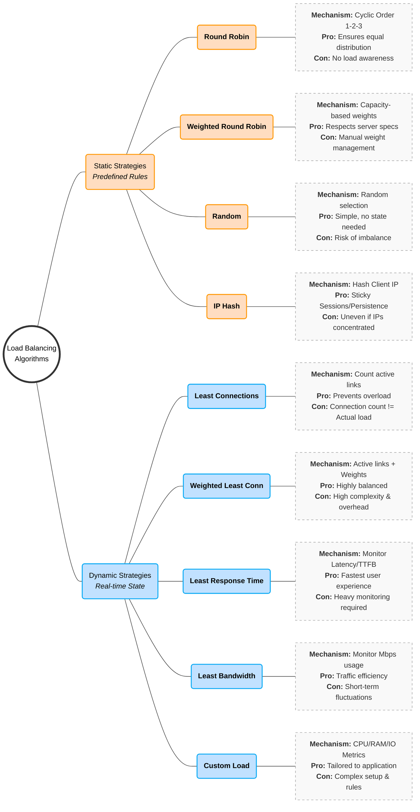

## Uses of Load Balancing

Load balancing is a technique used to distribute workloads evenly across multiple computing resources (servers, network links, etc.) to optimize resource utilization, minimize response time, and prevent overload.

[Image of load balancing architecture diagram]

### Key Benefits

1.  **Improving Website Performance**
    Distributes incoming traffic among multiple servers to reduce individual load and ensure faster response times for end users.

2.  **High Availability & Reliability**
    Prevents single points of failure by monitoring server health and automatically redirecting traffic to healthy servers if one fails.

3.  **Scalability**
    Enables seamless infrastructure scaling; new servers can be added to the pool to handle increased demand without disrupting services.

4.  **Redundancy**
    Maintains redundant copies of data and services across multiple servers, mitigating the risk of data loss or outages due to hardware failure.

5.  **Network Optimization**
    Reduces network congestion and improves throughput by distributing traffic across multiple paths or internet connections.

6.  **Geographic Distribution**
    Directs users to the nearest or best-performing data center based on location to reduce latency (e.g., routing US users to North American servers).

7.  **Application Performance**
    Assigns dedicated resources to specific applications or services, ensuring critical apps perform optimally without fighting for resources.

8.  **Security**
    Mitigates Distributed Denial-of-Service (DDoS) attacks by spreading malicious traffic across multiple servers, preventing any single target from being overwhelmed.

9.  **Cost & Energy Efficiency**
    Optimizes hardware usage, potentially reducing the number of servers required and lowering infrastructure and energy costs.

10. **Content Caching**
    Stores static content (images, videos) directly on the load balancer to serve requests instantly, reducing load on backend application servers.

## Load Balancer Types

A **Load Balancer** acts like a traffic cop for your servers. Imagine a supermarket with 10 checkout lanes. If everyone lines up at just one lane, that cashier gets overwhelmed while the other 9 sit idle. A load balancer stands at the entrance, directing each new customer to the shortest line.

In technical terms, it distributes incoming network traffic across multiple servers (a "server farm" or "server pool"). This ensures no single server bears too much demand, keeping the system fast, reliable, and available.

This guide details the different types of load balancing strategies, their pros and cons, and real-world examples.

---

### 1. Hardware Load Balancing

Hardware load balancers are physical, dedicated boxes (appliances) that you install in your data center. They are the "heavy lifters" of the industry, built with specialized chips like **ASICs** (Application-Specific Integrated Circuits) to process traffic at incredible speeds.

#### Pros

- **Massive Performance:** Because the hardware is built _only_ for this job, it can process gigabytes of data faster than general computers.
- **Security:** Often comes with "walled garden" security features, essentially acting as a firewall to block bad traffic before it hits your servers.
- **Multi-tasking:** Capable of handling many different types of traffic protocols simultaneously.

#### Cons

- **Cost:** These physical boxes are expensive (thousands to tens of thousands of dollars).
- **Scalability Limits:** If you max out the box's capacity, you have to buy another physical box and wire it up.
- **Maintenance:** You need specialized staff to physically manage, rack, and configure the device.

**Real-World Example:**

> A massive e-commerce company (like Amazon or eBay) uses hardware load balancers during Black Friday. They need dedicated machines that can handle millions of connections per second without a millisecond of lag.

---

### 2. Software Load Balancing

Software load balancers are programs you install on standard servers (like a standard Linux or Windows machine) or virtual machines. They use code and algorithms to route traffic rather than specialized physical chips.

#### Pros

- **Cost-Effective:** Much cheaper than buying specialized hardware. You usually pay for a license or use open-source (free) versions like NGINX or HAProxy.
- **Flexible:** You can install it anywhere—on your laptop for testing, on a server in your office, or in the cloud.
- **Easy Scaling:** Need more power? Just spin up another virtual machine copy of the software.

#### Cons

- **Resource Sharing:** Since it runs on a general computer, it has to share CPU and RAM with the operating system and other apps running on that machine.
- **Performance Ceiling:** It might not match the raw throughput speed of specialized hardware ASICs under extreme pressure.

**Real-World Example:**

> A startup launching a new app installs NGINX (a popular software load balancer) on a virtual server. As they grow from 100 to 10,000 users, they can simply upgrade the virtual server's RAM without buying new physical equipment.

---

### 3. Cloud-based Load Balancing

This is "Load Balancing as a Service." Major cloud providers (like AWS, Google Cloud, Azure) manage the load balancer for you. You don't see the physical hardware or install the software; you just click a button to turn it on.

#### Pros

- **Elasticity:** It scales automatically. If traffic spikes at 2 AM, the cloud provider automatically allocates more power.
- **Zero Maintenance:** No patching software, no dusting off servers. The provider handles updates and security fixes.
- **Pay-as-you-go:** You typically pay only for the traffic you process, making it great for unpredictable workloads.

#### Cons

- **Vendor Lock-in:** Moving from AWS to Azure can be difficult because their load balancers work differently.
- **Less Control:** You can't tweak every tiny setting "under the hood" like you can with your own hardware or software.

**Real-World Example:**

> A mobile game developer uses AWS Elastic Load Balancing. When their game goes viral, the load balancer automatically expands to handle the new players. When the hype dies down, it shrinks back, saving money.

---

### 4. DNS Load Balancing

DNS load balancing is a technique where the Domain Name System (DNS)—the system that translates human-readable domain names (like google.com) into machine-readable IP addresses (like 192.0.2.1)—is used to distribute incoming traffic across multiple servers.

Instead of a single server handling all requests for a website, the DNS server has a list of IP addresses for that domain. When users look up the domain, the DNS server hands out different IP addresses to different users, effectively spreading the load.

#### Pros

- **Simplicity:** Very easy to set up. It requires no extra hardware, just configuration of your domain settings.
- **Geographic Routing:** You can send users in Europe to a European IP and users in the US to a US IP.

#### Cons

- **Caching Issues (The "Lag"):** Computers remember (cache) DNS answers. If Server A crashes, your users' computers might still remember Server A's IP address for 10-15 minutes, sending them to a dead end until the cache clears.
- **"Dumb" Distribution:** It generally doesn't know if a server is overloaded; it just hands out IPs in a list (Round Robin).

**Real-World Example:**

> A Content Delivery Network (CDN) uses this to ensure that when you try to watch a Netflix video, your computer is given the IP address of the server physically closest to your house to prevent buffering.

---

### 5. Global Server Load Balancing (GSLB)

GSLB is the "Big Brother" of DNS load balancing. While standard DNS balancing just hands out IPs in a list, GSLB is intelligent. It monitors the health and speed of your data centers around the world in real-time to make routing decisions.

#### How it Works

1. **Health Checks:** GSLB constantly "pings" your data centers. If the London Data Center stops responding, GSLB removes it from the list instantly.
2. **Latency/Proximity:** It looks at the user's IP address. If the user is in Germany, GSLB calculates that the Frankfurt Data Center will respond faster than the New York Data Center, so it sends the user to Frankfurt.
3. **Site Capacity:** It can track how busy a site is. If Frankfurt is at 100% capacity, GSLB can spill traffic over to Paris.

#### Types of GSLB Configurations

- **Active-Passive (Disaster Recovery):** All traffic goes to the Primary Site (e.g., New York). The Backup Site (e.g., Chicago) sits idle. If New York fails, GSLB flips the switch, and all traffic goes to Chicago.
- **Active-Active:** Both New York and Chicago handle traffic simultaneously, usually splitting users based on whoever is closest.

#### Pros

- **Disaster Recovery:** The gold standard for keeping websites online during major outages (hurricanes, power failures).
- **Performance:** Ensures users connect to the server physically closest to them, reducing lag (latency).

### Cons

- **Complexity:** Setting this up requires a deep understanding of DNS, networking, and synchronization between data centers.
- **Cost:** Requires maintaining infrastructure in multiple physical locations around the world.

**Real-World Example:**

> A multinational bank uses GSLB. If their London data center has a power outage, European customers are seamlessly redirected to the Frankfurt data center. The customers never realize the London site went down because the GSLB handled the failover instantly.

---

## 6. Hybrid Load Balancing

Why choose one when you can use them all? Hybrid load balancing mixes hardware, software, and cloud solutions.

- **Think of it like:** A hybrid car. It uses an electric battery for low speeds and a gas engine for high speeds, optimizing for the best of both worlds.

### Pros

- **Ultimate Flexibility:** You can keep sensitive data on secure hardware in your own building while offloading public web traffic to the cloud.
- **Reliability:** You have multiple safety nets.

### Cons

- **Management Nightmare:** You have to manage different systems that might not talk to each other easily.
- **Skill Gap:** Your IT team needs to be expert in both cloud systems and physical hardware.

**Real-World Example:**

> A streaming service keeps its movie database on private hardware load balancers for security (Core Data) but uses cloud load balancers to stream the actual video files to millions of users (Public Traffic).

---

## 7. Layer 4 Load Balancing (The "Transport" Layer)

Layer 4 load balancing operates at the fourth layer of the OSI model (Transport Layer). It is a "low-level" routing method that focuses purely on **speed and volume**.

It routes traffic based on limited information: **Source IP + Port** and **Destination IP + Port**. It does _not_ look inside the data packet.

### How it Works (Packet Inspection)

1. **The Handshake:** A client (user) tries to connect to your server.
2. **The Decision:** The Load Balancer sees the request coming from `IP 1.2.3.4` on `Port 80`.
3. **The NAT (Network Address Translation):** The Load Balancer changes the destination IP to one of your backend servers (e.g., Server A) and forwards the packet.
4. **The Tunnel:** Once the connection is established, the Load Balancer just forwards packets back and forth without checking them again.

### Pros

- **Super Fast:** Because it doesn't "read the letter" (inspect packet contents), it makes decisions incredibly quickly with very low CPU usage.
- **Secure (by obscurity):** Since it doesn't decrypt data (like SSL/TLS), the data remains encrypted as it passes through the balancer.
- **Protocol Agnostic:** It handles any TCP/UDP traffic, meaning it works for websites, email, databases, and games equally well.

### Cons

- **Not "Smart":** It cannot route based on content. It can't send "mobile users" to Server A and "desktop users" to Server B because it doesn't know which device is connecting.
- **No Caching:** Since it doesn't see the content, it cannot cache images or files to speed up the site.

**Real-World Example:**

> **SQL Database Clustering:** A company uses Layer 4 balancing for their database. All requests to port 3306 (SQL) are distributed evenly across 5 database servers. The load balancer doesn't care what query is being run; it just balances the connection load.

---

## 8. Layer 7 Load Balancing (The "Application" Layer)

Layer 7 load balancing operates at the top layer of the OSI model (Application Layer). It is a "high-level" routing method that focuses on **intelligence and content**.

It fully terminates the network connection, decrypts the request, inspects the data, and then makes a routing decision based on the actual content (URL, Headers, Cookies).

### How it Works (Content Inspection)

1. **Termination:** The Load Balancer accepts the connection from the user and decrypts the data.
2. **Inspection:** It looks at the HTTP request. Is the user asking for `/video` or `/chat`? Is the user using an iPhone or Android? Is there a cookie saying they are a "Premium Member"?
3. **Routing:** Based on these details, it initiates a _new_ connection to the specific server best suited to handle that request.

### Specific Capabilities

- **URL Path Routing:** Send `example.com/blog` to the Blog Server and `example.com/shop` to the Store Server.
- **Host Routing:** Send `video.example.com` to powerful servers and `text.example.com` to cheaper servers.
- **Cookie persistence (Sticky Sessions):** If a user is logged in, Layer 7 balancing can see their "Session ID" cookie and ensure they are always sent to the same server so they don't get logged out.

### Pros

- **Very Smart:** Can optimize traffic flow based on exactly what the user is doing.
- **Caching:** Since it sees the content, it can cache static files (like images or CSS) and serve them instantly without bothering the backend servers.

### Cons

- **Slower (Computational Cost):** Decrypting SSL, reading headers, and making complex decisions takes more CPU power and time than Layer 4.
- **Complex:** Requires more configuration and management (e.g., managing SSL certificates on the load balancer itself).

**Real-World Example:**

> **Microservices Architecture:** A modern app like Netflix uses Layer 7.
>
> - If you click "Play," the request goes to a **Streaming Server**.
> - If you click "Search," the request goes to a **Search Index Server**.
> - If you update your billing, the request goes to a **PCI-Secure Payment Server**.
>   All of this happens behind a single domain name, managed by Layer 7 routing.

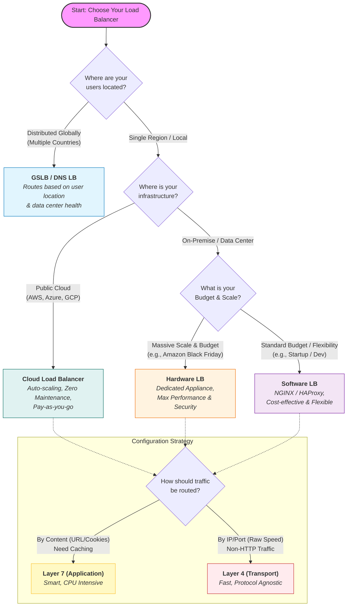

### Stateless vs. Stateful Load Balancing

Here is a comprehensive breakdown of Stateless and Stateful Load Balancing, expanding on your text with technical details, architectural context, and real-world implications.

#### 1. Stateless Load Balancing: "The Forgetful Router"

Stateless load balancing treats every single request as an isolated event. The load balancer has no memory of the user's previous requests. It looks at the incoming packet, applies a simple algorithm (like a coin toss or a list), and sends it to a backend server.

##### How It Works

- **Input Data:** Routing decisions are based strictly on the "packet headers" (static data). This includes the Source IP, Destination URL, or Protocol (TCP/UDP).
- **Algorithms:** Common algorithms include:
- **Round Robin:** Server A Server B Server C Server A.
- **Random:** Pick a server at random.
- **Least Connections:** Send to the server with the fewest current active requests.

- **No "Context":** If you send a request to add an item to your cart, and the next request is to checkout, a stateless balancer might send the first request to **Server A** and the second to **Server B**. If Server B doesn't know about the cart created on Server A, the checkout fails (unless they share a database).

#### Deep Dive into the Example: "Product Search"

- **Scenario:** A user searches for "Coffee Shops" in "Berlin."
- **Why Stateless works here:** The server does not need to know who you are or what you searched for 5 minutes ago to answer this question. The request contains all necessary data (`query="coffee"`, `location="Berlin"`).
- **Result:** The load balancer can send this query to _any_ available server. This maximizes speed because the balancer doesn't waste CPU cycles looking up session tables.

#### Pros & Cons

| Pros                                                                                        | Cons                                                                                                                                       |
| ------------------------------------------------------------------------------------------- | ------------------------------------------------------------------------------------------------------------------------------------------ |
| **High Performance:** No overhead for looking up session tables.                            | **No Continuity:** Cannot handle complex transactions (like banking) without external databases.                                           |
| **Resilience:** If a server dies, the next request just goes to a different one seamlessly. | **Redundant Caching:** If User A visits Server 1, then Server 2, both servers might have to fetch the same profile data from the database. |
| **Easy Scaling:** You can add new servers instantly without configuring "clustering."       |                                                                                                                                            |

---

### 2. Stateful Load Balancing: "The Loyal Router"

Stateful load balancing (often called **Session Persistence** or **Sticky Sessions**) creates a bond between a client and a specific backend server for the duration of a session.

#### How It Works

- **The Handshake:** When a client first connects, the load balancer assigns them to a server (e.g., Server A).
- **The Memory:** The load balancer records this assignment in a look-up table or injects a tracking mechanism (cookie) into the browser.
- **The Loyalty:** All future requests from that client are intercepted, identified, and routed specifically back to Server A.

#### Deep Dive into the Example: "User Login"

- **Scenario:** You log in to your banking dashboard.
- **The Problem:** Your login credentials (the "session token") are stored in the memory (RAM) of **Server A**. If the load balancer sends your next click ("View Balance") to **Server B**, Server B will say, "I don't know you, please log in again."
- **The Stateful Solution:** The load balancer ensures you stay connected to Server A so your login state remains valid.

#### Categories of Stateful Balancing

**A. Source IP Affinity (Client IP Persistence)**

- **Mechanism:** The load balancer takes the client's IP address and runs it through a hashing algorithm (). The result dictates which server takes the traffic.
- **The Flaw (Mobile Networks):** Mobile phones often switch IP addresses as they move between cell towers or when the carrier uses CGNAT (Carrier-Grade NAT). If your IP changes mid-session, the hash changes, and you are thrown to a new server, logging you out.
- **The Flaw (Mega-Proxies):** If a large company (with 5,000 employees) sits behind a single corporate proxy IP, _Source IP Affinity_ will send **all 5,000 employees** to the _same_ backend server, overloading it while other servers sit idle.

**B. Session Affinity (Cookie/Header Persistence)**

- **Mechanism:** This is the modern standard.
- **Application Cookie:** The web app generates a session cookie (`JSESSIONID`, `PHPSESSID`). The load balancer reads this and maps it to a server.
- **Load Balancer Cookie:** The load balancer _inserts_ its own cookie into the browser (e.g., `AWSALB` cookie). This cookie acts as a "nametag" that says "I belong to Server A."

- **Advantage:** It works regardless of IP changes. As long as the browser retains the cookie, the user stays connected to the right server.

---

### High Availability and Fault Tolerance

In simple terms, High Availability (HA) is the art of keeping your website online 99.999% of the time, even when things break. Fault Tolerance is the specific ability of a system to continue operating without interruption when one of its components fails.

#### 1. Redundancy and failover strategies for load balancers

To ensure high availability and fault tolerance, load balancers should be designed and deployed with redundancy in mind. This means having multiple instances of load balancers that can take over if one fails. Redundancy can be achieved through several failover strategies:

- **Active-passive configuration:**
  In this setup, you have two load balancers, but only one works at a time.

The Primary (Active): Handles 100% of the traffic.

The Standby (Passive): sits idle, doing nothing but watching the Primary.

**How it works technically:** Both load balancers share a "Virtual IP Address" (VIP). The Active node holds this IP. The Passive node sends a "heartbeat" signal (a tiny data packet) to the Active node every second, asking, "Are you alive?" If the Active node crashes and the heartbeat stops, the Passive node immediately takes over the VIP and starts accepting traffic. This process is often managed by a protocol called VRRP (Virtual Router Redundancy Protocol).

- Pros: Simplest to configure; debugging is easy (you know exactly which machine is doing the work).
- Cons: "Waste" of money/resources because the Passive server sits idle 99% of the time.

- **Active-active configuration:**
  Here, both load balancers are working simultaneously. If you have two load balancers, each handles roughly 50% of the traffic.

**How it works technically:** You need a mechanism in front of the load balancers to split the traffic between them. This is usually done via DNS Load Balancing (giving one domain name two IP addresses) or Anycast routing (where the network routes you to the nearest open node). If one load balancer fails, the DNS or network simply stops sending traffic to that IP, and the remaining load balancer takes on 100% of the load.

- Pros: 100% resource utilization (no wasted servers); higher total capacity.

- Cons: More complex to configure; troubleshooting is harder (which LB caused the error?); you must ensure the remaining LB can handle the sudden double-load if one fails.

##### 2. Health checks and monitoring

A load balancer is only useful if it sends traffic to servers that are actually working. "Health Checks" are the automated tests the load balancer runs to verify the status of backend servers.

There are two distinct levels of health checks:

- Layer 4 Checks (The "Ping"): The load balancer asks, "Is this server online?" It attempts to open a TCP connection. If the server accepts, it passes.

  - Limitation: A server might accept a connection but be frozen or displaying a blank white page. The L4 check won't catch this.

- Layer 7 Checks (The "Application Logic"): The load balancer makes a real HTTP request, usually to a specific endpoint like /health or /status. It expects a specific response (e.g., "200 OK").

  - Benefit: This confirms the database is connected and the app is actually running.

- The "Circuit Breaker" Pattern: If a server fails a health check 3 times in a row, the load balancer "trips the circuit" and stops sending it traffic. It will continue to secretly check that server in the background. Once the server passes health checks again, the load balancer slowly reintroduces traffic to it.

### Synchronization and State Sharing

The biggest challenge in High Availability is State. If you are logged into Load Balancer A, and it crashes, Load Balancer B needs to know who you are. If it doesn't, you will be logged out. This is why synchronization is vital.

#### The "Split-Brain" Scenario

This is a nightmare scenario in Active-Passive setups. Suppose the network cable connecting the two load balancers breaks, but both are actually still running.

- The Passive node thinks the Active node is dead (because the heartbeat stopped), so it tries to take over the IP.

- The Active node is still alive and holding the IP.

- Now both claim to be the "boss." This causes IP conflicts and data corruption.

#### Solution

- **External State Stores:** Instead of keeping session data in the load balancer's memory, we store it in a high-speed external database like Redis. If LB 1 dies, LB 2 just looks up the user's session in Redis.

- **Distributed Configuration (Consul/Etcd):** These are specialized tools that ensure every load balancer has the exact same settings. If you update a rule on one, these tools instantly replicate that rule to all others.

### Scalability and Performance

#### Horizontal and vertical scaling of load balancers

When a single load balancer becomes the bottleneck, you must scale the load balancing layer itself. This is distinct from scaling the backend application servers.

##### **A. Vertical Scaling (Scaling Up)**

This strategy involves beefing up the single load balancer instance with more hardware power—adding more CPU cores, increasing RAM, or upgrading network interfaces (e.g., moving from 10Gbps to 40Gbps NICs).

How it works: You replace the existing machine with a bigger one.

- **The Ceiling:** Vertical scaling has a "hard limit." Eventually, you hit the physical limits of current hardware technology.

- **The Software Bottleneck:** Even with infinite RAM, you are limited by software constraints, such as the maximum number of ephemeral ports (approx 65k) available for opening connections.

- **Use Case:** Best for small to medium workloads where simplicity is key. Managing one giant machine is easier than managing a cluster.

##### B. Horizontal Scaling (Scaling Out)

This is the standard for high-availability enterprise systems. Instead of one giant load balancer, you deploy a cluster of multiple load balancers that work in parallel.

- The "Bootstrap" Problem: If you have 5 load balancers, how does the client know which one to visit? You need a mechanism to distribute traffic to the load balancers.

  - DNS Load Balancing (Round Robin): The simplest method. You associate a single domain name (e.g., api.example.com) with multiple IP addresses (one for each load balancer) in your DNS records. The DNS server rotates the order of IPs it returns to clients.

    - Drawback: DNS propagation is slow. If one load balancer dies, clients might keep trying to hit it until their local DNS cache expires.

  - Anycast VIP: The advanced method. You assign the same IP address to multiple load balancers located in different places. The core network routers (using BGP - Border Gateway Protocol) automatically route the user's packet to the geographically nearest load balancer advertising that IP.

  - ECMP (Equal-Cost Multi-Path): Used within data centers. The network router spreads packets across multiple load balancers based on a hash of the packet headers, treating them as equal paths to the destination.

#### Connection and Request Rate Limits

Unchecked traffic can crash even the most robust systems. Load balancers act as the "bouncer" for your application, enforcing strict entry rules.

##### A. Connection Limiting (Layer 4 Protection)

This limits the number of open TCP connections a single client (or the total global traffic) can establish.

    - Why it matters: Every open connection consumes a file descriptor and memory on the server. If a hacker opens 100,000 connections but sends no data (a Slowloris attack), they can starve the server of resources.

    - Mechanism: The load balancer monitors the counter of active connections. If the limit is reached, new SYN packets (connection requests) are dropped or rejected immediately, protecting the backend servers from ever seeing the traffic.

##### B. Request Rate Limiting (Layer 7 Protection)

This limits the number of HTTP requests over a specific time window (e.g., "100 requests per minute").

**Algorithms:**

- **Token Bucket:** The user is given "tokens" at a steady rate. Every request costs a token. If the bucket is empty, the request is denied. This allows for short "bursts" of traffic.

- **Leaky Bucket:** Requests are processed at a constant, steady rate, regardless of how fast they come in. Good for smoothing out traffic spikes.

**Granularity:**

- **By IP:** Limits a specific user.

- **By Path:** Limits expensive endpoints (e.g., /search might have a lower limit than /home).

- **By API Key:** Ensures "Gold Tier" customers get more throughput than "Free Tier" users.

#### 3. Caching and Content Optimization

A load balancer is the perfect place to optimize content because it sits at the edge of your network, closest to the user.

##### A. Static Content Caching

Instead of asking the backend web server for logo.png every single time, the load balancer stores a copy in its memory.

- The "Hit" vs. "Miss": When a request comes in, the LB checks its cache. If the file is there (Cache Hit), it serves it instantly without touching the backend. This drastically lowers the CPU load on backend servers.

- Cache-Control Headers: The LB respects headers like max-age or ETag to know when the content is stale and needs to be refreshed from the backend.

##### B. Compression (Gzip/Brotli)

Sending large text files (HTML, CSS, JSON) is slow. Compression shrinks these files by up to 70%.

- Offloading: Compressing data requires CPU power. By performing compression on the load balancer (often using specialized hardware), you free up the backend application servers to focus on business logic rather than compressing bits.

##### C. SSL/TLS Termination

Decrypting HTTPS traffic is mathematically expensive.

- Termination: The load balancer decrypts the incoming traffic, inspects it, and passes it to the backend (often over unencrypted HTTP within the secure private network). This is called "SSL Offloading," saving the backend servers significant CPU cycles.

#### 4. Impact of load balancers on latency

Placing a load balancer in the middle inherently adds a small amount of latency (the time it takes to process and forward the packet). However, smart optimizations can actually make the total request time faster than if the load balancer weren't there.

##### A. Connection Multiplexing (Keep-Alive)

Establishing a TCP connection requires a "3-Way Handshake" (SYN, SYN-ACK, ACK), which takes time.

- The Optimization: The load balancer maintains a pool of "warm," already-established connections to the backend servers.

- The Flow: When a client request arrives, the LB doesn't open a new connection to the backend. It grabs an existing open connection from the pool. This eliminates the handshake latency for the backend leg of the journey.

##### B. Geographical Distribution (GSLB)

If your user is in London but your server is in New York, latency is governed by the speed of light.

- Global Server Load Balancing (GSLB): You deploy load balancers in multiple regions (e.g., US-East, EU-West, Asia-Pacific).

- DNS Routing: The GSLB system detects the user's location (via their IP) and updates DNS to point them to the physically closest load balancer (e.g., the London user is routed to the EU-West VIP).

##### C. Protocol Upgrades (HTTP/2 & HTTP/3)

Modern load balancers can translate protocols to improve speed.

- HTTP/2: Supports Multiplexing, allowing multiple requests (images, scripts, CSS) to be sent over a single TCP connection simultaneously, rather than waiting for one to finish before starting the next.

- HTTP/3 (QUIC): Uses UDP instead of TCP. It solves "Head-of-Line Blocking," meaning if one packet is lost, it doesn't pause the entire stream of data. This is crucial for users on unstable mobile networks.

### Challenges of Load Balancers

Here is a condensed, high-impact breakdown of the challenges associated with Load Balancers (LBs) and their architectural solutions.

---

#### **1. The Single Point of Failure (SPOF)**

Since the LB acts as the "front door," if it fails, the entire application goes offline (), regardless of backend health.

- **The Remedy: High Availability (HA) Pairs**
- **Active-Passive:** Deploy two LBs. The "Active" node handles traffic while the "Passive" node monitors its heartbeat.
- **VRRP (Virtual Router Redundancy Protocol):** If the Active node dies, the Passive node instantly claims the shared Virtual IP (VIP) to resume traffic flow without manual intervention.

#### **2. Configuration Complexity & Drift**

Modern LBs are programmable logic centers. Misconfigured timeouts or cipher suites can drop users or create security holes. Manual changes lead to **Configuration Drift**, where the live server diverges from documentation.

- **The Remedy: Infrastructure as Code (IaC)**
- Avoid manual tweaks. Use tools like **Terraform** or **Ansible** to define configurations in code. This ensures consistency and allows for rapid recovery or rollback.

#### **3. Scalability Bottlenecks**

The LB itself has limits, primarily **Port Exhaustion** (running out of ephemeral ports) and **CPU Saturation** (from heavy SSL decryption).

- **The Remedy: Offloading & DNS Scaling**
- **SSL Offloading:** Move the heavy lifting of decryption to specialized cloud services (like AWS ALB or Cloudflare) to spare the LB's CPU.
- **DNS Load Balancing:** Use DNS to distribute traffic across multiple LB clusters rather than relying on a single giant instance.

#### **4. Latency (The "Extra Hop")**

Introducing a middleman doubles the network packets needed for a request (Client LB Server), potentially increasing wait times.

- **The Remedy: Direct Server Return (DSR)**
- In DSR, the LB forwards the request to the backend, but the backend replies **directly to the client**, bypassing the LB on the return trip. This prevents the LB from becoming a bottleneck for large outbound data (like video streams).

#### **5. Sticky Sessions vs. Statelessness**

If an application stores user data (e.g., shopping carts) in a specific server's RAM, the LB must mistakenly keep sending that user to the same server ("Sticky Sessions"). This causes uneven load distribution.

- **The Remedy: Distributed Caching (Redis)**
- Adopt a **Stateless Architecture**. Don't store sessions on the web server. Store them in a shared database like **Redis**. Now, the LB can send traffic to _any_ server, and the user's session remains intact.

#### **6. Cost Management**

Hardware LBs require expensive upfront capital (CAPEX), while cloud LBs (OPEX) can scale costs linearly with traffic, leading to "bill shock" during attacks.

- **The Remedy:** Use **Autoscaling** to ensure you only pay for the active LBs you need at that moment, and implement strict **Rate Limiting** to prevent DDoS attacks from inflating your data processing bills.

#### **7. Health Checks & "Flapping"**

If an LB is too sensitive, it might mark a struggling server as "Dead," then "Healthy," then "Dead" again rapidly. This is called **Flapping**, and it destabilizes the cluster.

- **The Remedy: Hysteresis**
- Configure distinct thresholds for status changes. For example, require **3 consecutive failures** to mark a server down, but **5 consecutive successes** to mark it back up. This buffer ensures a server is truly stable before it receives traffic again.

---

### Introduction to API Gateway

An API Gateway acts as a single entry point for all client requests. It takes a request, understands what the user wants (the business intent), and routes it to the correct service. Crucially, it performs tasks that the backend services shouldn't have to worry about.

Key Responsibilities:

- Authentication & Security: "Do you have an ID badge?" It checks if the user is logged in (OAuth, JWT) before the request ever reaches your servers.

- Protocol Translation: "I speak English, but the engineering team speaks German." It can take a REST request from a phone and convert it to gRPC or SOAP for an old legacy system.

- Rate Limiting: "You can only visit 5 times a minute." It prevents users from spamming the system.

- Response Aggregation: If a user's profile page needs data from the User Service, Billing Service, and Shipping Service, the Gateway calls all three and combines the answers into one neat JSON response for the phone.

#### API Gateways and Load Balancer: How are they different?

The confusion often arises because **API Gateways can do load balancing**, but Load Balancers cannot do API management.

| Feature           | API Gateway                                                                                  | Load Balancer                                                                                   |
| ----------------- | -------------------------------------------------------------------------------------------- | ----------------------------------------------------------------------------------------------- |
| **Primary Goal**  | Expose, secure, and manage APIs as a product.                                                | Distribute traffic to ensure uptime and speed.                                                  |
| **OSI Layer**     | **Layer 7 (Application):** It reads the actual data/content of the message.                  | **Layer 4 (Transport):** Mostly looks at IP/Port. (Some L7 LBs exist but are less logic-heavy). |
| **Intelligence**  | **High:** Can read a user's ID, route based on specific headers, or rewrite URLs.            | **Low/Medium:** Cares mostly about server health and traffic volume.                            |
| **Security**      | **Deep Security:** Authentication (OAuth), SQL Injection blocking, Rate limiting by user ID. | **Infrastructure Security:** DDoS protection, Firewalling IPs, SSL Offloading.                  |
| **Routing Logic** | "Route `/billing` to Service A and `/profile` to Service B."                                 | "Route the next 10 packets to Server #3 because it's free."                                     |

---

### Key Usage of API Gateways

- Centralized Security: It provides a single point to enforce security policies. Instead of every microservice handling authentication (who you are) and authorization (what you are allowed to do), the gateway handles this once, verifying tokens or keys before passing the request further.

- Rate Limiting and Throttling: It protects backend services from being overwhelmed by traffic spikes or malicious attacks (DDoS). The gateway can limit how many requests a user or service can make per second.

- Protocol Translation: It allows clients to communicate via one protocol (e.g., HTTP/REST) while backend services might use another (e.g., gRPC or AMQP), ensuring seamless communication without the client needing to know backend details.

- Load Balancing: The gateway distributes incoming network traffic across multiple servers to ensure no single server bears too much load, improving application responsiveness and availability.

- Request/Response Transformation: It can modify requests and responses on the fly. For example, it might aggregate data from multiple services into a single response for the client, reducing the number of round trips the client needs to make.

- Analytics and Monitoring: Because all traffic flows through the gateway, it is the perfect place to log usage data, monitor response times, and track errors, providing a unified view of system health.

### Disadvantages of API Gateways

However, the very features that make an API Gateway powerful also create its downsides. By centralizing logic, you create a potential bottleneck and a critical dependency.

- **Single Point of Failure (SPOF):** This is the most critical risk. If the Product Service fails, only the product page breaks. **If the API Gateway fails, the entire application goes offline.** This necessitates expensive, high-availability setups with redundancy to ensure the Gateway never crashes.
- **Increased Latency:** Physics is unavoidable; the Gateway adds an extra "hop" in the network journey. Every request must go from Client Gateway Service, rather than Client Service. While usually measured in milliseconds, this additional step can be problematic for high-frequency trading or real-time gaming applications where every microsecond counts.
- **Operational Complexity:** Managing a Gateway is not free. It requires its own infrastructure, monitoring, and scaling rules. It can also become a **development bottleneck**; if a team adds a new microservice but has to wait for the "Gateway Team" to update the routing configuration before they can go live, agility is lost.
- **Risk of the "Monolithic Gateway":** There is a temptation to put too much business logic (like complex code or data processing) into the Gateway. If this happens, the Gateway essentially becomes a new monolith—bloated, hard to update, and difficult to test—recreating the exact problem microservices were meant to solve.

# Key Characteristics of Distributed Systems

## Scalability

Scalability is the ability of a system to handle an increasing workload, either by adding more resources (scaling out) or by upgrading the capacity of existing resources (scaling up).

### A. Horizontal Scaling

Horizontal scaling, also known as scaling out, involves adding more machines or nodes to a system to distribute the workload evenly. This approach allows the system to handle an increased number of requests without overloading individual nodes. Horizontal scaling is particularly useful in distributed systems because it provides a cost-effective way to manage fluctuating workloads and maintain high availability.

### B. Vertical Scaling

Vertical scaling, or scaling up, refers to increasing the capacity of individual nodes within a system. This can be achieved by upgrading the hardware, such as adding more CPU, memory, or storage. Vertical scaling can help improve the performance of a system by allowing it to handle more workloads on a single node. However, this approach has limitations, as there is a physical limit to the amount of resources that can be added to a single machine, and it can also lead to single points of failure.

### Horizontal vs. Vertical Scaling

With horizontal-scaling it is often easier to scale dynamically by adding more machines into the existing pool; Vertical-scaling is usually limited to the capacity of a single server and scaling beyond that capacity often involves downtime and comes with an upper limit.

Good examples of horizontal scaling are Cassandra and MongoDB as they both provide an easy way to scale horizontally by adding more machines to meet growing needs. Similarly, a good example of vertical scaling is MySQL as it allows for an easy way to scale vertically by switching from smaller to bigger machines. However, this process often involves downtime.

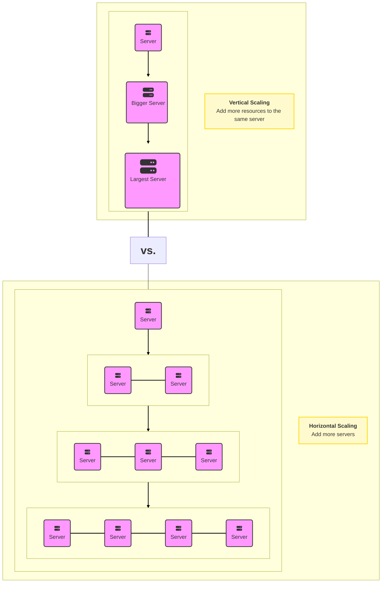

## Availability

Availability is a measure of how accessible and reliable a system is to its users. In distributed systems, high availability is crucial to ensure that the system remains operational even in the face of failures or increased demand.

### Definition of High Availability

High availability is often measured in terms of uptime, which is the ratio of time that a system is operational to the total time it is supposed to be operational. Achieving high availability involves minimizing planned and unplanned downtime, eliminating single points of failure, and implementing redundant systems and processes.

When it comes to distributed systems, high availability goes beyond simply ensuring that the system is up and running. It also involves guaranteeing that the system can handle increased load and traffic without compromising its performance. This scalability aspect is crucial, especially in scenarios where the user base grows rapidly or experiences sudden spikes in demand.

### Strategies for Achieving High Availability

To achieve high availability, organizations implement various strategies that focus on redundancy, replication, load balancing, distributed data storage, health monitoring, regular system maintenance, and geographic distribution.

#### 1. High Availability through Redundancy and Replication

One of the most effective strategies for achieving high availability is redundancy and replication. By duplicating critical components or entire systems, organizations can ensure that if one fails, the redundant system takes over seamlessly, avoiding any interruption in service.

#### 2. Availability through Load Balancing

Load balancing involves distributing workloads across multiple servers, ensuring that no single server is overwhelmed.

#### 3. Availability through Distributed Data Storage

Storing data across multiple locations or data centers enhances high availability by reducing the risk of data loss or corruption. Distributed data storage systems replicate data across geographically diverse locations, ensuring that even if one site experiences an outage, data remains accessible from other locations.

#### 4. Availability and Consistency Models (Strong, Weak, Eventual)

Consistency models define how a distributed system maintains a coherent and up-to-date view of its data across all replicas. Different consistency models provide different trade-offs between availability, performance, and data correctness.

Strong consistency ensures that all replicas have the same data at all times, at the cost of reduced availability and performance.

Weak consistency allows for temporary inconsistencies between replicas, with the advantage of improved availability and performance.

Eventual consistency guarantees that all replicas will eventually converge to the same data, providing a balance between consistency, availability, and performance.

#### 5. Availability through Health Monitoring and Alerts

Health monitoring involves continuously monitoring system performance, resource utilization, and various metrics to detect any anomalies or potential issues. Alerts are triggered when predefined thresholds are exceeded, allowing IT teams to take immediate action and prevent service disruptions.

#### 6. Availability through Regular System Maintenance and Updates

Regular system maintenance and updates are crucial for achieving high availability. By keeping systems up to date with the latest patches, security enhancements, and bug fixes, organizations can mitigate the risk of failures and vulnerabilities that could compromise system availability.

## Latency and Performance

Latency and performance are critical aspects of distributed systems, as they directly impact the user experience and the system's ability to handle large amounts of data and traffic.

### A. Data Locality

Data locality refers to the organization and distribution of data within a distributed system to minimize the amount of data that needs to be transferred between nodes. By storing related data close together or near the nodes that access it most frequently, you can reduce the latency associated with data retrieval and improve overall performance. Techniques to achieve data locality include data partitioning, sharding, and data replication.

### B. Load Balancing

Load balancing is the process of distributing incoming network traffic or computational workload across multiple nodes or resources to ensure that no single node is overwhelmed.

### C. Caching Strategies

Caching is a technique used to store frequently accessed data or computed results temporarily, allowing the system to quickly retrieve the data from cache instead of recalculating or fetching it from the primary data source.

## Concurrency and Coordination

In distributed systems, Concurrency and Coordination are the mechanisms used to tame non-determinism. Unlike a single computer where the OS controls the clock and memory, distributed systems consist of independent nodes connected by an unreliable network, each with its own clock.

### A. Concurrency Control

Concurrency control is the process of managing simultaneous access to shared resources or data in a distributed system.

- **Locking:** Locks are used to restrict access to shared resources or data, ensuring that only one process can access them at a time.

- **Optimistic concurrency control:** This approach assumes that conflicts are rare and allows multiple processes to work simultaneously. Conflicts are detected and resolved later, usually through a validation and rollback mechanism.

- **Transactional memory:** This technique uses transactions to group together multiple operations that should be executed atomically, ensuring data consistency and isolation.

### B. Synchronization

While Concurrency Control handles access, Synchronization handles timing and ordering. In distributed systems, "time" is relative because physical clocks drift.

- **Barriers:** Barriers are used to synchronize the execution of multiple processes or threads, ensuring that they all reach a specific point before proceeding.

- **Semaphores:** Semaphores are signaling mechanisms that control access to shared resources and maintain synchronization among multiple processes or threads.

- **Condition variables:** Condition variables allow processes or threads to wait for specific conditions to be met before proceeding with their execution.

### C. Coordination Services

Coordination services are specialized components or tools that help manage distributed systems' complexity by providing a set of abstractions and primitives for tasks like configuration management, service discovery, leader election, and distributed locking. Examples of coordination services include Apache ZooKeeper, etcd, and Consul.

### D. Consistency Models

Consistency models define the rules of engagement between your application and your data. They are the contract that tells you how current your data is at any given moment across a distributed cluster.

#### 1. Global / Data-Centric Models

These models view the system from the perspective of the database itself, ensuring that all nodes agree on a specific history of events.

**Linearizability (Strict Consistency)**
This is the "Holy Grail" of consistency. It provides a guarantee that the system behaves exactly like a single server, even if it is distributed across the world. In a linearizable system, once a write is successfully committed at a specific timestamp (say, 12:00:00), any read operation that begins after that timestamp (12:00:01) is guaranteed to return that new value, regardless of which node receives the request. This model respects **real-time** wall-clock order. It is extremely expensive to implement because it requires heavy coordination (like the Raft or Paxos algorithms) to ensure every node is perfectly synced before acknowledging a write.

- **Use Case:** Financial ledgers, password changes, or medical data where stale data could be catastrophic.

**Sequential Consistency**
This model is slightly more relaxed than Linearizability. It guarantees that all nodes see operations in the _same total order_, but that order does not necessarily have to match real-time wall-clock time. If User A writes "X" and User B writes "Y" simultaneously, the system can choose to process "Y" before "X" or "X" before "Y"—as long as _every_ node in the cluster agrees on that chosen sequence. The system respects the "program order" of a single client (if I write A then B, everyone sees A then B), but it does not guarantee that my write is instantly visible to you the moment I hit enter, only that we will eventually agree on the sequence of events.

- **Use Case:** Distributed queues (FIFO) or logging systems where the order of processing matters more than the exact millisecond the entry arrived.

---

#### 2. Relaxed / Weak Models

These models prioritize system uptime and low latency over immediate data accuracy. They are defined by the **BASE** philosophy (Basically Available, Soft state, Eventual consistency).

**Causal Consistency**
This model is a smart middle ground. It tracks which operations depend on others. If Operation B was caused by Operation A (e.g., a "Reply" to a "Comment"), the system guarantees that everyone will see the Comment (A) before the Reply (B). However, unrelated (concurrent) events can be seen in any order. If two people upload different photos to different albums at the same time, it doesn't matter which one you see first. This captures the vast majority of "correctness" required for human applications without the performance penalty of enforcing a global order on unrelated events.

- **Use Case:** Social media feeds, chat applications (Slack/Discord), where conversation threads must remain in order but unrelated channels don't matter.

**Eventual Consistency**
The weakest but fastest model. It guarantees that if no new updates are made to a given data item, _eventually_ all accesses to that item will return the last updated value. In the short term, however, different nodes may return different versions of the data. This allows the system to accept writes even when parts of the network are broken or slow. The system typically resolves conflicts using a "Last Write Wins" strategy or by asking the application to merge divergent data.

- **Use Case:** DNS (Domain Name System), YouTube view counters, or "Likes" on a viral post. It is acceptable if a user sees "99 likes" while another sees "101 likes" for a few seconds.

---

#### 3. Client-Centric Models

These models focus on the _user's_ experience rather than the global state of the database. They bridge the gap between weak and strong consistency by ensuring a single user sees a sensible view of the world.

**Read-Your-Writes Consistency**
This guarantees that a client will always see the effects of their _own_ previous writes. If you update your profile picture, this model ensures that when the page reloads, you see the new picture—even if other users in the world still see the old one for a few minutes. Without this, users would constantly feel like the application is broken ("I just saved this, why is it gone?").

- **Use Case:** User profile management, document editing tools, or posting a status update.

**Monotonic Read Consistency**
This guarantees that "time never moves backward." If a user reads a data value (Version 2), they will never subsequently read an older value (Version 1). This is crucial in distributed systems where a user might be load-balanced between two servers. If Server A has the new data and Server B is lagging, switching the user from A to B would effectively revert their view of history. Monotonic reads prevent this by ensuring the user is only routed to servers that are at least as up-to-date as the last one they visited.

- **Use Case:** Checking an email inbox (deleted emails shouldn't reappear) or banking transaction histories (a deposit shouldn't disappear after you've seen it).

**Session Consistency**
This wraps the above guarantees (Read-Your-Writes and Monotonic Reads) into the context of a specific user session. As long as your browser window is open or your session token is active, the system guarantees consistent data. If the session ends or expires, the guarantee resets. This is practical because it aligns the data guarantee with the user's interaction period.

- **Use Case:** E-commerce shopping carts. As long as you are shopping, your cart items must persist. If you log out and log back in days later, it is acceptable if the cart state is rebuilt from a slightly different backup, but during the active session, it must be rock solid.

## Monitoring and Observability

In the world of distributed systems, if you cannot measure it, you cannot manage it. Monitoring and Observability are often used interchangeably, but they serve different purposes.

- **Monitoring** tells you **when** something is wrong (e.g., "The server is down"). It is reactive and based on known failure modes.
- **Observability** allows you to understand **why** it is wrong (e.g., "The server is down because a database lock caused a memory leak"). It is exploratory and helps you debug unknown unknowns.

To achieve true observability, we rely on three fundamental pillars: **Metrics**, **Traces**, and **Logs**.

---

### A. Metrics Collection (The "Vitals")

Metrics are numerical data points measured over time. They are cheap to store and fast to query because they are aggregated. They tell you "What" is happening but not "Why."

- **How it works:** Instead of recording every single login attempt (which would fill your disk), metrics simply increment a counter: `login_attempts = 502`.
- **Key Types:**
- **Counters:** Values that only go up (e.g., Total Requests, Errors).
- **Gauges:** Values that fluctuate (e.g., CPU usage, Memory available).
- **Histograms:** Distributions of values (e.g., "99% of requests finished in under 200ms").

- **High Cardinality Issues:** A common challenge in metrics is "cardinality." If you tag metrics with data that changes too often (like User IDs or IP addresses), your database will explode in size. Metrics are for _aggregate_ health, not individual user tracking.
- **Tools:** **Prometheus** (standard for Kubernetes), **InfluxDB**, **Datadog**.

### B. Distributed Tracing (The "Journey")

In a microservices architecture, a single user click might trigger requests across 50 different services. If the request is slow, metrics will show high latency on all 50 services, but they won't tell you _which one_ caused the delay.

- **How it works:** A unique ID (**Trace ID**) is attached to the request header at the entry point (e.g., the Load Balancer). As the request travels from Service A → Service B → Database, this ID is passed along ("Context Propagation").
- **Spans:** Each operation in the chain creates a "Span," which records the start time, end time, and metadata for that specific step.
- **The Waterfall View:** Tracing tools visualize this data as a waterfall, instantly highlighting the specific database query or API call that took 5 seconds while everything else took 5ms.
- **Tools:** **Jaeger**, **Zipkin**, **OpenTelemetry** (the industry standard for collecting traces).

### C. Logging (The "Journal")

Logs are discrete, timestamped records of specific events. Unlike metrics, logs act as the "Black Box" recorder of your system, providing the highest fidelity of data.

- **Structured vs. Unstructured:**
- _Old Way (Unstructured):_ `2023-10-01 Error: User failed login.` (Hard for machines to parse).
- _New Way (Structured/JSON):_ `{"timestamp": "2023-10-01", "level": "ERROR", "event": "login_failed", "user_id": 8421}`. This allows you to query logs like a database (e.g., "Show me all errors for user 8421").

- **Log Aggregation:** Since you have hundreds of servers, you cannot SSH into each one to read text files. You must ship all logs to a central "Log Aggregator" to index and search them.
- **Tools:** **ELK Stack** (Elasticsearch, Logstash, Kibana), **Splunk**, **Loki**.

### D. Alerting & Anomaly Detection (The "Alarm")

Collecting data is useless if no one looks at it. Alerting converts data into action.

- **SLIs, SLOs, and SLAs:** Modern alerting is built on these acronyms:
- **SLI (Indicator):** The real number (e.g., "Latency is 250ms").
- **SLO (Objective):** The internal goal (e.g., "Latency should be < 300ms 99% of the time").
- **SLA (Agreement):** The legal contract with users (e.g., "If latency > 500ms, we pay you back").

- **Alert Fatigue:** The biggest risk in monitoring. If you alert on _everything_ (e.g., "CPU is at 80%"), engineers will ignore the pager. You should only alert on **symptoms** that affect the user (e.g., "Checkout Error Rate > 1%"), not purely on causes.
- **Anomaly Detection:** Instead of static thresholds ("Alert if > 100 errors"), machine learning learns the daily pattern. It knows that 100 errors is normal on Black Friday but abnormal on a Tuesday morning.

### E. Visualization (The "Cockpit")

This is the "Single Pane of Glass" where all three pillars converge.

- **Correlating Data:** The best dashboards allow you to spot a spike in a **Metric** (High Latency), click it to see the **Trace** (The slow database query), and drill down into the **Logs** (The specific error message "Connection Timeout").
- **Golden Signals:** Google SRE recommends every dashboard track the "Four Golden Signals":

1. **Latency:** Time it takes to service a request.
2. **Traffic:** Demand placed on your system (req/sec).
3. **Errors:** Rate of requests that fail.
4. **Saturation:** How "full" your most constrained resource is (e.g., Memory).

## Resilience and Error Handling

Resilience and error handling help minimize the impact of failures and ensure that the system can recover gracefully from unexpected events.

### A. Fault Tolerance

Fault tolerance is the architectural capacity of a system to continue delivering its intended service, possibly at a reduced level, rather than failing completely when some part of the system fails.

Designing a fault-tolerant system involves incorporating redundancy at various levels (data, services, nodes) and implementing strategies like replication, sharding, and load balancing to ensure that the system can withstand failures

### B. Graceful Degradation

When a system faces extreme load or component failure, it must prioritize the "Critical User Journey." Graceful degradation ensures that the system fails progressively rather than catastrophically.

System health is not a boolean (up/down). If a recommendation engine fails on an e-commerce site, the "Buy" button (core functionality) must still work, perhaps displaying a generic list of items instead of personalized ones.

### C. Retry and Backoff Strategies

Distributed systems frequently encounter "transient faults"—temporary glitches like network jitter or momentary service unavailability. Handling these requires a balance between persistence and resource conservation.

Before implementing retries, operations must be idempotent, meaning performing the same operation multiple times yields the same result (e.g., charging a credit card only once despite three retry attempts).

### D. Error Handling and Reporting

Resilience requires visibility. It is not enough to handle errors; the system must communicate the context of the error to engineers to facilitate Root Cause Analysis (RCA).

### E. Chaos Engineering

Chaos engineering is the practice of intentionally injecting failures into a distributed system to test its resilience and identify weaknesses. By simulating real-world failure scenarios, you can evaluate the system's ability to recover and adapt

## Fault Tolerance vs. High Availability

### Fault Tolerance

Fault Tolerance refers to a system's ability to continue operating without interruption when one or more of its components fail.

**Characteristics**

Redundancy: Incorporates redundancy in system components (like servers, networks, storage) to ensure no single point of failure.

Automatic Failover: Automatically switches to a redundant or standby system upon the failure of a system component.

No Data Loss: Ensures that no data is lost in the event of a failure.

### High Availability

High Availability refers to a system's ability to remain operational and accessible for a very high percentage of the time, minimizing downtime as much as possible.

**Characteristics**
Uptime Guarantee: Designed to ensure a high level of operational performance and uptime (often quantified in terms of “nines” – for example, 99.999% availability).

Load Balancing and Redundancy: Achieved through techniques like load balancing, redundant systems, and clustering.

Rapid Recovery: Focuses on quickly restoring service after a failure, though a brief disruption is acceptable.

# Network Essentials

## HTTP vs HTTPs

HTTP (Hypertext Transfer Protocol) and HTTPS (Hypertext Transfer Protocol Secure) are both protocols used for transmitting data over the internet, primarily used for loading webpages. While they are similar in many ways, the key difference lies in the security aspect provided by HTTPS.

### 1. What is HTTP?

HTTP stands for HyperText Transfer Protocol. It's the foundational protocol used for transmitting data on the World Wide Web. When you enter a website address in your browser, HTTP is responsible for fetching and displaying that site.

**Stateless Protocol:** Each request from a client to a server is independent. The server doesn't retain any session information between requests.

**Text-Based:** Data is transmitted in plain text, making it readable by both humans and machines.

**Port 80:** By default, HTTP uses port 80 for communication.

### 2. What is HTTPs?

HTTPS stands for HyperText Transfer Protocol Secure. It's an extension of HTTP with added security measures to protect data during transmission.

**Key Features of HTTPs**
**Encryption:** Uses protocols like SSL/TLS to encrypt data, ensuring that any intercepted information remains unreadable.

**Authentication:** Verifies that the website you're connecting to is legitimate, preventing man-in-the-middle attacks.

**Data Integrity:** Ensures that data isn't tampered with during transmission.

**Port 443:** HTTPS operates over port 443.

### How TLS handshake works

#### 1. The Core Concepts

Before the handshake begins, you must understand the two tools being used:

Asymmetric Encryption (The Handshake): Uses a Key Pair.

Public Key: Available to everyone. Used to encrypt data.

Private Key: Kept secret by the server. Used to decrypt data.

Mechanism: If you lock a box with the Public Key, only the Private Key can open it.

Symmetric Encryption (The Data Transfer): Uses a single "Session Key."

Both sides have the same key. It is used to lock and unlock the data.

Why switch? Asymmetric encryption is mathematically complex and slow. Symmetric encryption is incredibly fast.

#### 2. The Process: Step-by-Step

When you type https://google.com, your browser (Client) and the Google Server perform a TLS Handshake. This happens in milliseconds.

#### Phase 1: Negotiation (The "Hello")

Client Hello: Your browser sends a message listing the TLS versions and encryption algorithms (Cipher Suites) it supports. It also sends a random string of numbers (Client Random).

Server Hello: The server picks the best encryption algorithm from your list. It sends back its own random string (Server Random) and its Digital Certificate.

#### Phase 2: Authentication (Checking the ID)

The browser must prove the server is who it claims to be.

Certificate Check: The browser inspects the server's Digital Certificate. It looks at the Digital Signature on the certificate.

Chain of Trust: The browser asks: "Who signed this?" (e.g., DigiCert, Let's Encrypt). The browser has a pre-installed list of trusted authorities. If the signature matches a trusted authority, the identity is verified.

Public Key Extraction: The browser pulls the server's Public Key out of that verified certificate.

Phase 3: Key Exchange (The Secret Handoff)
Now they need to agree on a Session Key (Symmetric key) to encrypt the actual browsing data. There are two main ways this happens:

Option A: The RSA Key Exchange (Older, less common now)

The Client generates a random code called the Pre-Master Secret.

The Client encrypts this secret using the server's Public Key (extracted in Phase 2).

The Client sends this encrypted package to the Server.

The Server uses its Private Key to decrypt it. Now both sides have the Pre-Master Secret without anyone seeing it.

Option B: The Diffie-Hellman Exchange (Modern Standard, TLS 1.3)

Instead of sending a key across the wire, the two sides generate the key together mathematically.

The Math: Both sides share public variables (let's call them Paint Colors).

The Secret: Each side mixes their own secret color into the public paint.

The Swap: They exchange the mixed paints.

The Final Mix: Each side adds their secret color to the mix they just received.

Result: Both sides end up with the exact same final color (the Session Key), but a hacker seeing the exchanged paints cannot "un-mix" them to find the secret.

Phase 4: Encrypted Transmission
Both the Client and Server use the random numbers exchanged in Phase 1 + the Secret generated in Phase 3 to create the final Session Key.

The Handshake is complete.

Symmetric Encryption Begins: When you load the webpage, the data is encrypted using this Session Key. If a hacker intercepts the data, they see random characters (ciphertext).

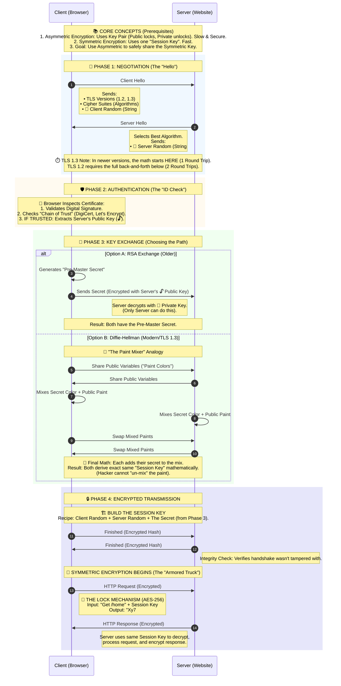

## TCP vs. UDP

Think of the internet as a massive system of mail delivery. **TCP (Transmission Control Protocol)** and **UDP (User Datagram Protocol)** are the two primary methods used to transport data packets between computers. They both run on top of the IP (Internet Protocol) layer, but they have completely different philosophies.

- **TCP** is like a **Certified Mail** service: It guarantees your letter arrives, in order, and sends you a receipt.
- **UDP** is like sending a **Postcard**: You drop it in the mailbox and hope it gets there. It's fast and cheap, but there is no tracking number.

Here is a detailed breakdown of how each works.

---

### 1. TCP (Transmission Control Protocol)

TCP is designed for **reliability**. It ensures that no matter how chaotic the network is, the data received is exactly the same as the data sent.

#### **Phase A: The Connection (The 3-Way Handshake)**

Before any data is transferred, TCP establishes a "virtual circuit" between two devices. This is known as the **3-way handshake**.

1. **SYN (Synchronize):** The client sends a packet with the `SYN` flag on. This is effectively asking, "Hello, I want to connect. My sequence number is ."
2. **SYN-ACK (Synchronize-Acknowledge):** The server receives it and replies with `SYN-ACK`. It says, "I received your request (). I am ready too. My sequence number is ."
3. **ACK (Acknowledge):** The client replies with `ACK`. It says, "I received your reply (). Let's start."

- _Result:_ A stateful connection is established.

#### **Phase B: Reliable Data Transfer**

Once connected, TCP manages the data flow using three sophisticated mechanisms:

- **Sequencing:** TCP chops data into segments and assigns a **Sequence Number** to each. If packets arrive out of order (e.g., packet 2 arrives after packet 3), the receiver uses these numbers to reassemble them correctly.
- **Acknowledgments (ACKs) & Retransmission:** When the receiver gets a packet, it sends an ACK back to the sender.
- _The "What if" scenario:_ If the sender does not receive an ACK within a specific timeframe (timeout), it assumes the packet was lost and **retransmits** it automatically.

- **Flow Control (Windowing):** The receiver tells the sender how much buffer space it has left (called the "Window Size"). If the receiver is overwhelmed, the sender slows down. This prevents the sender from drowning the receiver in data.

#### **Phase C: Connection Termination**

When the data transfer is done, TCP politely closes the connection using a **4-way handshake**:

1. **FIN:** Sender says "I'm done."
2. **ACK:** Receiver says "Received."
3. **FIN:** Receiver says "I'm done too."
4. **ACK:** Sender says "Goodbye."

---

### 2. UDP (User Datagram Protocol)

UDP is designed for **speed**. It strips away all the "safety checks" of TCP to reduce latency (delay).

#### **How It Works (Fire-and-Forget)**

UDP does **not** establish a connection (no handshake). It simply takes the application data, adds a tiny header, and throws it onto the network.

- **No Guarantees:** UDP does not care if the packet arrives. It does not check for errors (mostly) and does not ask for acknowledgments.
- **No Ordering:** If you send packets A, B, and C, they might arrive as C, A, B. The application layer must figure out what to do with them.
- **Header Simplicity:** Because it lacks these features, the UDP header is incredibly small—only **8 bytes**. In contrast, the TCP header is **20-60 bytes**.

---

### HTTP: 1.0 vs 1.1 vs 2.0 vs 3.0

#### HTTP 1.0

**How it worked:** It introduced Headers, allowing the transfer of images, video, and scripts, not just HTML. It also added status codes (like 404 Not Found).

**Limitation:** It still required opening a new TCP connection for every single file. If a website had 10 images, your browser had to set up and tear down 10 separate connections, which was incredibly slow.

#### HTTP 1.1

Released in 1997, this version powered the web for over 15 years and is still widely used.

**Key Innovation:** Persistent Connections ("Keep-Alive") Instead of opening a new connection for every file, HTTP/1.1 keeps the TCP connection open to reuse it for multiple requests (e.g., HTML, CSS, and images all travel over one wire).

**The Critical Flaw:** Head-of-Line Blocking HTTP/1.1 processes requests sequentially. If your browser requests a large image followed by a small script, the small script has to wait for the large image to finish downloading completely. It is like a single checkout lane at a grocery store; if the person in front of you has a full cart, you have to wait, even if you only have one item.

#### HTTP 2.0

Released in 2015, HTTP/2 was a massive redesign intended to fix the "checkout lane" problem of HTTP/1.1.

How it works:

- **Binary Framing:** It creates a binary layer separate from the visible text headers. It breaks data down into tiny binary "frames" of 1s and 0s, making it easier for machines to parse.

- **Multiplexing:** This is the game-changer. It allows multiple requests and responses to be sent at the same time over a single connection. The browser can request the HTML, CSS, and JS simultaneously, and the server sends them back in mixed chunks.

- **Analogy:** Instead of one checkout lane where customers wait in line (HTTP/1.1), HTTP/2 is like a conveyor belt where everyone puts their items on at once, and they get sorted out at the end.

- **The Remaining Flaw:** HTTP/2 still relies on TCP (Transmission Control Protocol). If a single packet of data gets lost in the network, TCP forces all streams to stop and wait until that packet is re-transmitted. This is called TCP Head-of-Line Blocking.

#### HTTP 3.0

Standardized recently (2022), HTTP/3 abandons TCP entirely to solve the packet-loss issue.

- **How it works (QUIC Protocol):** Instead of TCP, HTTP/3 uses a new protocol called QUIC, which is built on top of UDP (User Datagram Protocol).

- **Independent Streams:** Because it uses UDP, packet loss only affects the specific stream it belongs to. If a packet for an image is lost, the CSS and JavaScript streams continue loading without pause.

- **Faster Handshakes:** It combines the connection setup and encryption (TLS) handshake into one step (or even zero steps for repeat visitors), making connections establish much faster.

## URL vs. URI vs. URN

### URI (Uniform Resource Identifier)

"The Identifier"

A URI is a string of characters used to identify a resource. It doesn't necessarily tell you how to access the resource or where it is located—it just identifies it.

Function: Identification.

Scope: It is the parent term that covers both URLs and URNs.

Example: urn:isbn:0-486-27777-3 (This identifies a specific book, but doesn't tell you where to buy it).

### URL (Uniform Resource Locator)

"The Address"

This is the most common type of URI. A URL identifies a resource by telling you where it is located and how to retrieve it.

Function: Location + Access Method.

Key Feature: It includes the protocol (scheme) to use, such as https, ftp, or mailto.

Structure: protocol://domain:port/path?query_string#fragment_id

Protocol: https:// (How to talk to the server)

Domain: www.example.com (Where the server is)

Path: /images/logo.png (Where the file is on that server)

Example: https://www.google.com/search?q=cat (This tells your browser to use HTTPS to go to Google's server and look for the search results for "cat").

### URN (Uniform Resource Name)

"The Permanent Name"

A URN identifies a resource by a unique name that remains constant, even if the resource moves to a different location. It does not tell you how to access the resource, only what it is called.

Function: Naming + Uniqueness.

Key Feature: It is persistent. If a file moves from Server A to Server B, its URL changes, but its URN remains the same.

Structure: urn:<namespace>:<specific-string>

Real-world usage: URNs are often used in libraries, digital documents, and standard codes.

Example: urn:isbn:978-0-123-45678-9 (This is the International Standard Book Number. It identifies that specific book regardless of whether it is in a library, a bookstore, or a PDF on your computer).

---

## DNS (Domain Name System)

DNS is a hierarchical, distributed naming system that translates domain names (e.g., `www.google.com`) into IP addresses (e.g., `142.250.190.4`). It's the internet's phonebook.

**Why DNS matters in system design:**
- Enables server migrations without user impact (abstraction layer)
- First layer of load distribution and traffic management
- Critical for global scale (CDNs, geo-routing, failover)

### DNS Hierarchy and Resolution

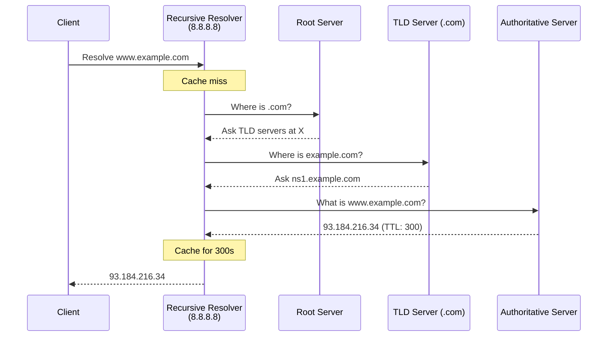

| Server Type | Role |
|-------------|------|
| **Root Servers** | 13 logical servers (A-M), ~1500+ instances via anycast. Entry point to hierarchy |
| **TLD Servers** | Manage .com, .org, etc. Point to authoritative servers |
| **Authoritative Servers** | Hold actual DNS records. Source of truth for a domain |
| **Recursive Resolver** | Does the heavy lifting for clients. Caches results |

### Essential DNS Records

| Record | Purpose | System Design Use |
|--------|---------|-------------------|
| **A** | Domain → IPv4 | Basic mapping, multiple for load balancing |
| **AAAA** | Domain → IPv6 | IPv6 support |
| **CNAME** | Alias → another domain | CDN integration (`cdn.example.com → d123.cloudfront.net`) |
| **NS** | Authoritative nameservers | Delegation |
| **MX** | Mail servers (with priority) | Email routing |

### TTL (Time To Live)

TTL controls how long DNS records are cached. This is crucial for system design trade-offs.

| TTL | Trade-off | When to Use |
|-----|-----------|-------------|
| **Low (60-300s)** | More DNS queries, faster failover | During migrations, active incident response |
| **High (1hr-1day)** | Fewer queries, slower propagation | Stable infrastructure |

**Interview insight:** Before a migration, lower TTL days in advance. After stable, raise it back.

### DNS-Based Load Balancing

#### Round-Robin DNS

Multiple A records for the same domain, rotated in responses.

```
example.com.  A  192.168.1.1
example.com.  A  192.168.1.2
example.com.  A  192.168.1.3
```

| Pros | Cons |
|------|------|
| Zero infrastructure cost | No health checks |
| Simple to implement | Client caching breaks distribution |
| Works everywhere | No awareness of server load |

**When to use:** Basic redundancy for stateless services. Never as sole load balancing for production.

#### Geo-DNS

Returns different IPs based on client location.

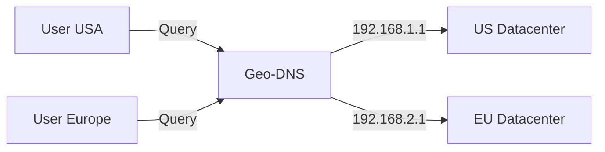

| Routing Policy | Use Case |
|----------------|----------|
| **Geographic** | Compliance, data residency |
| **Latency-based** | Performance optimization |
| **Failover** | Primary + secondary with health checks |
| **Weighted** | Gradual rollouts, A/B testing |

**Limitation:** Relies on IP geolocation (VPN users get wrong region). Failover speed limited by TTL.

### Anycast vs Geo-DNS

| Aspect | Anycast | Geo-DNS |
|--------|---------|---------|
| **How it works** | Same IP announced from multiple locations via BGP | Different IPs returned based on client location |
| **Routing layer** | Network (BGP) | Application (DNS) |
| **Failover speed** | Seconds (BGP convergence) | Minutes (DNS TTL) |
| **Best for** | Stateless (DNS, CDN) | Stateful applications |
| **TCP sessions** | Can break on route changes | Stable |

**Key insight:** Public DNS resolvers (8.8.8.8, 1.1.1.1) use anycast. CDNs use both.

### CDN and DNS Integration

CDNs use DNS to direct users to the nearest edge server.

```
1. User requests cdn.example.com/image.jpg
2. DNS: cdn.example.com → CNAME → d123.cloudfront.net
3. CDN DNS returns nearest edge IP (using geo/anycast)
4. Edge: Cache HIT → serve | Cache MISS → fetch from origin
```

**CNAME limitation:** Can't use CNAME at zone apex (`example.com`). Use ALIAS/ANAME records or CDN's anycast IP.

### Interview Checklist

| Topic | Key Points to Mention |
|-------|----------------------|
| **Resolution flow** | Client → Recursive Resolver → Root → TLD → Authoritative |
| **Caching** | Multiple layers (browser, OS, resolver). TTL controls freshness |
| **Load balancing** | Round-robin (simple), Geo-DNS (location), Anycast (network-level) |
| **TTL trade-offs** | Low = fast failover + more queries. High = fewer queries + stale data |
| **CDN integration** | CNAME to CDN, CDN resolves to edge. Mention cache HIT/MISS |
| **Failover** | Health checks + DNS updates. Anycast faster than DNS-based |

### Common Interview Scenarios

**"How would you handle a datacenter failover?"**
- Lower TTL beforehand
- Health checks detect failure
- DNS stops returning failed DC's IP
- Traffic shifts to healthy DC (delay = TTL)
- For faster: use anycast or L4 load balancer

**"Design a globally distributed service"**
- Geo-DNS for API servers (stateful, needs session affinity)
- CDN for static assets (stateless, cache at edge)
- Anycast for DNS resolution itself
- Consider: data replication, consistency trade-offs

---

# Caching

## What is Caching?

Caching is a technique that stores copies of frequently accessed data in a high-speed storage layer (the cache) to reduce the time and resources needed to fetch that data from its original, slower source. The cache sits between the data consumer and the data source, serving as a shortcut that dramatically improves response times.

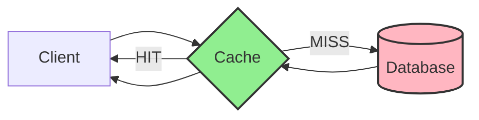

**The fundamental trade-off:** Caching exchanges storage space and data freshness for speed. You are essentially betting that the cost of occasionally serving stale data is less than the cost of always fetching fresh data.

### Why Caching Matters in System Design

| Problem | How Caching Solves It |
|---------|----------------------|
| **High Latency** | Serves data from memory (nanoseconds) instead of disk/network (milliseconds) |
| **Database Overload** | Reduces read traffic to the database by 80-99% |
| **Network Costs** | Fewer requests to origin servers, lower bandwidth bills |
| **Scalability** | Enables handling 10x-100x more requests without scaling the database |

**Interview insight:** Always quantify the impact. "Adding a Redis cache reduced our p99 latency from 200ms to 15ms and cut database load by 90%."

### The Caching Hierarchy

Data can be cached at multiple layers, each with different trade-offs:

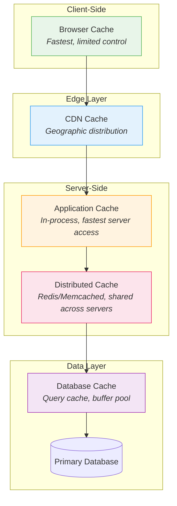

| Cache Layer | Latency | Capacity | Scope | Example |
|------------|---------|----------|-------|---------|
| **Browser** | ~0ms | Small (MB) | Single user | HTTP cache headers |
| **CDN** | 10-50ms | Large (TB) | Regional | Cloudflare, CloudFront |
| **Application** | <1ms | Medium (GB) | Single server | In-memory HashMap |
| **Distributed** | 1-5ms | Large (TB) | Cluster-wide | Redis, Memcached |
| **Database** | 1-10ms | Medium (GB) | Database scope | MySQL query cache |

**Key principle:** Cache as close to the user as possible. Each layer you move closer reduces latency significantly.

---

## Cache Strategies

Cache strategies define how your application reads from and writes to the cache. Choosing the right strategy depends on your read/write ratio, consistency requirements, and failure tolerance.

### Read Strategies

#### 1. Cache-Aside (Lazy Loading)

The application manages the cache explicitly. On a read, it first checks the cache; if missed, it fetches from the database and populates the cache.

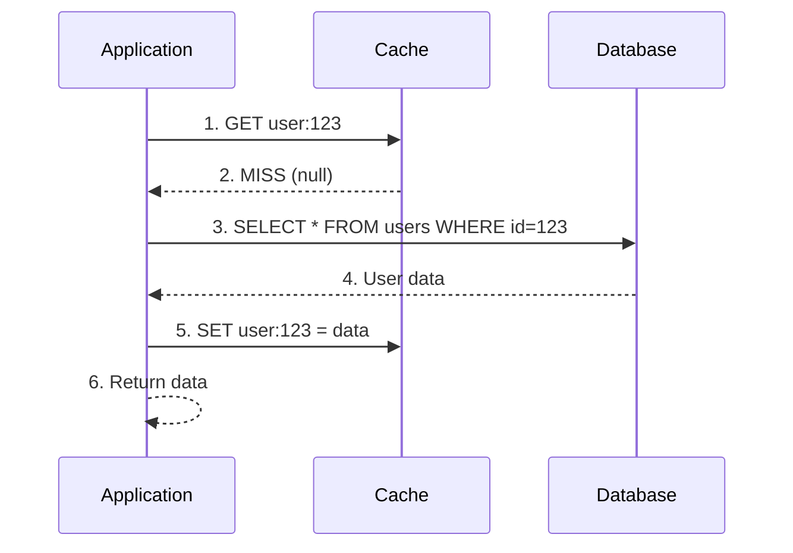

```
# Pseudocode
def get_user(user_id):
    data = cache.get(f"user:{user_id}")
    if data is None:  # Cache miss
        data = db.query("SELECT * FROM users WHERE id = ?", user_id)
        cache.set(f"user:{user_id}", data, ttl=3600)
    return data
```

| Pros | Cons |
|------|------|
| Only requested data is cached (no waste) | Cache miss = 3 round trips (slow first request) |
| Cache failure doesn't break the app | Data can become stale |
| Simple to implement | Application manages cache logic |

**Best for:** Read-heavy workloads where data is requested unevenly (some items hot, most cold).

---

#### 2. Read-Through

The cache sits in front of the database. The application only talks to the cache, which fetches from the database on a miss.

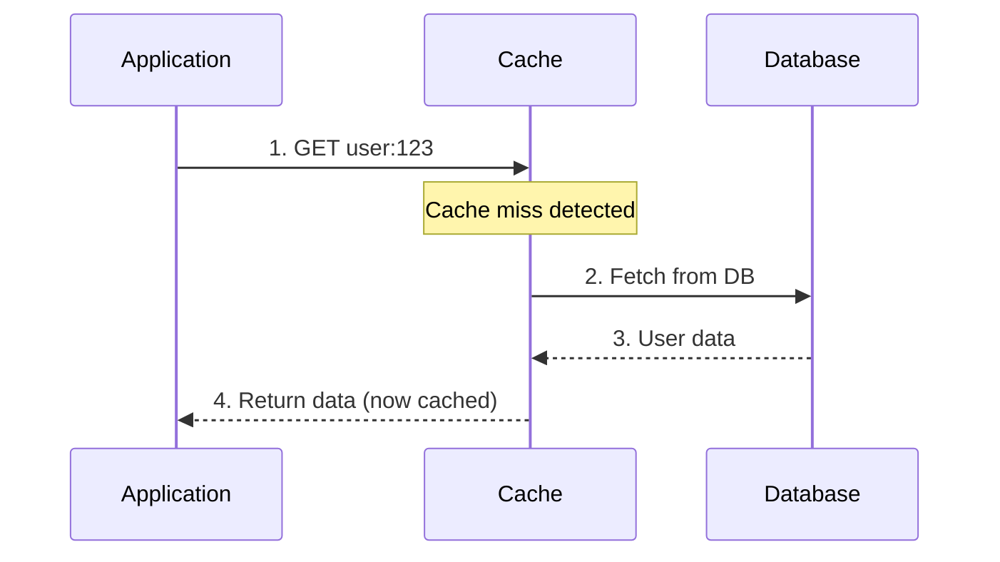

| Pros | Cons |
|------|------|
| Application code is simpler | Cache library must support DB integration |
| Consistent caching logic | Less flexibility in cache population |
| Cache handles miss logic | Tight coupling between cache and data source |

**Best for:** When you want to abstract caching logic away from application code.

**Key difference from Cache-Aside:** In read-through, the cache is responsible for loading data. In cache-aside, the application is responsible.

---

### Write Strategies

#### 1. Write-Through

Every write goes to both the cache and the database synchronously. The write is only acknowledged after both succeed.

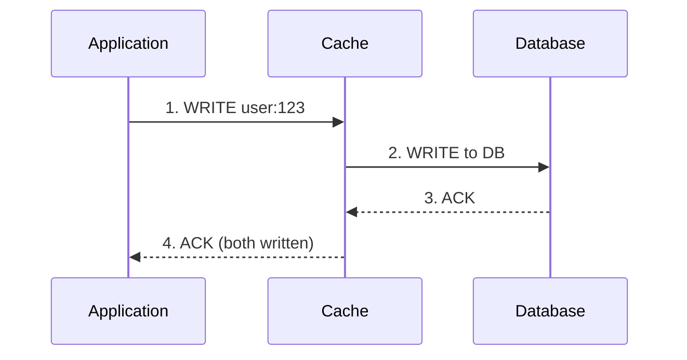

| Pros | Cons |
|------|------|
| Cache and DB always consistent | Higher write latency (2 writes) |
| No stale data | Every write hits DB (no write reduction) |
| Simple mental model | Cache may hold rarely-read data |

**Best for:** Systems where read-after-write consistency is critical (user profile updates, settings).

---

#### 2. Write-Behind (Write-Back)

Writes go to the cache immediately and return. The cache asynchronously flushes writes to the database in batches.

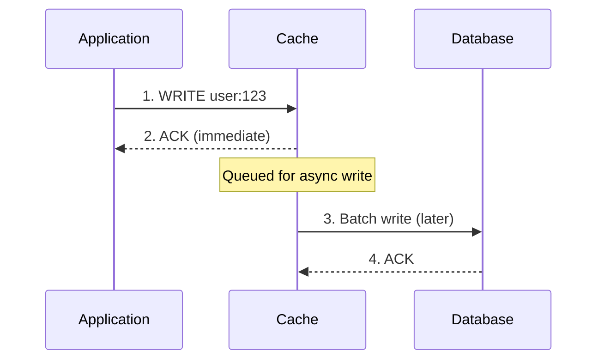

| Pros | Cons |
|------|------|
| Extremely fast writes | Risk of data loss if cache crashes |
| Reduces DB write load (batching) | Complex failure handling |
| Absorbs write spikes | Eventual consistency |

**Best for:** High write throughput systems where slight data loss is acceptable (analytics, counters, logs).

**Warning:** If the cache node dies before flushing, you lose data. Use replication or WAL (Write-Ahead Log).

---

#### 3. Write-Around

Writes go directly to the database, bypassing the cache. The cache is only populated on reads.

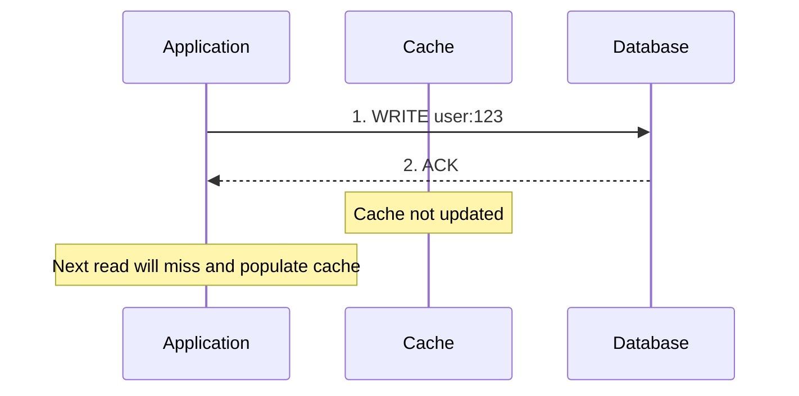

| Pros | Cons |
|------|------|
| Prevents cache churn from write-heavy data | First read after write is slow (miss) |
| Good for write-once, read-rarely data | Cache may serve stale data until TTL |

**Best for:** Data that is written frequently but read rarely (audit logs, historical records).

---

### Strategy Comparison Matrix

| Strategy | Consistency | Write Latency | Read Latency (Miss) | Data Loss Risk | Use Case |
|----------|-------------|---------------|---------------------|----------------|----------|
| **Cache-Aside** | Eventual | N/A (direct DB) | High (3 hops) | None | General purpose, read-heavy |
| **Read-Through** | Eventual | N/A | Medium (2 hops) | None | Abstracted caching |
| **Write-Through** | Strong | High | Low | None | Consistency critical |
| **Write-Behind** | Eventual | Very Low | Low | **High** | Write-heavy, analytics |
| **Write-Around** | Eventual | Low | High (first read) | None | Write-once data |

### Combining Strategies

In practice, you often combine read and write strategies:

| Combination | When to Use |
|-------------|-------------|
| **Cache-Aside + Write-Around** | Default choice for most applications |
| **Read-Through + Write-Through** | When you need strong consistency |
| **Cache-Aside + Write-Behind** | High-performance with acceptable risk |

**Interview tip:** Always mention the trade-off. "We chose write-through because user profile consistency was critical, accepting the higher write latency."

---

## Cache Invalidation

Cache invalidation is one of the "two hard problems" in computer science. The challenge: how do you ensure the cache doesn't serve stale data after the source of truth changes?

> "There are only two hard things in Computer Science: cache invalidation and naming things." — Phil Karlton

### Invalidation Strategies

#### 1. Time-To-Live (TTL)

Each cache entry has an expiration timestamp. After TTL expires, the entry is considered stale and will be refreshed on the next request.

```
cache.set("user:123", user_data, ttl=3600)  # Expires in 1 hour
```

| TTL Value | Trade-off | Use Case |
|-----------|-----------|----------|
| **Short (seconds)** | Fresh data, more DB load | Stock prices, live scores |
| **Medium (minutes)** | Balanced | User profiles, product info |
| **Long (hours/days)** | Stale data risk, low DB load | Static content, configs |

**The TTL dilemma:** Too short = cache is useless. Too long = users see stale data.

**Best practice:** Start with a reasonable TTL (5-15 minutes), then tune based on cache hit rate and staleness tolerance.

---

#### 2. Event-Based Invalidation

Actively invalidate or update cache entries when the underlying data changes.

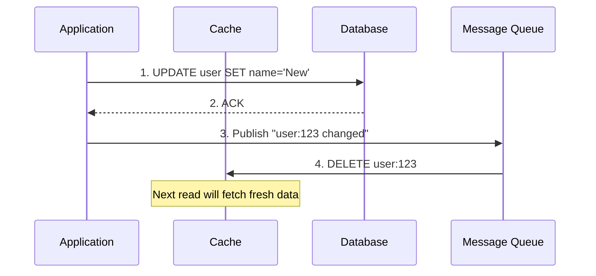

**Two approaches:**

| Approach | Description | Pros | Cons |
|----------|-------------|------|------|
| **Invalidate** | Delete the cache key | Simple, always consistent | Next read is slow (miss) |
| **Update** | Update cache with new value | No miss penalty | Risk of race conditions |

**Race condition warning:** If you update (not delete), concurrent writes can cause the cache to hold an older value than the DB.

```
# Dangerous: Race condition possible
Thread A: Read DB (version 1)
Thread B: Read DB (version 2)
Thread B: Write cache (version 2)
Thread A: Write cache (version 1)  <-- Stale!

# Safe: Invalidate instead
Thread A: DELETE cache key
Thread B: DELETE cache key
# Next read will fetch the latest version
```

---

#### 3. Version-Based Invalidation

Embed a version number in the cache key. When data changes, increment the version.

```
# Version 1
cache.get("user:123:v1")

# After update, use version 2
cache.get("user:123:v2")  # Old key automatically orphaned
```

| Pros | Cons |
|------|------|
| No explicit delete needed | Orphaned keys waste memory |
| Works well with immutable data | Requires version tracking |
| Natural cache busting for static assets | Key management complexity |

**Common use case:** Static asset URLs with hash/version (`app.js?v=abc123`).

---

### Invalidation Patterns Comparison

| Pattern | Consistency | Complexity | Best For |
|---------|-------------|------------|----------|
| **TTL Only** | Eventual (bounded staleness) | Low | Read-heavy, staleness OK |
| **Event-Based Delete** | Strong (after propagation) | Medium | Most applications |
| **Event-Based Update** | Strong (if no race) | High | Write-through systems |
| **Version-Based** | Strong | Medium | Immutable data, assets |

### Cache Invalidation in Distributed Systems

When you have multiple cache nodes, invalidation becomes harder:

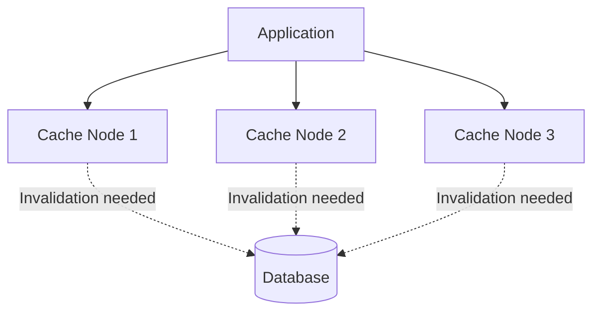

**Challenge:** How do you ensure all nodes invalidate simultaneously?

| Solution | How It Works |
|----------|--------------|
| **Pub/Sub** | Publish invalidation events to all cache nodes (Redis Pub/Sub, Kafka) |
| **Consistent Hashing** | Each key lives on one node only, no broadcast needed |
| **Short TTL + Event** | Use TTL as safety net, events for immediate invalidation |

**Interview insight:** "We used Redis Pub/Sub to broadcast invalidation events, with a 5-minute TTL as a fallback in case messages were lost."

---

## Cache Eviction Policies

When the cache is full and a new entry needs to be added, the eviction policy determines which existing entry to remove. This is different from invalidation (removing stale data) — eviction removes valid data due to space constraints.

### Common Eviction Policies

#### 1. LRU (Least Recently Used)

Evicts the entry that hasn't been accessed for the longest time.

```
Access pattern: A, B, C, D, A, E (cache size = 4)

[A]                    → A added
[A, B]                 → B added
[A, B, C]              → C added
[A, B, C, D]           → D added (cache full)
[B, C, D, A]           → A accessed (moved to end)
[C, D, A, E]           → E added, B evicted (least recent)
```

| Pros | Cons |
|------|------|
| Good general-purpose policy | Scan pollution (one-time reads evict hot data) |
| Adapts to access patterns | Overhead of maintaining access order |
| Simple to understand | Doesn't consider frequency |

**Best for:** Most general workloads. Default choice for Redis, Memcached.

---

#### 2. LFU (Least Frequently Used)

Evicts the entry with the lowest access count.

```
Access pattern: A, A, A, B, C, D, E (cache size = 4)

A: 3 accesses
B: 1 access
C: 1 access
D: 1 access
E: needs to be added → evict B, C, or D (tied at 1)
```

| Pros | Cons |
|------|------|
| Keeps frequently accessed items | Old popular items never evicted |
| Resistant to scan pollution | New items vulnerable (low count) |

**Best for:** Workloads with stable hot set (e.g., popular products, trending content).

---

#### 3. FIFO (First In, First Out)

Evicts the oldest entry regardless of access pattern.

| Pros | Cons |
|------|------|
| Simplest to implement | Ignores access patterns entirely |
| Predictable behavior | May evict hot items |
| Low overhead | Poor cache efficiency |

**Best for:** Time-sensitive data where age matters more than popularity.

---

#### 4. Random

Randomly selects an entry to evict.

| Pros | Cons |
|------|------|
| Zero overhead | Unpredictable performance |
| No metadata required | May evict hot items |

**Best for:** When simplicity matters more than optimization. Surprisingly effective in some workloads.

---

#### 5. TTL-Based Eviction

Evict entries closest to expiration first.

| Pros | Cons |
|------|------|
| Natural pairing with TTL | Doesn't consider access patterns |
| Proactive space management | May evict frequently accessed items |

---

### Eviction Policy Comparison

| Policy | Hit Rate | Overhead | Best For |
|--------|----------|----------|----------|
| **LRU** | High | Medium | General purpose (default choice) |
| **LFU** | Highest (stable workload) | High | Stable popularity distribution |
| **FIFO** | Low | Very Low | Time-sensitive data |
| **Random** | Medium | Very Low | Simple systems |
| **TTL-Based** | Medium | Low | Data with natural expiration |

### Redis Eviction Policies

Redis offers several eviction policies that combine these strategies:

| Policy | Behavior |
|--------|----------|
| `noeviction` | Return error when memory limit reached |
| `allkeys-lru` | LRU across all keys |
| `volatile-lru` | LRU only among keys with TTL |
| `allkeys-lfu` | LFU across all keys |
| `volatile-lfu` | LFU only among keys with TTL |
| `allkeys-random` | Random eviction |
| `volatile-ttl` | Evict keys with shortest TTL |

**Interview tip:** "We used `allkeys-lru` because our workload was general-purpose with no clear frequency pattern. If we had a stable hot set, we'd consider `allkeys-lfu`."

---

## Caching Challenges

Caching introduces complexity. Understanding these challenges and their solutions is critical for system design interviews.

### 1. Cache Stampede (Thundering Herd)

When a popular cache entry expires, hundreds of concurrent requests simultaneously hit the database to regenerate it.

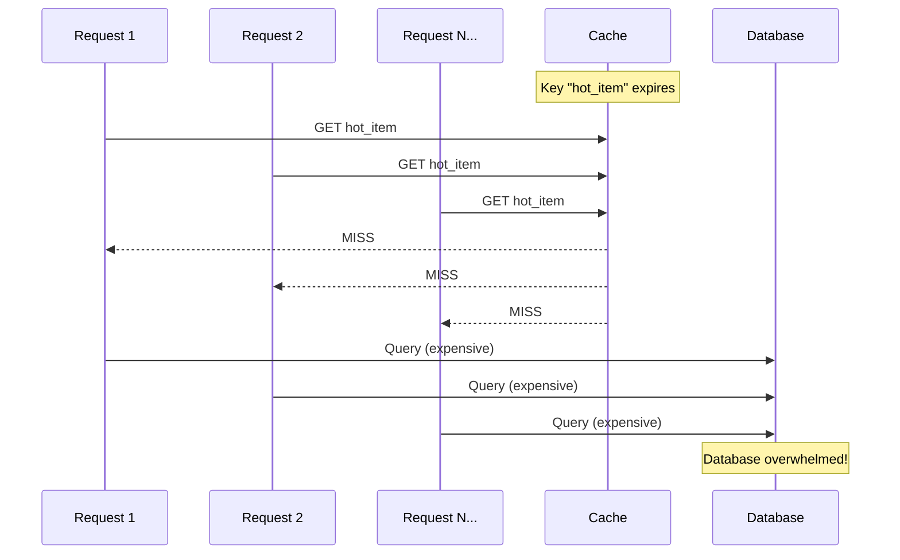

**Solutions:**

| Solution | How It Works | Trade-off |
|----------|--------------|-----------|
| **Locking** | First request acquires lock, others wait | Adds latency for waiting requests |
| **Probabilistic Early Refresh** | Randomly refresh before TTL expires | May refresh unnecessarily |
| **Stale-While-Revalidate** | Serve stale data while refreshing in background | Brief staleness |

**Locking implementation:**
```
def get_with_lock(key):
    data = cache.get(key)
    if data is not None:
        return data

    # Try to acquire lock
    if cache.set(f"lock:{key}", "1", nx=True, ttl=30):
        # Won the lock, fetch from DB
        data = db.query(key)
        cache.set(key, data, ttl=3600)
        cache.delete(f"lock:{key}")
        return data
    else:
        # Another request is fetching, wait and retry
        time.sleep(0.1)
        return get_with_lock(key)
```

---

### 2. Cache Penetration

Queries for data that doesn't exist bypass the cache and always hit the database.

```
Request: GET user:999999 (doesn't exist)
Cache: MISS
DB: NULL
Cache: Nothing to cache → Next request hits DB again
```

**Attack vector:** Malicious users can flood your system with requests for non-existent keys.

**Solutions:**

| Solution | How It Works |
|----------|--------------|
| **Cache Null Values** | Store `NULL` with short TTL: `cache.set("user:999", NULL, ttl=60)` |
| **Bloom Filter** | Probabilistic filter that quickly rejects non-existent keys |

**Bloom filter approach:**
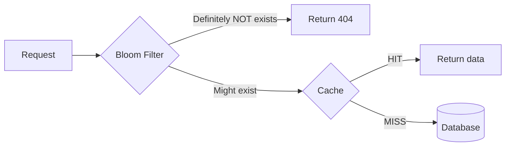

---

### 3. Cache Breakdown (Hot Key Problem)

A single extremely popular key expires, causing massive load on one database shard.

**Different from stampede:** Stampede affects many keys; breakdown is about one ultra-hot key.

**Solutions:**

| Solution | Description |
|----------|-------------|
| **Never expire hot keys** | Remove TTL for critical keys, invalidate manually |
| **Mutex/Lock** | Same as stampede solution |
| **Replicate hot keys** | Store copies across multiple cache nodes |

---

### 4. Cache Avalanche

Many cache entries expire simultaneously, causing massive database load.

**Common cause:** Server restart clears all cache, or all keys were set with the same TTL.

**Solutions:**

| Solution | Description |
|----------|-------------|
| **Jittered TTL** | Add random offset: `ttl = base_ttl + random(0, 300)` |
| **Warm-up on restart** | Pre-populate cache before accepting traffic |
| **Circuit breaker** | Fail fast if DB is overwhelmed |

```
# Add jitter to prevent synchronized expiration
base_ttl = 3600
jitter = random.randint(0, 300)
cache.set(key, value, ttl=base_ttl + jitter)
```

---

### 5. Data Inconsistency

Cache and database can become out of sync due to failed updates, race conditions, or network partitions.

**Classic race condition:**
```
Time 1: Thread A reads user (version 1) from DB
Time 2: Thread B updates user to version 2 in DB
Time 3: Thread B invalidates cache
Time 4: Thread A writes version 1 to cache ← STALE!
```

**Solutions:**

| Solution | Description |
|----------|-------------|
| **Delete, don't update** | Always invalidate instead of updating cache |
| **Read-your-writes** | After write, read from DB (not cache) |
| **Versioning** | Include version in cache key or value |
| **Short TTL** | Limit staleness window |

---

### Challenge Summary Table

| Challenge | Symptom | Primary Solution |
|-----------|---------|------------------|
| **Stampede** | DB spike when popular key expires | Locking or stale-while-revalidate |
| **Penetration** | DB hit for non-existent data | Cache nulls + Bloom filter |
| **Breakdown** | Single hot key overwhelms DB | Never-expire + replication |
| **Avalanche** | Mass expiration crashes DB | Jittered TTL |
| **Inconsistency** | Stale data served | Delete-based invalidation |

---

## Distributed Caching

When a single cache server isn't enough, you need a distributed cache cluster. This introduces new challenges around data distribution and consistency.

### Cache Topologies

#### 1. Replicated Cache

Every node holds a complete copy of all data.

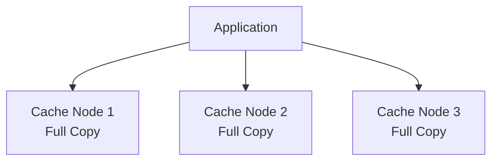

| Pros | Cons |
|------|------|
| Any node can serve any request | Limited by smallest node's memory |
| High availability | Write amplification (update all nodes) |
| Simple reads | Consistency challenges |

**Best for:** Small datasets that are read-heavy.

---

#### 2. Partitioned (Sharded) Cache

Data is divided across nodes. Each key lives on one node.

```mermaid
flowchart TB
    App[Application]
    App --> Router{Hash Router}
    Router -->|Keys A-M| Node1[Cache Node 1]
    Router -->|Keys N-Z| Node2[Cache Node 2]
```

**How to route:** Use consistent hashing to determine which node owns a key.

| Pros | Cons |
|------|------|
| Scales horizontally | Node failure loses that shard's data |
| Large total capacity | Cross-shard operations expensive |
| Write scales linearly | Hot keys can overload one node |

**Best for:** Large datasets, write-heavy workloads.

---

### Consistent Hashing

Traditional hashing (`hash(key) % num_nodes`) breaks when nodes are added/removed — nearly all keys remap.

Consistent hashing minimizes key movement when the cluster changes.

```mermaid
flowchart LR
    subgraph Ring [Hash Ring]
        direction TB
        N1((Node A<br/>pos: 90))
        N2((Node B<br/>pos: 180))
        N3((Node C<br/>pos: 270))
    end

    K1[Key X<br/>hash: 100] -.->|Maps to| N2
    K2[Key Y<br/>hash: 200] -.->|Maps to| N3
    K3[Key Z<br/>hash: 50] -.->|Maps to| N1
```

**Rule:** A key maps to the first node clockwise from its hash position.

**When Node B fails:** Only keys between A and B remap to C. Other keys unchanged.

| Operation | Keys Remapped |
|-----------|---------------|
| Add node | ~1/N of keys (N = total nodes) |
| Remove node | ~1/N of keys |

**Virtual nodes:** Each physical node gets multiple positions on the ring to ensure even distribution.

---

### Redis vs Memcached

| Feature | Redis | Memcached |
|---------|-------|-----------|
| **Data Structures** | Strings, Lists, Sets, Hashes, Sorted Sets | Strings only |
| **Persistence** | RDB snapshots, AOF logs | None (pure cache) |
| **Replication** | Built-in master-replica | None |
| **Clustering** | Redis Cluster (auto-sharding) | Client-side sharding |
| **Memory Efficiency** | Higher overhead | More efficient for simple K/V |
| **Pub/Sub** | Yes | No |
| **Lua Scripting** | Yes | No |

**When to use Redis:** Need data structures, persistence, or pub/sub.

**When to use Memcached:** Simple key-value, maximum memory efficiency, multi-threaded performance.

---

## Cache Performance Metrics

Monitor these metrics to understand cache health:

| Metric | Formula | Target |
|--------|---------|--------|
| **Hit Rate** | Hits / (Hits + Misses) | > 90% for most workloads |
| **Miss Rate** | Misses / (Hits + Misses) | < 10% |
| **Latency (p50/p99)** | Time to serve request | p99 < 5ms for Redis |
| **Eviction Rate** | Evictions per second | Low (if high, increase memory) |
| **Memory Usage** | Used / Total | 70-85% (leave room for spikes) |

**Hit rate interpretation:**
- **< 50%:** Cache is ineffective. Check key design, TTL, or access patterns.
- **50-80%:** Room for improvement. Tune TTL or increase capacity.
- **> 90%:** Healthy cache. Monitor for changes.

---

## Interview Checklist

| Topic | Key Points to Mention |
|-------|----------------------|
| **Why cache** | Reduce latency, offload DB, enable scale |
| **Cache-aside vs read-through** | Application vs cache manages loading |
| **Write strategies** | Write-through (consistent), write-behind (fast), write-around (write-heavy) |
| **Invalidation** | TTL (simple), event-based (consistent), version-based (assets) |
| **Eviction** | LRU (default), LFU (stable hot set), understand Redis policies |
| **Challenges** | Stampede (locking), penetration (bloom filter), avalanche (jitter) |
| **Distributed** | Consistent hashing, Redis Cluster vs Memcached |
| **Metrics** | Hit rate > 90%, p99 latency, eviction rate |

### Common Interview Questions

**"How would you cache user sessions?"**
- Use Redis with `allkeys-lru` eviction
- Key: `session:{session_id}`, Value: user data (JSON)
- TTL: 30 minutes, refresh on activity
- Consider: sticky sessions vs distributed cache trade-off

**"Design a cache for a news feed"**
- Cache recent posts per user: `feed:{user_id}`
- Cache individual posts: `post:{post_id}`
- Invalidation: Event-driven when new post created
- Challenge: Fan-out on write vs fan-out on read

**"How do you handle cache warming after deployment?"**
- Pre-populate cache before routing traffic
- Gradual traffic shift (canary deployment)
- Accept higher miss rate initially, monitor hit rate recovery
- Consider: lazy loading vs eager loading trade-offs

**"Cache consistency between microservices?"**
- Shared Redis cluster vs per-service cache
- Event bus for invalidation (Kafka, Redis Pub/Sub)
- Accept eventual consistency with short TTL
- Consider: who owns the data vs who caches it

---

# CDN (Content Delivery Network)

## What is CDN?

A Content Delivery Network (CDN) is a geographically distributed network of servers that delivers content to users from the server closest to them. Instead of every user fetching content from a single origin server (potentially thousands of miles away), a CDN caches content at multiple "edge" locations worldwide, dramatically reducing latency and load on the origin.

```mermaid
flowchart TB
    subgraph Origin [Origin Data Center]
        OS[(Origin Server)]
    end

    subgraph CDN_Network [CDN Edge Network]
        direction LR
        E1[Edge Server<br/>New York]
        E2[Edge Server<br/>London]
        E3[Edge Server<br/>Tokyo]
        E4[Edge Server<br/>Sydney]
    end

    subgraph Users [Users Worldwide]
        U1[User NY]
        U2[User UK]
        U3[User Japan]
        U4[User Australia]
    end

    OS -.->|Content Distribution| E1
    OS -.->|Content Distribution| E2
    OS -.->|Content Distribution| E3
    OS -.->|Content Distribution| E4

    U1 -->|Low Latency| E1
    U2 -->|Low Latency| E2
    U3 -->|Low Latency| E3
    U4 -->|Low Latency| E4

    style OS fill:#FFB6C1,stroke:#333,stroke-width:2px
    style E1 fill:#90EE90,stroke:#333
    style E2 fill:#90EE90,stroke:#333
    style E3 fill:#90EE90,stroke:#333
    style E4 fill:#90EE90,stroke:#333
```

**The core value proposition:** A user in Tokyo requesting an image from a US-based website gets it from a Tokyo edge server (~20ms) instead of crossing the Pacific Ocean (~200ms). This 10x latency reduction is why CDNs are essential for any globally accessible application.

### Why CDN Matters in System Design

| Problem | How CDN Solves It |
|---------|-------------------|
| **High Latency** | Serves content from geographically nearest server |
| **Origin Overload** | Offloads 80-95% of static content requests |
| **Bandwidth Costs** | Reduces egress from expensive origin data centers |
| **Availability** | If one edge fails, traffic routes to the next nearest |
| **DDoS Protection** | Distributed network absorbs attack traffic across many nodes |

**Interview insight:** "Our CDN handles 95% of static asset requests, reducing origin server load from 100K to 5K requests per second, and dropping global p50 latency from 180ms to 25ms."

---

## Origin Server vs. Edge Server

Understanding the distinction between origin and edge servers is fundamental to CDN architecture.

### Origin Server

The **origin server** is the authoritative source of truth for your content. It hosts the original, canonical version of all files and data. When content isn't available at an edge location, the CDN fetches it from the origin.

**Characteristics:**
- Single location (or small number of replicated data centers)
- Contains the master copy of all content
- Handles cache misses from edge servers
- Typically where your application logic runs
- Higher latency for distant users if accessed directly

### Edge Server

**Edge servers** (also called PoPs - Points of Presence) are CDN nodes distributed globally. They cache copies of content and serve users from the nearest location.

**Characteristics:**
- Hundreds to thousands of locations worldwide
- Store cached copies of popular content
- No application logic—just content delivery
- Optimized for fast reads and high throughput
- Automatically route users to nearest healthy node

```mermaid
flowchart LR
    subgraph Origin_Characteristics [Origin Server]
        O1[Single Location]
        O2[Master Data Copy]
        O3[Application Logic]
        O4[Handles Cache Misses]
    end

    subgraph Edge_Characteristics [Edge Server]
        E1[Global Distribution]
        E2[Cached Copies]
        E3[No App Logic]
        E4[Optimized for Speed]
    end

    User([User Request]) --> Decision{Content<br/>Cached?}
    Decision -->|Yes - Cache HIT| Edge_Characteristics
    Decision -->|No - Cache MISS| Origin_Characteristics
    Origin_Characteristics -->|Populate Cache| Edge_Characteristics
    Edge_Characteristics -->|Response| User

    style Decision fill:#FFD700,stroke:#333
    style Origin_Characteristics fill:#FFB6C1,stroke:#333
    style Edge_Characteristics fill:#90EE90,stroke:#333
```

### Comparison Table

| Aspect | Origin Server | Edge Server |
|--------|---------------|-------------|
| **Location** | Centralized (1-3 data centers) | Distributed (100s of PoPs) |
| **Content** | Original, authoritative | Cached copies |
| **Latency to User** | High (100-300ms globally) | Low (10-50ms) |
| **Traffic Volume** | Low (only cache misses) | High (serves most requests) |
| **Cost** | Higher compute costs | Higher bandwidth costs |
| **Failure Impact** | Critical—affects cache refills | Minimal—traffic reroutes |

**Interview tip:** "The origin is like a warehouse storing all inventory, while edge servers are local stores. Customers shop at local stores for speed, but the warehouse restocks them and handles special orders."

---

## CDN Architecture

A CDN's architecture determines how content flows from origin to users. Understanding this flow is critical for system design interviews.

### How a CDN Request Works

```mermaid
sequenceDiagram
    participant User
    participant DNS
    participant Edge as Edge Server (PoP)
    participant Origin as Origin Server

    User->>DNS: 1. Resolve cdn.example.com
    DNS->>User: 2. Return nearest Edge IP (Anycast/GeoDNS)
    User->>Edge: 3. Request /images/logo.png

    alt Cache HIT
        Edge->>User: 4a. Return cached content (fast!)
    else Cache MISS
        Edge->>Origin: 4b. Fetch from origin
        Origin->>Edge: 5. Return content
        Edge->>Edge: 6. Cache for future requests
        Edge->>User: 7. Return content to user
    end
```

### Request Flow Explained

1. **DNS Resolution:** User's browser resolves `cdn.example.com`. The CDN's DNS (using GeoDNS or Anycast) returns the IP of the nearest edge server.

2. **Edge Selection:** The CDN automatically routes the user to the optimal PoP based on:
   - Geographic proximity
   - Network latency
   - Server health and load
   - ISP peering arrangements

3. **Cache Check:** The edge server checks if the requested content exists in its cache and is still valid (not expired).

4. **Cache HIT:** If cached, content is served immediately (~10-50ms latency).

5. **Cache MISS:** If not cached, the edge fetches from origin, caches the response, then serves the user.

### CDN Components Architecture

```mermaid
flowchart TB
    subgraph Client_Layer [Client Layer]
        Browser[Browser/App]
    end

    subgraph DNS_Layer [DNS Layer]
        GeoDNS[GeoDNS / Anycast DNS]
    end

    subgraph Edge_Layer [Edge Layer - Global PoPs]
        direction LR
        subgraph PoP1 [PoP - Americas]
            LB1[Load Balancer]
            Cache1[(Edge Cache)]
            Edge1[Edge Servers]
        end
        subgraph PoP2 [PoP - Europe]
            LB2[Load Balancer]
            Cache2[(Edge Cache)]
            Edge2[Edge Servers]
        end
        subgraph PoP3 [PoP - Asia]
            LB3[Load Balancer]
            Cache3[(Edge Cache)]
            Edge3[Edge Servers]
        end
    end

    subgraph Mid_Tier [Mid-Tier / Shield Layer]
        Shield[(Regional Cache Shield)]
    end

    subgraph Origin_Layer [Origin Layer]
        Origin[(Origin Server)]
        Storage[(Object Storage<br/>S3/GCS)]
    end

    Browser --> GeoDNS
    GeoDNS --> LB1 & LB2 & LB3
    LB1 --> Edge1 --> Cache1
    LB2 --> Edge2 --> Cache2
    LB3 --> Edge3 --> Cache3

    Cache1 & Cache2 & Cache3 -.->|Cache MISS| Shield
    Shield -.->|Cache MISS| Origin
    Origin --- Storage

    style Shield fill:#FFD700,stroke:#333
    style Origin fill:#FFB6C1,stroke:#333
```

### Key Architectural Components

| Component | Purpose | Example |
|-----------|---------|---------|
| **GeoDNS** | Routes users to nearest PoP based on IP geolocation | Route53, Cloudflare DNS |
| **Anycast** | Single IP advertised from multiple locations; network routes to nearest | Used by Cloudflare, Google |
| **Edge Cache** | Stores content at PoP level; first cache layer | SSD-based, in-memory |
| **Cache Shield** | Mid-tier cache that protects origin from thundering herd | Reduces origin load by 90%+ |
| **Origin** | Authoritative content source | Your servers, S3, GCS |

### Cache Shield (Mid-Tier Caching)

A **cache shield** is an intermediate caching layer between edge servers and the origin. Instead of every edge PoP hitting the origin on a cache miss, they first check a regional shield.

**Why it matters:**
- Without shield: 100 PoPs × 1 miss each = 100 origin requests
- With shield: 100 PoPs hit 3 regional shields = 3 origin requests max

```mermaid
flowchart LR
    subgraph Edges [Edge PoPs]
        E1[Edge 1]
        E2[Edge 2]
        E3[Edge 3]
        E4[Edge N...]
    end

    subgraph Shield [Cache Shield]
        S1[(Shield)]
    end

    subgraph Origin [Origin]
        O[(Origin)]
    end

    E1 & E2 & E3 & E4 -->|MISS| S1
    S1 -->|MISS| O

    style S1 fill:#FFD700,stroke:#333
```

**Interview insight:** "We added a cache shield layer, reducing origin requests from 50K/sec during cache expiration storms to under 100/sec—a 500x reduction."

---

## Push CDN vs. Pull CDN

The two fundamental CDN models differ in **who initiates content distribution**: the origin (push) or the edge (pull). This is one of the most common CDN questions in system design interviews.

### Pull CDN (Lazy Loading)

In a **Pull CDN**, edge servers fetch content from the origin **on-demand** when a user requests it. The first user experiences a cache miss; subsequent users get cached content.

```mermaid
sequenceDiagram
    participant U1 as User 1 (First)
    participant U2 as User 2 (Second)
    participant Edge as Edge Server
    participant Origin as Origin Server

    U1->>Edge: Request image.jpg
    Edge->>Edge: Cache MISS
    Edge->>Origin: Fetch image.jpg
    Origin->>Edge: Return image.jpg
    Edge->>Edge: Store in cache
    Edge->>U1: Return image.jpg (slow)

    Note over Edge: Content now cached

    U2->>Edge: Request image.jpg
    Edge->>Edge: Cache HIT
    Edge->>U2: Return image.jpg (fast!)
```

**How it works:**
1. User requests content from edge
2. Edge checks cache → MISS on first request
3. Edge fetches from origin, caches it, returns to user
4. Subsequent requests served from cache until TTL expires

**Pros:**
- Simple setup—just point your domain to the CDN
- Storage efficient—only caches content that's actually requested
- Automatic—no manual content management needed

**Cons:**
- First user experiences higher latency (cache miss penalty)
- Origin must always be available for cache misses
- Can cause origin spikes when cache expires (thundering herd)

**Best for:**
- Websites with unpredictable traffic patterns
- Large content libraries where not everything is accessed
- Dynamic content with short TTLs
- Most general-purpose web applications

---

### Push CDN (Proactive Loading)

In a **Push CDN**, you explicitly upload content to the CDN **before** users request it. The CDN acts more like distributed storage than a cache.

```mermaid
sequenceDiagram
    participant Admin as Admin/CI Pipeline
    participant CDN as CDN Storage
    participant Edge as Edge Servers
    participant User as User

    Admin->>CDN: Upload video.mp4 (proactive)
    CDN->>Edge: Distribute to all PoPs
    Note over Edge: Content pre-positioned

    User->>Edge: Request video.mp4
    Edge->>Edge: Cache HIT (always!)
    Edge->>User: Return video.mp4 (fast!)
```

**How it works:**
1. You upload content directly to CDN storage (API, CLI, or CI/CD)
2. CDN distributes content to edge locations proactively
3. Users always get cache hits (content is pre-positioned)
4. You manage content lifecycle (upload, update, delete)

**Pros:**
- No cache miss penalty—content always available at edge
- Origin can be offline—CDN serves independently
- Predictable performance—no cold start latency
- Full control over what's cached and where

**Cons:**
- Higher storage costs—pay for all content, not just popular items
- Manual management—you must upload/update/delete content
- Replication delay—takes time to propagate to all PoPs
- Overkill for frequently changing content

**Best for:**
- Video streaming platforms (Netflix, YouTube)
- Software distribution (game patches, app updates)
- Static assets that rarely change (logos, fonts)
- Scenarios where origin availability is uncertain

---

### Push vs. Pull Comparison

| Aspect | Pull CDN | Push CDN |
|--------|----------|----------|
| **Content Loading** | On-demand (lazy) | Proactive (eager) |
| **First Request** | Cache miss (slow) | Cache hit (fast) |
| **Storage Cost** | Lower (only popular content) | Higher (all content) |
| **Origin Dependency** | Required for misses | Can work offline |
| **Management** | Automatic | Manual upload/delete |
| **Best For** | Websites, APIs | Video, large files |
| **TTL Control** | Cache headers | Explicit versioning |
| **Invalidation** | Purge API + wait for TTL | Re-upload new version |

### Decision Framework

```mermaid
flowchart TD
    Start([Choose CDN Model]) --> Q1{Content size?}

    Q1 -->|Small files<br/>< 10MB| Q2{Traffic pattern?}
    Q1 -->|Large files<br/>> 100MB| Push[Push CDN]

    Q2 -->|Unpredictable<br/>Long tail| Pull[Pull CDN]
    Q2 -->|Predictable<br/>Known hot content| Q3{Origin always<br/>available?}

    Q3 -->|Yes| Pull
    Q3 -->|No/Uncertain| Push

    Pull --> PullEx[Examples:<br/>Websites, APIs,<br/>User-generated content]
    Push --> PushEx[Examples:<br/>Video streaming,<br/>Game downloads,<br/>OS updates]

    style Pull fill:#90EE90,stroke:#333
    style Push fill:#87CEEB,stroke:#333
```

### Hybrid Approach

Most production systems use **both** models:

- **Pull CDN** for HTML, CSS, JS, and user-uploaded images
- **Push CDN** for video content, software binaries, and critical static assets

**Example architecture:**
```
cdn.example.com/static/*     → Pull CDN (CloudFront)
cdn.example.com/videos/*     → Push CDN (dedicated video CDN)
cdn.example.com/downloads/*  → Push CDN (pre-positioned binaries)
```

**Interview tip:** "We use a hybrid approach: Pull CDN for our website assets since traffic is unpredictable and storage efficiency matters, but Push CDN for video content where eliminating cache misses is critical for user experience."

---

## CDN Use Cases and Content Types

Understanding what content belongs on a CDN—and what doesn't—is crucial for system design interviews.

### Ideal CDN Content

| Content Type | Why CDN Excels | Example |
|-------------|----------------|---------|
| **Static Assets** | Immutable, highly cacheable | CSS, JS, images, fonts |
| **Video/Audio** | Large files, high bandwidth | Streaming, podcasts |
| **Software Downloads** | Predictable, large files | App installers, game patches |
| **Documents** | Read-heavy, rarely changes | PDFs, whitepapers |

### Content NOT Suited for CDN

| Content Type | Why CDN Struggles | Better Alternative |
|-------------|-------------------|-------------------|
| **Real-time Data** | Changes constantly | WebSocket, direct API |
| **Personalized Content** | Unique per user, uncacheable | Application server |
| **Transactional APIs** | Write operations, state changes | Origin server |
| **Sensitive Data** | Security/compliance concerns | Private network |

### Common CDN Use Cases

**1. Static Website Hosting**
```
User → CDN Edge → (HTML, CSS, JS, Images)
```
- Entire site served from edge
- Origin only needed for deployments
- Example: Marketing sites, documentation

**2. API Acceleration**
```
User → CDN Edge → (cached GET responses) or → Origin (POST/PUT)
```
- Cache GET requests with appropriate TTL
- Pass through mutations to origin
- Example: Product catalogs, public APIs

**3. Video Streaming**
```
User → CDN Edge → (video chunks/segments)
```
- Pre-positioned or pull-cached video files
- Adaptive bitrate streaming (HLS/DASH)
- Example: Netflix, YouTube, Twitch

**4. Software Distribution**
```
User → CDN Edge → (installers, updates, patches)
```
- Push model for predictable releases
- Critical for launch day traffic spikes
- Example: Steam, Windows Update, App Stores

---

## CDN Challenges

While CDNs provide significant benefits, they introduce complexity. Understanding these challenges demonstrates depth in system design interviews.

### 1. Cache Invalidation

The classic "hardest problem in computer science." When content changes at origin, cached copies at edge servers become stale.

**The problem:**
```
Time 0: User uploads new profile picture
Time 1: Origin has new image
Time 2: CDN edges still serve old image (cached)
Time 3: User sees old picture, thinks upload failed
```

**Solutions:**

| Strategy | How It Works | Trade-off |
|----------|--------------|-----------|
| **TTL-based** | Content expires after set time | Simple but allows staleness window |
| **Purge API** | Explicitly invalidate specific URLs | Immediate but requires integration |
| **Versioned URLs** | `image.jpg?v=2` or `image.v2.jpg` | Never stale but requires URL updates |
| **Surrogate Keys** | Tag content, purge by tag | Flexible but CDN-specific |

**Best practice:** Use versioned URLs for assets (cache forever), short TTL + purge for dynamic content.

```
# Versioned assets (cache forever)
/static/app.a1b2c3d4.js  → Cache-Control: max-age=31536000

# Dynamic content (short TTL + purge on change)
/api/user/123/profile    → Cache-Control: max-age=60
```

---

### 2. Cache Consistency Across PoPs

Different edge locations may have different cached versions during propagation.

**The problem:**
```
User in NYC: Sees v2 of homepage (just purged/updated)
User in Tokyo: Still sees v1 (purge hasn't propagated)
```

**Solutions:**
- **Accept eventual consistency:** Most applications can tolerate brief inconsistency
- **Versioned URLs:** All users request same version (no inconsistency possible)
- **Sticky routing:** Route same user to same PoP (bad for latency)

**Interview insight:** "We use content-addressed URLs (hash in filename) so cache inconsistency is impossible—users either get the old URL or new URL, never mixed content."

---

### 3. Origin Overload During Cache Misses

When cache expires or is purged, all edge servers simultaneously request from origin (thundering herd).

```mermaid
sequenceDiagram
    participant E1 as Edge NYC
    participant E2 as Edge London
    participant E3 as Edge Tokyo
    participant Origin as Origin

    Note over E1,E3: Cache expires simultaneously

    E1->>Origin: GET /popular-item
    E2->>Origin: GET /popular-item
    E3->>Origin: GET /popular-item
    Note over Origin: Overwhelmed!
```

**Solutions:**
- **Cache shield:** Single mid-tier cache absorbs stampede
- **Stale-while-revalidate:** Serve stale content while refreshing
- **Request coalescing:** Edge waits for first request to complete, shares response
- **Jittered TTL:** Randomize expiration to prevent synchronization

---

### 4. Cold Start / Cache Warming

After deployment or PoP addition, caches are empty. First users experience high latency.

**Solutions:**

| Strategy | Description |
|----------|-------------|
| **Pre-warming** | Proactively request popular content after deployment |
| **Gradual rollout** | Slowly shift traffic to new PoPs |
| **Origin scaling** | Ensure origin can handle initial miss storm |

---

### 5. Cost Management

CDN costs can escalate unexpectedly, especially with:
- High bandwidth content (video)
- Global distribution (more PoPs = higher cost)
- Cache misses (origin egress + CDN ingress)

**Cost optimization strategies:**
- Compress content (gzip/brotli) to reduce bandwidth
- Optimize cache hit ratio (longer TTLs, better keys)
- Use tiered pricing (commit to bandwidth for discounts)
- Monitor and alert on unexpected traffic spikes

---

### 6. Security Considerations

**Challenges:**
- **Sensitive data leakage:** Ensure private content isn't cached
- **Cache poisoning:** Attacker tricks CDN into caching malicious content
- **DDoS amplification:** CDN can amplify attacks if misconfigured

**Mitigations:**
- Set `Cache-Control: private` for user-specific content
- Validate `Host` header to prevent poisoning
- Use CDN's built-in DDoS protection features
- Implement proper access controls at origin

---

## CDN Interview Checklist

Quick reference for system design interviews involving CDN.

| Topic | Key Points to Mention |
|-------|----------------------|
| **What is CDN** | Geographically distributed cache, reduces latency, offloads origin |
| **Origin vs Edge** | Origin = source of truth; Edge = cached copies near users |
| **Push vs Pull** | Pull = on-demand (websites); Push = proactive (video, downloads) |
| **Cache Invalidation** | TTL, purge API, versioned URLs (best practice) |
| **Cache Shield** | Mid-tier cache protecting origin from thundering herd |
| **When NOT to use** | Real-time data, personalized content, write operations |

### Common Interview Questions

**"When would you use a CDN?"**
- Static assets (images, CSS, JS)
- Global user base requiring low latency
- High read-to-write ratio content
- Video streaming or large file downloads
- Protecting origin from traffic spikes

**"How do you handle cache invalidation?"**
- Versioned URLs for static assets (`app.a1b2c3.js`)
- Short TTL + purge API for dynamic content
- Cache shield to prevent origin stampede
- Accept eventual consistency for non-critical content

**"Push vs Pull CDN—when to use which?"**
- Pull: Unknown access patterns, storage cost sensitive, frequently changing
- Push: Predictable content, latency critical, origin unreliable
- Hybrid: Most real systems use both based on content type

**"Design a video streaming system"**
- Push CDN for video segments (pre-positioned)
- Adaptive bitrate streaming (HLS/DASH)
- Regional cache shields
- Origin in object storage (S3/GCS)
- Consider: encoding pipeline, DRM, live vs VOD

**"How would you reduce CDN costs?"**
- Increase cache hit ratio (longer TTL, better cache keys)
- Compress content (save 60-80% bandwidth)
- Use cache shield (reduce origin egress)
- Committed use discounts with CDN provider
- Monitor for cache-busting query strings

### CDN Selection Criteria

| Factor | Considerations |
|--------|----------------|
| **PoP Coverage** | Where are your users? Match CDN's edge locations |
| **Features** | Edge compute, video optimization, security features |
| **Pricing Model** | Bandwidth vs requests, egress costs, commit discounts |
| **Origin Support** | S3, custom origin, multi-origin failover |
| **Invalidation** | Purge speed, API availability, cost per purge |
| **Analytics** | Real-time logs, hit ratio metrics, latency data |

### Popular CDN Providers

| Provider | Strengths | Best For |
|----------|-----------|----------|
| **Cloudflare** | Security, free tier, edge compute | General purpose, security-focused |
| **CloudFront** | AWS integration, Lambda@Edge | AWS-native applications |
| **Akamai** | Largest network, enterprise features | Enterprise, media streaming |
| **Fastly** | Real-time purge, VCL customization | Dynamic content, API acceleration |
| **Google Cloud CDN** | GCP integration, global load balancing | GCP-native applications |

---

## Data Partitioning

### What is Data Partitioning?

Data partitioning (sharding) splits a large dataset across multiple databases/servers. Each partition holds a subset of data, enabling horizontal scaling when a single database can't handle the load.

**When to partition:**
- Single database can't handle read/write throughput
- Dataset exceeds single machine storage
- Need to reduce query latency by limiting scan scope

---

### Partitioning Methods

#### 1. Horizontal Partitioning (Sharding)

Splits rows across partitions. Each partition has same schema but different rows.

```mermaid
flowchart LR
    subgraph Original [Original Table]
        T[Users Table<br/>10M rows]
    end

    subgraph Sharded [Horizontal Partitions]
        S1[Shard 1<br/>user_id 1-3.3M]
        S2[Shard 2<br/>user_id 3.3M-6.6M]
        S3[Shard 3<br/>user_id 6.6M-10M]
    end

    T --> S1
    T --> S2
    T --> S3

    style T fill:#FFB6C1,stroke:#333
    style S1 fill:#90EE90,stroke:#333
    style S2 fill:#90EE90,stroke:#333
    style S3 fill:#90EE90,stroke:#333
```

**Use case:** Most common. Users table split by user_id ranges.

#### 2. Vertical Partitioning

Splits columns across partitions. Each partition has different columns.

```mermaid
flowchart LR
    subgraph Original [Original Table]
        T[Users<br/>id, name, email,<br/>photo, bio, settings]
    end

    subgraph Vertical [Vertical Partitions]
        V1[Core Data<br/>id, name, email]
        V2[Profile Data<br/>id, photo, bio, settings]
    end

    T --> V1
    T --> V2

    style T fill:#FFB6C1,stroke:#333
    style V1 fill:#87CEEB,stroke:#333
    style V2 fill:#DDA0DD,stroke:#333
```

**Use case:** Separate frequently accessed columns from large/rarely accessed ones (e.g., blob storage).

#### 3. Functional Partitioning

Splits by business function. Different databases for different features.

**Use case:** Orders DB, Users DB, Payments DB - each scaled independently.

---

### Sharding Strategies

#### 1. Range-Based Sharding

Partition by value ranges (e.g., user_id 1-1M → Shard 1).

| Pros | Cons |
|------|------|
| Simple to implement | Uneven distribution (hotspots) |
| Range queries efficient | New ranges need rebalancing |

#### 2. Hash-Based Sharding

`shard = hash(partition_key) % num_shards`

| Pros | Cons |
|------|------|
| Even distribution | Range queries span all shards |
| No hotspots | Adding shards requires rehashing |

#### 3. Directory-Based Sharding

Lookup service maps keys to shards.

| Pros | Cons |
|------|------|
| Flexible mapping | Lookup service is SPOF |
| Easy rebalancing | Extra network hop |

#### 4. Consistent Hashing

Keys and servers mapped to a hash ring. Minimizes data movement when adding/removing nodes.

```mermaid
flowchart TB
    subgraph Ring [Hash Ring]
        direction TB
        N1((Node A<br/>pos: 0))
        N2((Node B<br/>pos: 90))
        N3((Node C<br/>pos: 180))
        N4((Node D<br/>pos: 270))
    end

    K1[Key X → pos 45] -.->|Assigned to| N2
    K2[Key Y → pos 200] -.->|Assigned to| N4

    style N1 fill:#90EE90,stroke:#333
    style N2 fill:#90EE90,stroke:#333
    style N3 fill:#90EE90,stroke:#333
    style N4 fill:#90EE90,stroke:#333
    style K1 fill:#FFD700,stroke:#333
    style K2 fill:#FFD700,stroke:#333
```

**Interview insight:** "When adding a new shard with consistent hashing, only K/N keys need redistribution (K=total keys, N=nodes), versus rehashing everything with modulo hashing."

---

### Choosing a Partition Key

The partition key determines data distribution. Critical decision.

**Good partition key:**
- High cardinality (many unique values)
- Even distribution (no hotspots)
- Matches query patterns (queries hit single shard)

| Scenario | Good Key | Bad Key |
|----------|----------|---------|
| User data | user_id | country (uneven) |
| Time-series | device_id + time bucket | timestamp only (writes to one shard) |
| Multi-tenant | tenant_id | created_at |

---
### Benefits of Data Partitioning

| Benefit | Description |
|---------|-------------|
| **Horizontal Scalability** | Add shards to handle more data/traffic |
| **Improved Performance** | Queries scan smaller datasets |
| **Increased Availability** | Shard failure affects only subset of data |
| **Cost Efficiency** | Use commodity hardware instead of vertical scaling |

---

### Common Problems with Data Partitioning

#### 1. Cross-Shard Queries

Queries spanning multiple shards require scatter-gather, increasing latency.

**Mitigation:** Design schema so common queries hit single shard.

#### 2. Cross-Shard Joins

Joins across shards are expensive or impossible.

**Mitigation:** Denormalize data or use application-level joins.

#### 3. Hotspots

Uneven data/traffic distribution overloads some shards.

**Mitigation:** Better partition key, consistent hashing, or shard splitting.

#### 4. Rebalancing

Adding/removing shards requires data migration.

**Mitigation:** Consistent hashing, virtual nodes, or directory-based routing.

#### 5. Distributed Transactions

ACID across shards is complex (2PC, Saga patterns).

**Mitigation:** Design for eventual consistency where possible.

#### 6. Referential Integrity

Foreign keys can't span shards.

**Mitigation:** Application-level enforcement, denormalization.

---
### Data Partitioning Interview Checklist

| Topic | Key Points |
|-------|------------|
| **When to shard** | Exceeded single DB capacity (storage, throughput, or latency) |
| **Partition key selection** | High cardinality, even distribution, matches access patterns |
| **Horizontal vs Vertical** | Horizontal = rows, Vertical = columns |
| **Hash vs Range** | Hash = even distribution; Range = efficient range queries |
| **Consistent hashing** | Minimizes redistribution when cluster changes |
| **Cross-shard operations** | Expensive; design to avoid them |
| **Hotspot mitigation** | Salting keys, consistent hashing, virtual nodes |
| **Rebalancing strategy** | Consistent hashing or directory-based for flexibility |

---

## Redundancy and Replication

### What is Redundancy?

Redundancy is duplicating critical system components to eliminate single points of failure (SPOF). If Component A fails, Component A' takes over instantly or with minimal interruption.

**Core Principle:** Any component whose failure brings down the system is a SPOF. Redundancy eliminates SPOFs by ensuring no single failure can cause total outage.

**Types:**

| Type | What's Duplicated | Example |
|------|-------------------|---------|
| **Hardware** | Physical components | RAID disks, dual power supplies, standby servers |
| **Data** | Information copies | Database replicas, backup files |
| **Network** | Connectivity paths | Multiple NICs, dual ISPs, redundant switches |
| **Geographic** | Entire locations | Multi-region deployments, DR sites |

**Redundancy Patterns:**

**Active-Active:** All redundant components handle traffic simultaneously. Load is distributed. If one fails, others absorb its share.
```
[Load Balancer]
     |
  ┌──┴──┐
  ▼     ▼
[App1] [App2]  ← Both serving requests
```

**Active-Passive (Hot Standby):** Primary handles all traffic. Standby is running but idle, ready for instant failover.
```
[Primary] ──heartbeat──► [Standby]
    ▲                        │
    └── traffic              └── takes over on failure
```

**Active-Passive (Cold Standby):** Standby is powered off. Requires manual or automated boot on failure. Cheaper but slower recovery.

**N+1 Redundancy:** For N required components, deploy N+1. Common in server clusters—if you need 4 servers for load, deploy 5.

**2N Redundancy:** Full duplication. Critical for systems requiring zero downtime (e.g., hospital equipment, financial trading).

**Interview insight:** "Redundancy level depends on failure cost. A blog can use N+1. A stock exchange uses 2N with geographic redundancy. Always ask: what's the cost of 1 hour downtime vs. cost of redundancy?"

---

### What is Replication?

Replication continuously copies data from one node (source/primary) to others (replicas/secondaries). Unlike backup, replicas are live and queryable.

**Why Replicate:**

1. **High Availability:** If primary dies, promote replica to primary. No data reconstruction needed.

2. **Read Scaling:** Primary handles writes. Replicas handle reads. A single MySQL primary can support 10+ read replicas, multiplying read throughput.

3. **Geographic Distribution:** Replica in Europe serves European users with low latency while primary sits in US.

4. **Fault Isolation:** Analytical queries on replica don't impact production primary.

**Replication Lag:**

The delay between write on primary and visibility on replica. Critical concept.

```
Time 0ms: Write "balance=100" to Primary
Time 0ms: Primary acknowledges write to client
Time 50ms: Replica receives and applies write
         ↑
    50ms replication lag
```

**Consequences of lag:**
- User writes, then reads from replica, sees stale data
- Read-after-write inconsistency breaks user experience

**Mitigation:** Read-your-writes consistency (route user's reads to primary after their writes), or use synchronous replication.

---

### Replication Methods

#### 1. Synchronous Replication

Primary waits for ALL replicas to acknowledge before confirming write to client.

```
Client ──write──► Primary ──replicate──► Replica1
                     │                      │
                     │◄────────ACK──────────┘
                     │
                     ├──replicate──► Replica2
                     │                   │
                     │◄───────ACK────────┘
                     │
                  commit
                     │
Client ◄───ACK───────┘
```

| Pros | Cons |
|------|------|
| Zero data loss (RPO = 0) | Write latency = slowest replica |
| Strong consistency | One slow/dead replica blocks all writes |
| Simple failover (any replica is up-to-date) | Doesn't scale geographically (cross-region latency kills performance) |

**Use case:** Financial systems where losing a single transaction is unacceptable. Primary-standby within same data center.

#### 2. Asynchronous Replication

Primary confirms write immediately. Replication happens in background.

```
Client ──write──► Primary
                     │
Client ◄───ACK───────┘  (immediate)
                     │
                     └──replicate (background)──► Replicas
```

| Pros | Cons |
|------|------|
| Low write latency | Data loss window (RPO > 0) |
| Primary unaffected by replica failures | Replicas can fall behind (lag) |
| Works across regions | Failover may lose recent writes |

**Data loss scenario:**
```
Time 0: Write W1 to Primary, ACK to client
Time 1: Write W2 to Primary, ACK to client
Time 2: Primary crashes (W1, W2 not yet replicated)
Time 3: Promote Replica → W1, W2 lost forever
```

**Use case:** Read replicas, cross-region replication where latency matters more than zero data loss.

#### 3. Semi-Synchronous Replication

Primary waits for at least ONE replica to acknowledge. Others replicate asynchronously.

```
Client ──write──► Primary ──replicate──► Replica1 (sync)
                     │                      │
                     │◄────────ACK──────────┘
                  commit
                     │
Client ◄───ACK───────┘
                     │
                     └──replicate (async)──► Replica2, Replica3
```

**Trade-off:** Guaranteed durability on at least 2 nodes (primary + 1 replica) without waiting for all replicas.

**Use case:** MySQL semi-synchronous replication. PostgreSQL synchronous_commit with `remote_write`.

---

### Replication Topologies

#### 1. Single-Leader (Primary-Replica)

One node accepts writes. All others are read-only replicas.

```
        [Primary]
       /    |    \
      ▼     ▼     ▼
   [R1]   [R2]   [R3]

Writes: Primary only
Reads: Primary + all replicas
```

**Conflict handling:** None needed—only one writer.

**Failover:** Promote one replica to primary. Other replicas must re-point to new primary.

**Bottleneck:** Write throughput limited to single node.

**Use case:** PostgreSQL streaming replication, MySQL replication, Redis Sentinel.

#### 2. Multi-Leader (Active-Active)

Multiple nodes accept writes. Each replicates to others.

```
[Leader1] ◄──────► [Leader2]
    │                  │
    ▼                  ▼
  [R1]               [R2]
```

**Conflict handling:** Required. Same row updated on both leaders simultaneously.

**Conflict resolution strategies:**
- **Last-Write-Wins (LWW):** Timestamp determines winner. Simple but loses data.
- **Custom merge:** Application logic merges conflicting values.
- **CRDTs:** Data structures that mathematically guarantee conflict-free merges.

**Use case:** Multi-datacenter writes (each DC has a leader), collaborative editing, CouchDB.

**Interview insight:** "Multi-leader is complex. Only use when you truly need write availability in multiple regions. Most systems are fine with single-leader + async cross-region replicas."

#### 3. Leaderless (Dynamo-style)

No leader. Any node accepts reads and writes. Uses quorums for consistency.

```
     Client
    /   |   \
   ▼    ▼    ▼
 [N1]  [N2]  [N3]
```

**Quorum formula:** `W + R > N`
- N = total replicas
- W = nodes that must ACK a write
- R = nodes that must respond to a read

**Example (N=3, W=2, R=2):**
- Write succeeds if 2/3 nodes ACK
- Read queries 2/3 nodes, returns latest version
- Guarantees read sees latest write (overlap guaranteed)

**Sloppy quorum:** During partition, write to any available nodes (not necessarily the designated replicas). "Hinted handoff" repairs later.

**Use case:** Cassandra, DynamoDB, Riak. High availability, partition tolerance, eventual consistency.

**Interview insight:** "Leaderless trades consistency complexity for availability. Great for use cases tolerating eventual consistency (shopping carts, session data). Avoid for transactions requiring strong consistency."

---

### Data Backup vs. Disaster Recovery

**Backup:** Point-in-time copy of data. Insurance against data loss.

**Disaster Recovery (DR):** Comprehensive plan to restore entire business operations after catastrophic failure.

| Aspect | Backup | Disaster Recovery |
|--------|--------|-------------------|
| **Purpose** | Restore lost/corrupted data | Resume business operations |
| **Scope** | Data files, databases | Data + servers + network + applications + DNS |
| **Protects Against** | Accidental deletion, corruption, ransomware | Data center fire, regional outage, natural disaster |
| **Speed** | Hours to days acceptable | Minutes to hours required |
| **Location** | Can be same site (local backup) | Must be geographically separate |
| **Testing** | Restore individual files | Full failover drill |

**Key Metrics:**

**RPO (Recovery Point Objective):** Maximum tolerable data loss measured in time.

```
Last backup: 6:00 AM
Disaster: 10:00 AM
Data loss: 4 hours of transactions

If RPO = 1 hour → VIOLATED (lost 4 hours)
If RPO = 24 hours → MET (lost only 4 hours)
```

Lower RPO = more frequent backups/replication = higher cost.

**RTO (Recovery Time Objective):** Maximum tolerable downtime.

```
Disaster: 10:00 AM
Systems restored: 2:00 PM
Downtime: 4 hours

If RTO = 1 hour → VIOLATED
If RTO = 8 hours → MET
```

Lower RTO = hot standby, automated failover = higher cost.

**DR Strategies (Cold → Hot):**

| Strategy | RTO | RPO | Cost | Description |
|----------|-----|-----|------|-------------|
| **Backup & Restore** | Days | Hours | $ | Restore from backups to new infrastructure |
| **Pilot Light** | Hours | Minutes | $$ | Minimal core infrastructure running, scale up on disaster |
| **Warm Standby** | Minutes | Seconds | $$$ | Scaled-down replica running, scale up on disaster |
| **Hot Standby (Active-Active)** | Seconds | Zero | $$$$ | Full replica running, instant failover |

**Interview insight:** "Always ask business stakeholders: what's 1 hour of downtime cost? What's losing 1 hour of data cost? That determines RTO/RPO targets, which determines architecture and budget."

---

### Redundancy vs. Replication vs. Backup

| Concept | What | Purpose | Protects Against | Recovery Time |
|---------|------|---------|------------------|---------------|
| **Redundancy** | Duplicate components | Eliminate SPOF | Hardware failure | Instant (automatic failover) |
| **Replication** | Live data copies | Availability + read scaling | Node failure, read load | Instant to seconds |
| **Backup** | Point-in-time snapshots | Data recovery | Corruption, deletion, ransomware | Minutes to hours |

**Why all three are needed:**

```
Scenario: Corrupted write propagates to all replicas

Redundancy: ✗ Doesn't help (corruption isn't hardware failure)
Replication: ✗ Corruption replicated to all nodes
Backup: ✓ Restore from pre-corruption snapshot
```

```
Scenario: Primary server catches fire

Redundancy: ✓ Standby server takes over
Replication: ✓ Replica promoted to primary
Backup: Unnecessary (no data corruption, just hardware loss)
```

```
Scenario: User accidentally deletes production database

Redundancy: ✗ Deletion executed on primary
Replication: ✗ DELETE replicated to all replicas instantly
Backup: ✓ Restore from last backup
```

**Interview insight:** "Replication is not backup. If you `DROP TABLE users`, that command replicates to all replicas within milliseconds. You need backup for logical errors. You need replication for physical failures. You need redundancy for component failures. Defense in depth."

---

## Proxy Servers

### What is a Proxy Server?

A proxy server is an intermediary between clients and servers. Clients connect to the proxy, which forwards requests to the destination server and returns responses.

**Why proxies matter:** In distributed systems, direct client-to-server communication creates tight coupling. Proxies decouple clients from servers, enabling load balancing, caching, security, and protocol translation without changing either endpoint.

```mermaid
flowchart LR
    C[Client] --> P[Proxy Server] --> S[Server]
    S --> P --> C

    style P fill:#FFD700,stroke:#333
```

### Types of Proxies

#### Forward Proxy

Sits in front of clients. Server sees proxy's IP, not client's.

**How it works:** Client explicitly configures proxy address. All outbound requests route through proxy first. Proxy can inspect, filter, cache, or modify requests before forwarding.

```mermaid
flowchart LR
    subgraph Internal [Internal Network]
        C1[Client 1]
        C2[Client 2]
    end
    FP[Forward Proxy]
    S[External Server]

    C1 --> FP
    C2 --> FP
    FP --> S

    style FP fill:#90EE90,stroke:#333
```

**Use cases:** Corporate network filtering, anonymity, bypass geo-restrictions, shared caching for repeated requests.

#### Reverse Proxy

Sits in front of servers. Client sees proxy's IP, not server's.

**How it works:** Client connects to proxy thinking it's the actual server. Proxy receives request, decides which backend server handles it, forwards request, and returns response. Client never knows backend exists.

**Why it's essential:** Almost every production system uses reverse proxies. They're the entry point that enables horizontal scaling—without them, you'd need to expose every backend server directly and handle load distribution client-side.

```mermaid
flowchart LR
    C[Client]
    RP[Reverse Proxy]
    subgraph Backend [Backend Servers]
        S1[Server 1]
        S2[Server 2]
    end

    C --> RP
    RP --> S1
    RP --> S2

    style RP fill:#87CEEB,stroke:#333
```

**Use cases:** Load balancing, SSL termination, caching, security, A/B testing, canary deployments.

**Interview insight:** "Nginx and HAProxy are reverse proxies. CDN edge servers also act as reverse proxies with caching."

### Forward vs Reverse Proxy

| Aspect | Forward Proxy | Reverse Proxy |
|--------|---------------|---------------|
| **Position** | In front of clients | In front of servers |
| **Who configures** | Client | Server admin |
| **Hides** | Client identity | Server identity |
| **Use case** | Access control, anonymity | Load balancing, security |

---

### Uses of Proxies in System Design

| Use Case | How It Works |
|----------|--------------|
| **Load Balancing** | Distribute requests across backend servers |
| **SSL Termination** | Decrypt HTTPS at proxy, reducing backend load |
| **Caching** | Store responses, serve repeated requests without hitting origin |
| **Compression** | Compress responses before sending to clients |
| **Rate Limiting** | Control request rates per client/IP |
| **Authentication** | Centralized auth before reaching backend |
| **API Gateway** | Route, transform, and aggregate API requests |

---

### VPN vs. Proxy Server

| Aspect | Proxy | VPN |
|--------|-------|-----|
| **Scope** | Application-level (browser, app) | System-level (all traffic) |
| **Encryption** | Usually none (except HTTPS proxy) | Always encrypted tunnel |
| **Speed** | Faster (no encryption overhead) | Slower (encryption cost) |
| **Anonymity** | Partial (only proxied apps) | Full (all traffic routed) |
| **Use case** | Bypass restrictions, caching | Security on untrusted networks |

**When to use which:**
- **Proxy:** Route specific application traffic, caching, load balancing
- **VPN:** Encryption for all traffic, secure remote access

---

### Proxy Interview Checklist

| Topic | Key Points |
|-------|------------|
| **Forward vs Reverse** | Forward = client-side, Reverse = server-side |
| **Reverse proxy examples** | Nginx, HAProxy, Envoy, Traefik |
| **Common uses** | Load balancing, SSL termination, caching, rate limiting |
| **API Gateway** | Reverse proxy + routing + auth + rate limiting |
| **CDN as proxy** | Edge servers are reverse proxies with geographic distribution |

---

## CAP Theorem

### Introduction to CAP Theorem

CAP theorem states that a distributed system can only guarantee **two of three** properties simultaneously:

- **Consistency (C):** Every read receives the most recent write or an error
- **Availability (A):** Every request receives a non-error response (no guarantee it's the latest data)
- **Partition Tolerance (P):** System continues operating despite network partitions between nodes

**The catch:** Network partitions are inevitable in distributed systems. You don't choose P—you have it forced upon you. The real choice is **C vs A** when a partition occurs.

```
         Consistency
            /\
           /  \
          /    \
         / CP   \
        /________\
       /\        /\
      /  \  CA  /  \
     / AP \    /    \
    /______\  /______\
Availability    Partition
                Tolerance
```

**Interview insight:** "CAP is about behavior during partitions. When network splits, do you return stale data (choose A) or return an error (choose C)? You can't have both."

---

### Components of CAP Theorem

#### Consistency

All nodes see the same data at the same time. After a write completes, all subsequent reads return that value.

```
Write X=5 to Node A
         │
         ▼
    ┌─────────┐
    │ Node A  │──sync──► Node B, Node C
    │  X=5    │
    └─────────┘
         │
Read from ANY node → returns X=5
```

**Strong consistency requires coordination:** Every write must propagate to all nodes before acknowledgment. This adds latency and reduces availability (if a node is unreachable, writes block).

#### Availability

Every request receives a response. No request times out or returns an error due to system state.

**Key distinction:** Availability in CAP doesn't mean "high availability" (99.99% uptime). It means every non-failing node must respond to every request. A node that's up must answer—it can't say "I don't know, ask someone else."

#### Partition Tolerance

System continues to function when network communication between nodes fails.

```
Normal:           Partition:
┌──────┐         ┌──────┐
│Node A│◄──────► │Node B│
└──────┘         └──────┘
    │                ╳     ← network split
    ▼                │
┌──────┐         ┌──────┐
│Node C│◄──────► │Node D│
└──────┘         └──────┘
```

**Partitions happen:** Network cables cut, switches fail, cloud availability zones lose connectivity. Any production distributed system must handle partitions—making P non-negotiable.

---

### Trade-offs in CAP Theorem

Since P is mandatory, the real choice is:

#### CP Systems (Consistency + Partition Tolerance)

During partition, refuse requests that can't guarantee consistency.

```
Partition occurs:
┌──────────┐      ╳      ┌──────────┐
│  Node A  │─────────────│  Node B  │
│ (leader) │             │(follower)│
└──────────┘             └──────────┘

Client → Node B: "Write X=10"
Node B: "ERROR: Cannot reach leader, refusing write"
```

| Behavior | Impact |
|----------|--------|
| Writes may fail | Users see errors |
| Reads may block | Higher latency |
| Data always correct | Strong consistency guaranteed |

**Use cases:** Financial transactions, inventory systems, leader election, distributed locks.

**Examples:** Zookeeper, etcd, HBase, MongoDB (with majority write concern), Spanner.

#### AP Systems (Availability + Partition Tolerance)

During partition, accept requests but allow inconsistency.

```
Partition occurs:
┌──────────┐      ╳      ┌──────────┐
│  Node A  │─────────────│  Node B  │
│   X=5    │             │   X=5    │
└──────────┘             └──────────┘
     │                         │
  Write X=10               Write X=20
     │                         │
     ▼                         ▼
┌──────────┐             ┌──────────┐
│  Node A  │             │  Node B  │
│   X=10   │             │   X=20   │
└──────────┘             └──────────┘

Partition heals → conflict: X=10 or X=20?
```

| Behavior | Impact |
|----------|--------|
| Writes always succeed | Users never see errors |
| Reads return something | May be stale |
| Conflicts possible | Need resolution strategy (LWW, merge, CRDT) |

**Use cases:** Shopping carts, social media feeds, DNS, session stores.

**Examples:** Cassandra, DynamoDB, CouchDB, Riak.

#### CA Systems?

CA (Consistency + Availability without Partition Tolerance) is **theoretical only**.

In practice: If you have a single-node database (no distribution), you have CA—but that's not a distributed system. The moment you distribute data, partitions become possible.

**Interview insight:** "CA systems don't exist in distributed computing. If someone says their system is CA, either it's a single node, or they're sacrificing one of C/A during partitions without admitting it."

---

### CAP Theorem Decision Matrix

| Scenario | Choose | Why |
|----------|--------|-----|
| Bank account balance | CP | Wrong balance = money lost |
| Shopping cart | AP | Unavailable cart = lost sale |
| Distributed lock | CP | Two holders = data corruption |
| Social media likes | AP | Stale count is acceptable |
| Inventory count (last item) | CP | Overselling = fulfillment nightmare |
| User session | AP | Logged out user = bad UX |
| Leader election | CP | Two leaders = split brain disaster |

---

### Beyond CAP Theorem

CAP is a simplification. Real systems are more nuanced.

#### PACELC Theorem

Extends CAP: Even when there's **no partition (E)**, there's still a trade-off between **latency (L)** and **consistency (C)**.

```
If Partition:
  Choose A or C (same as CAP)
Else (normal operation):
  Choose L or C
```

**Full form:** If **P**artition, choose **A**vailability or **C**onsistency; **E**lse, choose **L**atency or **C**onsistency.

| System | During Partition (PAC) | Normal Operation (ELC) |
|--------|------------------------|------------------------|
| DynamoDB | PA (available) | EL (low latency) |
| Cassandra | PA | EL |
| MongoDB | PC (consistent) | EC (consistent) |
| Spanner | PC | EC (pays latency cost) |

**Interview insight:** "PACELC reveals that even without failures, you're still choosing between fast responses and strong consistency. Spanner chooses consistency always (PC/EC), paying with latency. DynamoDB chooses speed always (PA/EL), requiring conflict resolution."

#### Tunable Consistency

Modern databases let you choose consistency per-operation, not per-system.

**Cassandra example:**
```
// Strong consistency (quorum)
SELECT * FROM users WHERE id=1 CONSISTENCY QUORUM;

// Fast but potentially stale
SELECT * FROM users WHERE id=1 CONSISTENCY ONE;
```

**Quorum formula:** `W + R > N` guarantees consistency
- N = replicas, W = write acknowledgments, R = read nodes
- N=3, W=2, R=2 → always read your writes
- N=3, W=1, R=1 → fast but inconsistent

---

### System Design Trade-offs in Interviews

#### How to Apply CAP in Interviews

1. **Identify the data type:** Is incorrect data catastrophic (financial) or tolerable (social)?

2. **Consider failure modes:** What happens during network issues? Users see errors vs. stale data?

3. **State your choice explicitly:**
   - "For payment processing, I'll choose CP because double-charging is worse than temporary unavailability"
   - "For the news feed, I'll choose AP because showing a slightly stale feed is better than an error page"

4. **Mention tunable consistency:** "We can use strong consistency for writes and eventual consistency for reads to optimize both correctness and performance"

#### Common Interview Mistakes

| Mistake | Reality |
|---------|---------|
| "I'll use CA for high availability" | CA doesn't exist in distributed systems |
| "CAP means pick any 2" | P is mandatory; you're choosing C vs A during partitions |
| "Eventual consistency means inconsistent" | It means temporarily inconsistent, eventually correct |
| "Strong consistency is always better" | It's slower and less available—often overkill |

#### CAP Interview Checklist

| Topic | Key Points |
|-------|------------|
| **CAP components** | C = same data everywhere, A = always respond, P = survive network splits |
| **Real choice** | P is mandatory; choose C or A during partitions |
| **CP examples** | Zookeeper, etcd, Spanner, MongoDB (majority writes) |
| **AP examples** | Cassandra, DynamoDB, CouchDB, DNS |
| **PACELC** | Even without partition, trade-off between latency and consistency |
| **Tunable consistency** | Quorum reads/writes let you choose per-operation |
| **When CP** | Financial data, locks, leader election, inventory |
| **When AP** | Social feeds, carts, sessions, caches |

---

## Databases

### Introduction to Databases

A database is an organized collection of data stored and accessed electronically. In system design, database choice directly impacts scalability, consistency, performance, and development complexity.

**Two fundamental questions in interviews:**
1. What type of data are you storing? (structured vs. unstructured)
2. What are your access patterns? (read-heavy, write-heavy, complex queries)

```
┌─────────────────────────────────────────────────────┐
│                   Database Types                     │
├─────────────────────┬───────────────────────────────┤
│        SQL          │           NoSQL               │
│   (Relational)      │      (Non-Relational)         │
├─────────────────────┼───────────────────────────────┤
│ MySQL, PostgreSQL   │ Document: MongoDB, CouchDB    │
│ Oracle, SQL Server  │ Key-Value: Redis, DynamoDB    │
│                     │ Column: Cassandra, HBase      │
│                     │ Graph: Neo4j, Amazon Neptune  │
└─────────────────────┴───────────────────────────────┘
```

---

### SQL Databases

Relational databases store data in tables with predefined schemas. Tables relate to each other through foreign keys.

#### Core Concepts

**Schema:** Fixed structure defined before data insertion. Every row conforms to the schema.

```
Users Table
┌────┬──────────┬─────────────────┬─────────┐
│ id │   name   │      email      │  age    │
├────┼──────────┼─────────────────┼─────────┤
│ 1  │ Alice    │ alice@mail.com  │   28    │
│ 2  │ Bob      │ bob@mail.com    │   34    │
└────┴──────────┴─────────────────┴─────────┘

Orders Table
┌────┬─────────┬────────────┬────────┐
│ id │ user_id │   product  │ amount │
├────┼─────────┼────────────┼────────┤
│ 1  │    1    │   Laptop   │  999   │
│ 2  │    1    │   Mouse    │   25   │
└────┴─────────┴────────────┴────────┘
       ↑
    Foreign Key → References Users.id
```

**JOINS:** Combine data from multiple tables in a single query.

```sql
SELECT users.name, orders.product, orders.amount
FROM users
JOIN orders ON users.id = orders.user_id
WHERE users.id = 1;
```

#### Strengths

| Strength | Why It Matters |
|----------|----------------|
| **ACID compliance** | Guaranteed data integrity for transactions |
| **Complex queries** | JOINs, aggregations, subqueries natively supported |
| **Data integrity** | Foreign keys, constraints, triggers enforce rules |
| **Mature tooling** | Decades of optimization, monitoring, backup tools |

#### Weaknesses

| Weakness | Impact |
|----------|--------|
| **Rigid schema** | Schema changes require migrations, downtime risk |
| **Horizontal scaling is hard** | Sharding breaks JOINs, requires application changes |
| **Not ideal for hierarchical data** | Nested objects require multiple tables and JOINs |

**When to use:** Financial systems, e-commerce orders, user management, any data with complex relationships and need for transactions.

**Examples:** PostgreSQL, MySQL, Oracle, SQL Server, SQLite.

---

### NoSQL Databases

NoSQL ("Not Only SQL") databases sacrifice some SQL guarantees for flexibility and scalability.

#### Types of NoSQL Databases

**1. Document Stores**

Store data as JSON/BSON documents. Each document can have different structure.

```json
// User document in MongoDB
{
  "_id": "user_123",
  "name": "Alice",
  "email": "alice@mail.com",
  "orders": [
    {"product": "Laptop", "amount": 999},
    {"product": "Mouse", "amount": 25}
  ],
  "preferences": {
    "theme": "dark",
    "notifications": true
  }
}
```

**Use case:** Content management, user profiles, catalogs with varying attributes.

**Examples:** MongoDB, CouchDB, Amazon DocumentDB.

**2. Key-Value Stores**

Simplest model. Store values indexed by unique keys. No query by value—only by key.

```
┌─────────────────┬──────────────────────────┐
│      Key        │         Value            │
├─────────────────┼──────────────────────────┤
│ session:abc123  │ {user_id: 1, expires:...}│
│ user:1:cart     │ [item1, item2, item3]    │
│ config:feature_x│ {"enabled": true}        │
└─────────────────┴──────────────────────────┘
```

**Use case:** Session storage, caching, real-time leaderboards, shopping carts.

**Examples:** Redis, Memcached, Amazon DynamoDB, etcd.

**3. Column-Family Stores**

Store data in columns rather than rows. Optimized for queries over large datasets with specific columns.

```
Row Key: user_123
┌─────────────────────────────────────────────────┐
│ Column Family: profile                          │
│ ┌──────────┬──────────┬───────────────────────┐ │
│ │   name   │   age    │        email          │ │
│ │  Alice   │    28    │   alice@mail.com      │ │
│ └──────────┴──────────┴───────────────────────┘ │
│ Column Family: activity                         │
│ ┌──────────────┬──────────────┬───────────────┐ │
│ │  last_login  │  page_views  │   purchases   │ │
│ │  2024-01-15  │     342      │      12       │ │
│ └──────────────┴──────────────┴───────────────┘ │
└─────────────────────────────────────────────────┘
```

**Use case:** Time-series data, analytics, write-heavy workloads, IoT sensor data.

**Examples:** Cassandra, HBase, ScyllaDB, Google Bigtable.

**4. Graph Databases**

Store entities as nodes and relationships as edges. Optimized for traversing relationships.

```
       ┌───────┐
       │ Alice │
       └───┬───┘
           │ FOLLOWS
           ▼
       ┌───────┐      LIKES      ┌─────────┐
       │  Bob  │────────────────►│ Post #1 │
       └───┬───┘                 └─────────┘
           │ WORKS_AT
           ▼
       ┌─────────┐
       │ Google  │
       └─────────┘
```

**Use case:** Social networks, recommendation engines, fraud detection, knowledge graphs.

**Examples:** Neo4j, Amazon Neptune, ArangoDB, JanusGraph.

---

### SQL vs NoSQL

| Aspect | SQL | NoSQL |
|--------|-----|-------|
| **Schema** | Fixed, predefined | Flexible, dynamic |
| **Scaling** | Vertical (bigger server) | Horizontal (more servers) |
| **Transactions** | ACID guaranteed | BASE (eventual consistency) |
| **Query language** | Standardized SQL | Database-specific APIs |
| **Relationships** | JOINs across tables | Embedded or application-level |
| **Data model** | Tables with rows | Documents, key-value, columns, graphs |
| **Best for** | Complex queries, transactions | Scale, flexibility, specific access patterns |

#### Decision Framework

```
Start
  │
  ▼
Need ACID transactions? ──Yes──► SQL (PostgreSQL, MySQL)
  │
  No
  │
  ▼
Data has complex relationships? ──Yes──► SQL or Graph DB
  │
  No
  │
  ▼
Schema changes frequently? ──Yes──► Document DB (MongoDB)
  │
  No
  │
  ▼
Simple key-based access? ──Yes──► Key-Value (Redis, DynamoDB)
  │
  No
  │
  ▼
Write-heavy time-series? ──Yes──► Column Store (Cassandra)
  │
  No
  │
  ▼
Traversing relationships? ──Yes──► Graph DB (Neo4j)
```

**Interview insight:** "Most production systems use multiple databases. SQL for transactions, Redis for caching, Elasticsearch for search. The skill is knowing which tool for which job."

---

### ACID vs BASE Properties

Two opposing philosophies for database transactions.

#### ACID (SQL Databases)

| Property | Meaning | Example |
|----------|---------|---------|
| **Atomicity** | All operations succeed or all fail | Transfer $100: debit AND credit both happen or neither |
| **Consistency** | Data moves from one valid state to another | Balance can't go negative if rules forbid it |
| **Isolation** | Concurrent transactions don't interfere | Two transfers from same account don't overwrite each other |
| **Durability** | Committed data survives crashes | Power loss after commit → data still there |

```
ACID Transaction Example:

BEGIN TRANSACTION;
  UPDATE accounts SET balance = balance - 100 WHERE id = 1;  -- Debit
  UPDATE accounts SET balance = balance + 100 WHERE id = 2;  -- Credit
COMMIT;

If any statement fails → entire transaction rolls back
Account 1 won't lose money without Account 2 receiving it
```

#### BASE (NoSQL Databases)

| Property | Meaning | Trade-off |
|----------|---------|-----------|
| **Basically Available** | System always responds | May return stale data |
| **Soft state** | State may change over time without input | Due to eventual consistency |
| **Eventually consistent** | Given time, all replicas converge | Not immediately consistent |

```
BASE Example (Shopping Cart):

User adds item on Node A
  │
  ▼
Node A: cart = [item1, item2, item3]
Node B: cart = [item1, item2]  ← hasn't received update yet
  │
  (milliseconds later)
  │
  ▼
Node B: cart = [item1, item2, item3]  ← now consistent
```

#### When to Use Each

| ACID | BASE |
|------|------|
| Banking transactions | Social media feeds |
| Order processing | Shopping carts |
| Inventory management | Analytics/metrics |
| User authentication | Session storage |
| Anything where "almost correct" = wrong | Anything where "eventually correct" = acceptable |

**Interview insight:** "ACID costs performance and availability. BASE costs consistency. Choose based on business impact of inconsistency—financial data needs ACID, like counts can use BASE."

---

### Real-World Database Choices

| Company | Use Case | Database Choice | Why |
|---------|----------|-----------------|-----|
| **Uber** | Trip data | PostgreSQL + Cassandra | SQL for transactions, Cassandra for scale |
| **Netflix** | User data | Cassandra | Global scale, availability over consistency |
| **Airbnb** | Listings | MySQL + Elasticsearch | MySQL for data, ES for search |
| **Twitter** | Tweets | MySQL + Manhattan (custom) | Started SQL, built custom for scale |
| **Instagram** | Posts/Users | PostgreSQL + Cassandra | Postgres for relations, Cassandra for feeds |
| **Discord** | Messages | Cassandra → ScyllaDB | Write-heavy, time-series nature |

**Pattern:** Most large systems are polyglot—multiple databases for different purposes.

---

### SQL Normalization and Denormalization

#### Normalization

Organizing data to reduce redundancy. Split data into multiple related tables.

**Normal Forms (simplified):**

**1NF:** No repeating groups, atomic values only
```
Bad:  | id | phones           |
      | 1  | 123-456, 789-012 |

Good: | id | phone   |
      | 1  | 123-456 |
      | 1  | 789-012 |
```

**2NF:** 1NF + no partial dependencies (every non-key column depends on entire primary key)

**3NF:** 2NF + no transitive dependencies (non-key columns don't depend on other non-key columns)

```
Normalized Design:
┌─────────┐      ┌──────────┐      ┌──────────┐
│  Users  │      │  Orders  │      │ Products │
├─────────┤      ├──────────┤      ├──────────┤
│ id (PK) │◄────►│ user_id  │      │ id (PK)  │
│ name    │      │ prod_id  │◄────►│ name     │
│ email   │      │ quantity │      │ price    │
└─────────┘      └──────────┘      └──────────┘
```

**Pros:** No data duplication, easier updates, data integrity
**Cons:** Complex queries (JOINs), slower reads

#### Denormalization

Intentionally adding redundancy for read performance.

```
Denormalized Design:
┌─────────────────────────────────────────────┐
│                   Orders                     │
├─────────────────────────────────────────────┤
│ id │ user_id │ user_name │ product │ price │
├────┼─────────┼───────────┼─────────┼───────┤
│ 1  │    1    │   Alice   │ Laptop  │  999  │
│ 2  │    1    │   Alice   │ Mouse   │   25  │
└────┴─────────┴───────────┴─────────┴───────┘
         ↑           ↑
    user_name and price duplicated for fast reads
```

**Pros:** Faster reads (no JOINs), simpler queries
**Cons:** Data duplication, update anomalies, storage overhead

#### When to Denormalize

| Scenario | Action |
|----------|--------|
| Read-heavy workload (>90% reads) | Denormalize |
| Write-heavy workload | Keep normalized |
| Need fast dashboards/reports | Denormalize or use read replicas |
| Data integrity critical | Keep normalized |
| Scaling horizontally (sharding) | Denormalize (JOINs break across shards) |

**Interview insight:** "Normalize for writes, denormalize for reads. Most systems start normalized and selectively denormalize hot paths based on profiling."

---

### In-Memory Database vs. On-Disk Database

#### On-Disk Databases

Data persisted to disk (SSD/HDD). Survives restarts.

```
Write Path:
Application → Database → Write-Ahead Log (disk) → Memory → Background flush to disk

Read Path:
Application → Database → Check memory cache → If miss, read from disk
```

**Latency:** Milliseconds (disk I/O bound)
**Durability:** Data survives power loss
**Capacity:** Limited by disk size (terabytes+)

**Examples:** PostgreSQL, MySQL, MongoDB, Cassandra.

#### In-Memory Databases

Data stored primarily in RAM. Optionally persisted to disk.

```
Write Path:
Application → Database (RAM) → Optional async persistence

Read Path:
Application → Database (RAM) → Return immediately
```

**Latency:** Microseconds (memory-speed)
**Durability:** Data lost on crash unless persisted
**Capacity:** Limited by RAM (expensive at scale)

**Examples:** Redis, Memcached, VoltDB, SAP HANA.

#### Comparison

| Aspect | On-Disk | In-Memory |
|--------|---------|-----------|
| **Latency** | ~1-10ms | ~0.1-1ms |
| **Durability** | Default | Requires configuration |
| **Cost** | Lower (disk is cheap) | Higher (RAM is expensive) |
| **Capacity** | Terabytes+ | Gigabytes (practically) |
| **Use case** | Primary data store | Cache, session, real-time |

#### Redis Persistence Options

```
RDB (Snapshotting):
  - Point-in-time snapshots every N minutes
  - Fast recovery, but lose data since last snapshot

AOF (Append-Only File):
  - Log every write operation
  - Better durability, slower recovery
  - Can replay log to rebuild state

Hybrid (RDB + AOF):
  - Best of both: snapshots + recent operations log
```

**Interview insight:** "Redis is not just a cache—with AOF persistence, it can be a primary database for appropriate use cases. But always plan for data loss scenarios."

---

### Data Replication vs. Data Mirroring

Both create copies of data, but for different purposes.

#### Data Replication

Copies data across multiple nodes for availability and read scaling. Replicas may lag behind primary.

```
        ┌──────────┐
        │  Primary │ ◄── All writes
        └────┬─────┘
             │ async replication
     ┌───────┼───────┐
     ▼       ▼       ▼
┌────────┐┌────────┐┌────────┐
│Replica1││Replica2││Replica3│ ◄── Handle reads
└────────┘└────────┘└────────┘

Replicas may be seconds/minutes behind (replication lag)
```

**Purpose:** High availability, read scaling, geographic distribution
**Consistency:** Eventually consistent (unless synchronous)
**Latency impact:** Minimal (async)

#### Data Mirroring

Creates exact, synchronous copy. Mirror is always identical to source.

```
┌──────────┐         ┌──────────┐
│  Primary │◄──────► │  Mirror  │
└──────────┘  sync   └──────────┘

Write completes only after both acknowledge
Mirror is ALWAYS identical to Primary
```

**Purpose:** Disaster recovery, zero data loss
**Consistency:** Strongly consistent (synchronous)
**Latency impact:** Higher (must wait for mirror ACK)

#### Comparison

| Aspect | Replication | Mirroring |
|--------|-------------|-----------|
| **Synchronization** | Async (usually) | Synchronous |
| **Lag** | Seconds to minutes | Zero |
| **Data loss risk** | Possible (lag window) | None |
| **Performance impact** | Minimal | Higher latency |
| **Use case** | Read scaling, HA | DR, compliance |
| **Failover** | Promote replica (may lose recent data) | Instant, no data loss |

**Interview insight:** "Replication is for scaling and availability. Mirroring is for disaster recovery with zero RPO. Use replication for read replicas, mirroring for critical DR requirements."

---

### Database Federation

Splitting databases by function/domain. Each service owns its database.

```
Monolithic:                    Federated:
┌───────────────┐             ┌─────────┐  ┌─────────┐  ┌─────────┐
│   Single DB   │             │ User DB │  │Order DB │  │Product DB│
│ Users         │     →       └────┬────┘  └────┬────┘  └────┬────┘
│ Orders        │                  │            │            │
│ Products      │             ┌────┴────┐  ┌────┴────┐  ┌────┴────┐
│ Payments      │             │User Svc │  │Order Svc│  │Product  │
└───────────────┘             └─────────┘  └─────────┘  │   Svc   │
                                                        └─────────┘
```

#### Benefits

| Benefit | Description |
|---------|-------------|
| **Independent scaling** | Scale each database based on its load |
| **Isolation** | User DB issues don't affect Order DB |
| **Technology freedom** | Use PostgreSQL for users, Cassandra for events |
| **Team autonomy** | Each team owns their data |

#### Challenges

| Challenge | Mitigation |
|-----------|------------|
| **Cross-database queries** | API calls between services, or data duplication |
| **Distributed transactions** | Saga pattern, eventual consistency |
| **Data consistency** | Event-driven sync, accept eventual consistency |
| **Operational complexity** | More databases to manage, monitor, backup |

#### Federation vs. Sharding

| Aspect | Federation | Sharding |
|--------|------------|----------|
| **Split by** | Function/domain | Data (same schema) |
| **Schema** | Different per database | Same across shards |
| **Use case** | Microservices | Single service at scale |
| **Example** | Users DB, Orders DB, Products DB | Users shard 1, Users shard 2, Users shard 3 |

**Interview insight:** "Federation aligns with microservices—each service owns its data. But it introduces distributed systems complexity. Start with a monolith, federate when team/scale demands it."

---

### Database Interview Checklist

| Topic | Key Points |
|-------|------------|
| **SQL vs NoSQL** | SQL = ACID, complex queries; NoSQL = scale, flexibility |
| **NoSQL types** | Document, Key-Value, Column-Family, Graph |
| **ACID** | Atomicity, Conssistency, Isolation, Durability |
| **BASE** | Basically Available, Soft state, Eventually consistent |
| **When SQL** | Transactions, complex relationships, data integrity |
| **When NoSQL** | Scale, flexible schema, specific access patterns |
| **Normalization** | Reduce redundancy, easier writes, slower reads |
| **Denormalization** | Add redundancy, faster reads, update complexity |
| **In-memory vs disk** | RAM = fast/volatile, Disk = slow/durable |
| **Replication vs mirroring** | Async/scale vs sync/DR |
| **Federation** | Split by function, microservices pattern |
| **Polyglot persistence** | Use multiple databases for different needs |

## Database Indexing

### What is an Index?

An index is a data structure that improves query speed at the cost of additional storage and write overhead. Without an index, the database performs a full table scan—examining every row to find matches.

```
Without Index (Full Table Scan):
┌─────────────────────────────────────┐
│         Users Table (1M rows)        │
├────┬──────────┬─────────────────────┤
│ id │   name   │        email        │
├────┼──────────┼─────────────────────┤
│ 1  │ Alice    │ alice@mail.com      │ ← Check
│ 2  │ Bob      │ bob@mail.com        │ ← Check
│ 3  │ Charlie  │ charlie@mail.com    │ ← Check
│... │ ...      │ ...                 │ ← Check ALL rows
│ 1M │ Zara     │ zara@mail.com       │ ← Check
└────┴──────────┴─────────────────────┘
Query: SELECT * FROM users WHERE email = 'bob@mail.com'
Time: O(n) — must scan all 1M rows

With Index on email:
┌──────────────────┐      ┌─────────────────┐
│   Email Index    │      │   Users Table   │
│   (B+ Tree)      │      │                 │
├──────────────────┤      ├─────────────────┤
│ alice@mail.com →─┼──────│► Row 1          │
│ bob@mail.com →───┼──────│► Row 2          │
│ charlie@mail... →┼──────│► Row 3          │
└──────────────────┘      └─────────────────┘
Time: O(log n) — direct lookup via tree
```

**Core trade-off:** Faster reads, slower writes. Every INSERT/UPDATE/DELETE must also update the index.

---

### How Indexes Work Internally

Indexes use specialized data structures to enable fast lookups.

#### B+ Tree (Most Common)

The default index structure for most relational databases. Balanced tree where:
- All values stored in leaf nodes
- Leaf nodes linked for range queries
- Internal nodes contain only keys for navigation

```
                    ┌─────────────┐
                    │   [50, 100] │  ← Root (navigation only)
                    └──────┬──────┘
           ┌───────────────┼───────────────┐
           ▼               ▼               ▼
      ┌─────────┐    ┌──────────┐    ┌───────────┐
      │[10,30,40]│   │[60,70,80]│    │[110,120]  │ ← Internal
      └────┬────┘    └────┬─────┘    └─────┬─────┘
           ▼              ▼                ▼
    ┌──────────────────────────────────────────┐
    │ 10→20→30→40→50→60→70→80→100→110→120      │ ← Leaf nodes
    └──────────────────────────────────────────┘   (linked list)
              ↑ All data here, linked for range scans
```

**Why B+ Tree?**
- Balanced: All leaf nodes at same depth → predictable O(log n)
- High fanout: Few disk reads to reach any value
- Range-friendly: Linked leaves enable efficient `BETWEEN`, `ORDER BY`

**Lookup:** `WHERE id = 70`
1. Start at root: 70 > 50, go right
2. At [60,70,80]: Find 70
3. Follow pointer to data row

**Range query:** `WHERE id BETWEEN 60 AND 100`
1. Find 60 in leaf
2. Scan linked list until 100

---

### Types of Indexes

#### 1. Primary Index (Clustered Index)

Determines physical storage order of table data. Only one per table.

```
Clustered Index on id:
┌─────────────────────────────────────┐
│ Data stored in id order on disk     │
├────┬──────────┬─────────────────────┤
│ 1  │ Alice    │ alice@mail.com      │ ← Physically first
│ 2  │ Bob      │ bob@mail.com        │ ← Physically second
│ 3  │ Charlie  │ charlie@mail.com    │ ← Physically third
└────┴──────────┴─────────────────────┘
```

**Characteristics:**
- Table data IS the index (no separate structure)
- Range queries on clustered key are fast (sequential disk read)
- Inserts in middle require physical reorganization

#### 2. Secondary Index (Non-Clustered Index)

Separate structure pointing to row locations. Multiple allowed per table.

```
Secondary Index on email:
┌──────────────────────┐     ┌─────────────────┐
│     Email Index      │     │  Actual Table   │
├──────────────────────┤     │  (clustered by  │
│ alice@mail.com → ────┼────►│   id on disk)   │
│ bob@mail.com → ──────┼────►│                 │
│ charlie@mail... → ───┼────►│                 │
└──────────────────────┘     └─────────────────┘
          ↑
   Stores pointer (row ID or primary key)
```

**Characteristics:**
- Extra lookup required (index → pointer → data)
- Multiple secondary indexes allowed
- Can become stale, requires maintenance

#### 3. Composite Index (Multi-Column Index)

Index on multiple columns. Order matters.

```sql
CREATE INDEX idx_name_age ON users(last_name, first_name, age);
```

```
Composite Index Structure:
┌────────────────────────────────────┐
│     last_name, first_name, age     │
├────────────────────────────────────┤
│ Adams, Alice, 25 → Row 5           │
│ Adams, Bob, 30 → Row 12            │
│ Baker, Alice, 22 → Row 3           │
│ Baker, Carol, 28 → Row 8           │
└────────────────────────────────────┘
```

**Leftmost prefix rule:** Index used only when query includes leftmost columns.

| Query | Uses Index? |
|-------|-------------|
| `WHERE last_name = 'Adams'` | Yes |
| `WHERE last_name = 'Adams' AND first_name = 'Alice'` | Yes |
| `WHERE last_name = 'Adams' AND first_name = 'Alice' AND age = 25` | Yes |
| `WHERE first_name = 'Alice'` | No (skipped last_name) |
| `WHERE age = 25` | No (skipped last_name, first_name) |
| `WHERE last_name = 'Adams' AND age = 25` | Partial (only last_name) |

#### 4. Unique Index

Enforces uniqueness constraint. Rejects duplicate values.

```sql
CREATE UNIQUE INDEX idx_email ON users(email);
```

**Characteristics:**
- Constraint + performance in one
- NULL handling varies by database (some allow multiple NULLs)

#### 5. Covering Index

Index contains all columns needed for query. No table lookup required.

```sql
-- Query
SELECT email, name FROM users WHERE email = 'bob@mail.com';

-- Covering index
CREATE INDEX idx_cover ON users(email, name);
```

```
Query uses only index data:
┌────────────────────────────┐
│   Index (email, name)      │
├────────────────────────────┤
│ alice@mail.com, Alice      │ ← All data here
│ bob@mail.com, Bob          │ ← No table access needed
└────────────────────────────┘
```

**Performance:** Eliminates secondary lookup. Significant for read-heavy queries.

#### 6. Hash Index

Uses hash function for O(1) lookups. Equality only—no ranges.

```
Hash Index:
hash('alice@mail.com') = 42 → Bucket 42 → Row pointer
hash('bob@mail.com') = 17 → Bucket 17 → Row pointer

┌─────────────────────────────┐
│ Bucket 17: bob@mail.com → 2 │
│ Bucket 42: alice@...    → 1 │
└─────────────────────────────┘
```

| Use Case | Hash Index |
|----------|------------|
| `WHERE email = 'x'` | O(1) |
| `WHERE email LIKE 'a%'` | Not supported |
| `WHERE email > 'a'` | Not supported |
| `ORDER BY email` | Not supported |

**Use case:** Memory databases (Redis), exact-match lookups.

#### 7. Full-Text Index

Specialized for text search. Tokenizes content into searchable terms.

```sql
CREATE FULLTEXT INDEX idx_content ON articles(title, body);

SELECT * FROM articles WHERE MATCH(title, body) AGAINST('database indexing');
```

**Characteristics:**
- Supports natural language queries
- Handles stemming (running → run)
- Relevance ranking

#### 8. Bitmap Index

Uses bit arrays for low-cardinality columns. Efficient for AND/OR operations.

```
Column: status (3 values: active, pending, closed)

active:  [1,0,0,1,1,0,0,1...]  ← 1 where row is active
pending: [0,1,0,0,0,1,0,0...]
closed:  [0,0,1,0,0,0,1,0...]

Query: status = 'active' AND type = 'premium'
→ Bitwise AND between active bitmap and premium bitmap
```

**Best for:** Data warehouses, OLAP, columns with few distinct values.
**Avoid for:** OLTP, frequently updated columns (bitmap rebuild expensive).

---

### Index Comparison

| Index Type | Best For | Limitations |
|------------|----------|-------------|
| **B+ Tree** | Range queries, sorting, most use cases | Write overhead |
| **Hash** | Exact equality lookups | No range, no ordering |
| **Bitmap** | Low cardinality, analytics | Poor for updates |
| **Full-text** | Text search | Storage, complexity |
| **Covering** | Eliminating table lookups | Index size |

---

### When NOT to Index

Indexes are not always beneficial.

| Scenario | Why Index Hurts |
|----------|-----------------|
| **Small tables** | Full scan faster than index lookup overhead |
| **Write-heavy workloads** | Every write updates all indexes |
| **Low selectivity columns** | Boolean/status columns return too many rows |
| **Frequently updated columns** | Constant index maintenance |
| **Wide columns** | Large index size, poor cache utilization |

**Rule of thumb:** If a query returns >15-20% of table rows, full scan often beats index.

---
