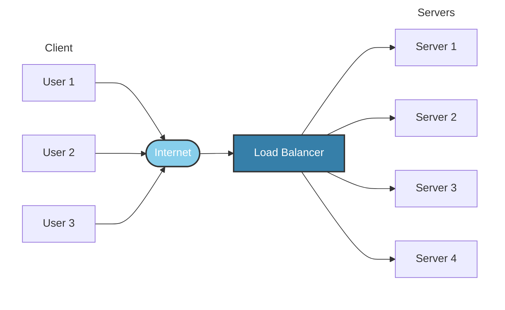

## Load Balancing

### Introduction to Load Balancing

Load balancing is a crucial component of System Design, as it helps distribute incoming requests and traffic evenly across multiple servers. The main goal of load balancing is to ensure high availability, reliability, and performance by avoiding overloading a single server and avoiding downtime.

Typically a load balancer sits between the client and the server accepting incoming network and application traffic and distributing the traffic across multiple backend servers using various algorithms. By balancing application requests across multiple servers, a load balancer reduces the load on individual servers and prevents any one server from becoming a single point of failure, thus improving overall application availability and responsiveness.

To utilize full scalability and redundancy, we can try to balance the load at each layer of the system. We can add LBs at three places:

- Between the user and the web server
- Between web servers and an internal platform layer, like application servers or cache servers
- Between internal platform layer and database.

#### Key terminology and concepts

**Load Balancer:** A device or software that distributes network traffic across multiple servers based on predefined rules or algorithms.

**Backend Servers:** The servers that receive and process requests forwarded by the load balancer. Also referred to as the server pool or server farm.

**Load Balancing Algorithm:** The method used by the load balancer to determine how to distribute incoming traffic among the backend servers.

**Health Checks:** Periodic tests performed by the load balancer to determine the availability and performance of backend servers. Unhealthy servers are removed from the server pool until they recover.

**Session Persistence:** A technique used to ensure that subsequent requests from the same client are directed to the same backend server, maintaining session state and providing a consistent user experience.

**SSL/TLS Termination:** The process of decrypting SSL/TLS-encrypted traffic at the load balancer level, offloading the decryption burden from backend servers and allowing for centralized SSL/TLS management.
