# System Design Fundamentals - Walkthrough

This guide covers the essential building blocks for designing scalable, reliable, and performant distributed systems. Whether you're preparing for system design interviews or building production systems, these 44 topics in `00-sysdesign-fundementals` provide the foundational knowledge you need—from load balancing and caching to databases, CAP theorem, and distributed patterns.

---

## Learning Roadmap

```mermaid
flowchart TB
    subgraph START [" "]
        direction TB
        S((🚀 START)) --> NET
    end

    subgraph FOUNDATION ["🏗️ PHASE 1: FOUNDATION"]
        direction TB

        subgraph NET ["📡 Networking"]
            N1[Network Essentials]
            N2[TCP vs UDP]
            N3[URL/URI/URN]
            N4[DNS]
            N1 --> N2 --> N3 --> N4
        end

        subgraph LB ["⚖️ Load Balancing"]
            L1[Load Balancing Basics]
            L2[Algorithms]
            L3[Use Cases]
            L4[L4 vs L7 Types]
            L1 --> L2 --> L3 --> L4
        end

        NET --> LB
    end

    subgraph CORE ["⚡ PHASE 2: CORE CONCEPTS"]
        direction TB

        subgraph SCALE ["📈 Scalability"]
            SC1[Horizontal vs Vertical]
            SC2[Distributed Systems Characteristics]
            SC3[Latency & Performance]
            SC4[Concurrency & Coordination]
            SC1 --> SC2 --> SC3 --> SC4
        end

        subgraph RELY ["🛡️ Reliability"]
            R1[Monitoring & Observability]
            R2[Resilience & Error Handling]
            R3[Fault Tolerance vs HA]
            R1 --> R2 --> R3
        end

        SCALE --> RELY
    end

    subgraph PERF ["🚄 PHASE 3: PERFORMANCE"]
        direction TB

        subgraph CACHE ["💾 Caching"]
            C1[Caching Fundamentals]
            C2[Strategies & Patterns]
            C3[Invalidation & Eviction]
            C4[Distributed Caching]
            C5[Challenges & Metrics]
            C1 --> C2 --> C3 --> C4 --> C5
        end

        subgraph CDN ["🌐 CDN"]
            CD1[CDN Basics]
            CD2[Use Cases]
            CD3[Challenges]
            CD1 --> CD2 --> CD3
        end

        CACHE --> CDN
    end

    subgraph DATA ["🗄️ PHASE 4: DATA LAYER"]
        direction TB

        subgraph DB ["💿 Databases"]
            D1[SQL vs NoSQL]
            D2[ACID vs BASE]
            D3[Indexing]
            D4[Bloom Filters]
            D1 --> D2 --> D3 --> D4
        end

        subgraph DM ["📊 Data Management"]
            DM1[Partitioning/Sharding]
            DM2[Replication]
            DM3[CAP Theorem]
            DM4[Proxy Servers]
            DM1 --> DM2 --> DM3 --> DM4
        end

        DB --> DM
    end

    subgraph DIST ["🔄 PHASE 5: DISTRIBUTED SYSTEMS"]
        direction TB

        subgraph COMM ["📨 Communication"]
            CM1[Long Polling]
            CM2[WebSockets]
            CM3[Server-Sent Events]
            CM1 --> CM2 --> CM3
        end

        subgraph PATT ["🔗 Patterns"]
            P1[Quorum]
            P2[Heartbeat]
            P3[Checksum]
            P4[Leader-Follower]
            P1 --> P2 --> P3 --> P4
        end

        COMM --> PATT
    end

    subgraph ADV ["🎯 PHASE 6: ADVANCED"]
        direction TB

        subgraph SEC ["🔐 Security"]
            SE1[Auth & Encryption]
            SE2[Rate Limiting]
            SE3[API Security]
            SE1 --> SE2 --> SE3
        end

        subgraph SYS ["⚙️ Systems"]
            SY1[Distributed Messaging]
            SY2[Distributed File Systems]
            SY3[Misc Concepts]
            SY1 --> SY2 --> SY3
        end

        SEC --> SYS
    end

    subgraph FINISH [" "]
        E((🏆 MASTER))
    end

    FOUNDATION --> CORE
    CORE --> PERF
    PERF --> DATA
    DATA --> DIST
    DIST --> ADV
    ADV --> FINISH

    %% Styling
    classDef phase fill:#1a1a2e,stroke:#16213e,stroke-width:3px,color:#eee
    classDef startEnd fill:#e94560,stroke:#0f3460,stroke-width:4px,color:#fff
    classDef network fill:#4361ee,stroke:#3a0ca3,color:#fff
    classDef loadbal fill:#7209b7,stroke:#560bad,color:#fff
    classDef scale fill:#f72585,stroke:#b5179e,color:#fff
    classDef rely fill:#4cc9f0,stroke:#4895ef,color:#000
    classDef cache fill:#06d6a0,stroke:#059669,color:#000
    classDef cdn fill:#118ab2,stroke:#073b4c,color:#fff
    classDef db fill:#ef476f,stroke:#d62839,color:#fff
    classDef datam fill:#ffd166,stroke:#f4a261,color:#000
    classDef comm fill:#8338ec,stroke:#5a189a,color:#fff
    classDef patt fill:#ff006e,stroke:#c9184a,color:#fff
    classDef sec fill:#fb5607,stroke:#ff6d00,color:#fff
    classDef sys fill:#3a86ff,stroke:#0077b6,color:#fff

    class S,E startEnd
    class N1,N2,N3,N4 network
    class L1,L2,L3,L4 loadbal
    class SC1,SC2,SC3,SC4 scale
    class R1,R2,R3 rely
    class C1,C2,C3,C4,C5 cache
    class CD1,CD2,CD3 cdn
    class D1,D2,D3,D4 db
    class DM1,DM2,DM3,DM4 datam
    class CM1,CM2,CM3 comm
    class P1,P2,P3,P4 patt
    class SE1,SE2,SE3 sec
    class SY1,SY2,SY3 sys
```

### Roadmap Summary

| Phase | Focus Area | Topics | Priority |
|-------|------------|--------|----------|
| **Phase 1** | Foundation | Networking (4) + Load Balancing (4) | 🔴 Critical |
| **Phase 2** | Core Concepts | Scalability (4) + Reliability (3) | 🔴 Critical |
| **Phase 3** | Performance | Caching (9) + CDN (4) | 🔴 Critical |
| **Phase 4** | Data Layer | Databases (4) + Data Management (4) | 🔴 Critical |
| **Phase 5** | Distributed | Communication (1) + Patterns (4) | 🟡 Important |
| **Phase 6** | Advanced | Security (1) + Systems (3) | 🟢 Good to Know |

---

## Topics Overview

| # | Topic | Category | Key Concept |
|---|-------|----------|-------------|
| 01 | [Load Balancing](00-sysdesign-fundementals/01-load-balancing/README.md) | Load Balancing | Distributes traffic across servers for availability |
| 02 | [Load Balancing Algorithms](00-sysdesign-fundementals/02-load-balancing-algorithms/README.md) | Load Balancing | Round Robin, Least Connections, IP Hash, Weighted |
| 03 | [Uses of Load Balancing](00-sysdesign-fundementals/03-uses-of-load-balancing/README.md) | Load Balancing | Web tier, app tier, database tier placement |
| 04 | [Load Balancer Types](00-sysdesign-fundementals/04-load-balancer-types/README.md) | Load Balancing | L4 (transport) vs L7 (application) load balancers |
| 05 | [Scalability and Performance](00-sysdesign-fundementals/05-scalability-and-performance/README.md) | Scalability | Horizontal vs vertical scaling strategies |
| 06 | [Key Characteristics of Distributed Systems](00-sysdesign-fundementals/06-key-characteristics-of-distributed-systems/README.md) | Scalability | Scalability, availability, reliability, efficiency |
| 07 | [Latency and Performance](00-sysdesign-fundementals/07-latency-and-performance/README.md) | Scalability | Response time optimization techniques |
| 08 | [Concurrency and Coordination](00-sysdesign-fundementals/08-concurrency-and-coordination/README.md) | Scalability | Locks, semaphores, distributed coordination |
| 09 | [Monitoring and Observability](00-sysdesign-fundementals/09-monitoring-and-observability/README.md) | Reliability | Metrics, logging, tracing, alerting |
| 10 | [Resilience and Error Handling](00-sysdesign-fundementals/10-resilience-and-error-handling/README.md) | Reliability | Circuit breakers, retries, fallbacks |
| 11 | [Fault Tolerance vs High Availability](00-sysdesign-fundementals/11-fault-tolerance-vs.-high-availability/README.md) | Reliability | Redundancy, failover, recovery strategies |
| 12 | [Network Essentials](00-sysdesign-fundementals/12-network-essentials/README.md) | Networking | OSI model, protocols, networking basics |
| 13 | [TCP vs UDP](00-sysdesign-fundementals/13-tcp-vs.-udp/README.md) | Networking | Connection-oriented vs connectionless protocols |
| 14 | [URL vs URI vs URN](00-sysdesign-fundementals/14-url-vs.-uri-vs.-urn/README.md) | Networking | Resource identification and addressing |
| 15 | [DNS](00-sysdesign-fundementals/15-dns-(domain-name-system)/README.md) | Networking | Domain name resolution, DNS hierarchy |
| 16 | [Caching](00-sysdesign-fundementals/16-caching/README.md) | Caching | Introduction to caching concepts |
| 17 | [What is Caching](00-sysdesign-fundementals/17-what-is-caching/README.md) | Caching | Cache fundamentals and benefits |
| 18 | [Cache Strategies](00-sysdesign-fundementals/18-cache-strategies/README.md) | Caching | Write-through, write-behind, cache-aside |
| 19 | [Cache Invalidation](00-sysdesign-fundementals/19-cache-invalidation/README.md) | Caching | TTL, event-based, manual invalidation |
| 20 | [Cache Eviction Policies](00-sysdesign-fundementals/20-cache-eviction-policies/README.md) | Caching | LRU, LFU, FIFO, TTL-based eviction |
| 21 | [Caching Challenges](00-sysdesign-fundementals/21-caching-challenges/README.md) | Caching | Thundering herd, cold start, coherence |
| 22 | [Distributed Caching](00-sysdesign-fundementals/22-distributed-caching/README.md) | Caching | Redis, Memcached, distributed cache patterns |
| 23 | [Cache Performance Metrics](00-sysdesign-fundementals/23-cache-performance-metrics/README.md) | Caching | Hit ratio, miss ratio, latency metrics |
| 24 | [Interview Checklist](00-sysdesign-fundementals/24-interview-checklist/README.md) | Caching | Caching interview preparation guide |
| 25 | [CDN](00-sysdesign-fundementals/25-cdn-(content-delivery-network)/README.md) | CDN | Geographically distributed content delivery |
| 26 | [CDN Use Cases and Content Types](00-sysdesign-fundementals/26-cdn-use-cases-and-content-types/README.md) | CDN | Static assets, video streaming, API caching |
| 27 | [CDN Challenges](00-sysdesign-fundementals/27-cdn-challenges/README.md) | CDN | Cache invalidation, cost, origin protection |
| 28 | [CDN Interview Checklist](00-sysdesign-fundementals/28-cdn-interview-checklist/README.md) | CDN | CDN interview preparation guide |
| 29 | [Data Partitioning](00-sysdesign-fundementals/29-data-partitioning/README.md) | Data Management | Horizontal, vertical, directory-based sharding |
| 30 | [Redundancy and Replication](00-sysdesign-fundementals/30-redundancy-and-replication/README.md) | Data Management | Data copies for availability and durability |
| 31 | [Proxy Servers](00-sysdesign-fundementals/31-proxy-servers/README.md) | Data Management | Forward proxy, reverse proxy, use cases |
| 32 | [CAP Theorem](00-sysdesign-fundementals/32-cap-theorem/README.md) | Data Management | Consistency, Availability, Partition Tolerance |
| 33 | [Databases](00-sysdesign-fundementals/33-databases/README.md) | Data Management | SQL vs NoSQL, ACID vs BASE, database types |
| 34 | [Database Indexing](00-sysdesign-fundementals/34-database-indexing/README.md) | Data Management | B-tree, hash indexes, query optimization |
| 35 | [Bloom Filters](00-sysdesign-fundementals/35-bloom-filters/README.md) | Data Management | Probabilistic data structure for membership |
| 36 | [Long Polling vs WebSockets vs SSE](00-sysdesign-fundementals/36-long-polling-vs.-websockets-vs.-server-sent-events/README.md) | Communication | Real-time communication patterns |
| 37 | [Quorum](00-sysdesign-fundementals/37-quorum/README.md) | Distributed Patterns | Minimum nodes for consensus (W + R > N) |
| 38 | [Heartbeat](00-sysdesign-fundementals/38-heartbeat/README.md) | Distributed Patterns | Failure detection via periodic signals |
| 39 | [Checksum](00-sysdesign-fundementals/39-checksum/README.md) | Distributed Patterns | Data integrity verification |
| 40 | [Leader and Follower](00-sysdesign-fundementals/40-leader-and-follower/README.md) | Distributed Patterns | Leader election, replication patterns |
| 41 | [Security](00-sysdesign-fundementals/41-security/README.md) | Security & Systems | Auth, encryption, rate limiting, API security |
| 42 | [Distributed Messaging System](00-sysdesign-fundementals/42-distributed-messaging-system/README.md) | Security & Systems | Message queues, pub/sub, Kafka, RabbitMQ |
| 43 | [Distributed File Systems](00-sysdesign-fundementals/43-distributed-file-systems/README.md) | Security & Systems | HDFS, GFS, data replication |
| 44 | [Misc Concepts](00-sysdesign-fundementals/44-misc-concepts/README.md) | Security & Systems | Additional system design concepts |

---
